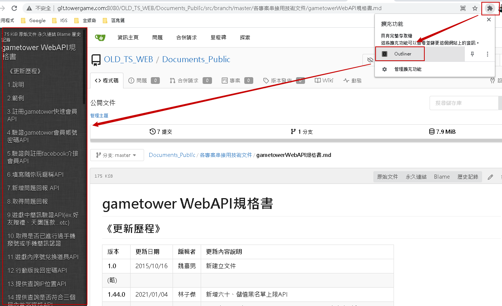
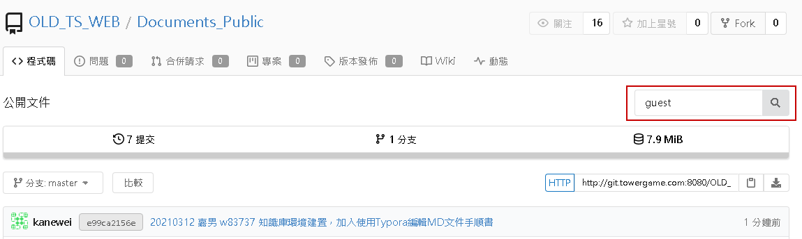
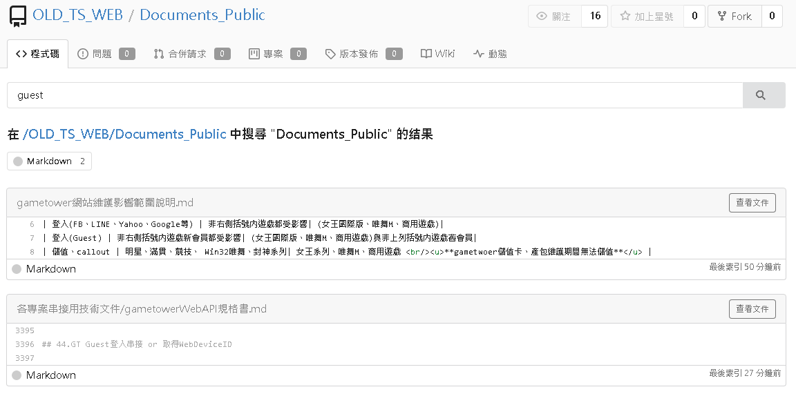

# 網頁組公開文件說明

此文件由技術服務部網頁組提供

網址：http://git.towergame.com:8080/OLD_TS_WEB/Documents_Public

## 使用網頁查看文件瀏覽大綱方法

目前已可透過網址查看MD文件(例如查看 [[gametowerWebAPI規格書](http://git.towergame.com:8080/OLD_TS_WEB/Documents_Public/src/branch/master/%e5%90%84%e5%b0%88%e6%a1%88%e4%b8%b2%e6%8e%a5%e7%94%a8%e6%8a%80%e8%a1%93%e6%96%87%e4%bb%b6/gametowerWebAPI%e8%a6%8f%e6%a0%bc%e6%9b%b8.md)])，但是如果文件較長就會不知道有哪些大綱，這時候可以安裝Chrome套件[[outliner](https://chrome.google.com/webstore/detail/outliner/kdabjjgkcfjdlbpneackoihbkdpdmodp?utm_source=chrome-ntp-icon)]，這樣就可以在網頁查看的時候開啟outliner，就會自動展開大綱方便查看文件。

## 搜尋文件方法

點選右上角的搜尋框，輸入要搜尋的關鍵字按下搜尋圖案，就可以得到搜尋結果

## MD檔案編輯方法

建議可以安裝Typora進行編輯，使用說明請參考 [[Typora安裝與設定](http://git.towergame.com:8080/OLD_TS_WEB/Documents_Public/src/branch/master/%e6%8a%80%e8%a1%93%e6%96%87%e4%bb%b6/%e4%bd%bf%e7%94%a8Typora%e7%b7%a8%e8%bc%afMD%e6%96%87%e4%bb%b6%e6%89%8b%e9%a0%86%e6%9b%b8/%e4%bd%bf%e7%94%a8Typora%e7%b7%a8%e8%bc%afMD%e6%96%87%e4%bb%b6%e6%89%8b%e9%a0%86%e6%9b%b8.md)] 文件

## Gitea合併請求操作方法

請參考 [[Gitea合併請求操作手順書](http://git.towergame.com:8080/OLD_TS_WEB/Documents_Public/src/branch/master/%E6%8A%80%E8%A1%93%E6%96%87%E4%BB%B6/Gitea%E5%90%88%E4%BD%B5%E8%AB%8B%E6%B1%82%E6%93%8D%E4%BD%9C%E6%89%8B%E9%A0%86%E6%9B%B8/Gitea%E5%90%88%E4%BD%B5%E8%AB%8B%E6%B1%82%E6%93%8D%E4%BD%9C%E6%89%8B%E9%A0%86%E6%9B%B8.md)] 文件