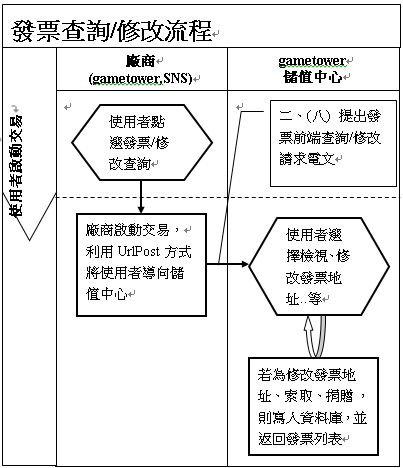

# gametower儲值中心-規格書

## 《更新歷程》


| 版本       | 更新日期   | 編輯者 | 更新內容說明                   |
| --- | --- |--- | ---|
| **0.5**    | 2010/12/06 | 魏嘉男 | 新建立文件                     |
| (略) |  |  |  |
| **1.51.0** | 2021/01/25 | 吳志豪 | (1) 四.付款方式代碼表『GASH卡』的說明刪除E-PIN相關 |
| **1.52.0** | 2021/02/23 | 吳志豪 | (1)新增CodaPay 新加坡儲值管道『GrabPay』、『PayNow』<br>(2)四.付款方式代碼表新增CodaPay新加坡相關儲值管道之說明<br>(3)五.各付費方式延伸欄位說明新增CodaPay新加坡相關儲值管道之說明 |
| **1.52.1** | 2021/03/18 | 吳志豪 | (1)四.付款方式代碼表 修改CodaPay新加坡相關儲值管道之說明 |
| **1.53.1** | 2021/04/27 | 吳志豪 | (1)移除微信支付相關說明與處理嘉男建立文件有漏刪的說明<br>(2)移除已無合作的渠道相關說明 |

## 一.交易流程種類說明
### (一)廠商標準流程

說明：使用者從廠商選擇付款方式、金額等資訊啟動的交易，並於付費平台完成交易。

適用付費平台：WebATM,SmartPay,ADSL、市話、行動電話輕鬆付、Alipay、ChinaPay..等。

**注意事項：有可能因為網路中斷或是付費平台的關係導致廠商端無收到(三)交易結果電文，且(三)交易結果電文 也不保證在 (四)交易回報確認電文之前發生，串接時必須考慮只收到(四)交易回報確認電文 或 先收到 (四)交易回報確認電文 再收到
(三)交易結果電文 的狀況。**


### (二)廠商進階流程

說明：標準交易流程中加上確認請求的動作，以核對使用者在付費平台提供的交易資料，例如使用者在信用卡付費平台輸入卡號，付費平台透過儲值中心將卡號回傳讓廠商確認此卡號是否可進行交易。

適用付費平台：信用卡。 **注意事項同 (一)廠商標準流程**


### (三)付費平台標準流程

說明：使用者從付費平台啟動的交易，驗證資料後完成交易。

適用付費平台：簡訊、語音儲值，便利超商輕鬆付。


### (四)發票處理流程

> **(因應新版個資法，降低個資外洩風險，已停用此流程，請改用流程六及七)**

說明：使用者進行查詢或是修改發票資料。

適用付費平台：需要發票資訊的付費方式(詳見【四、付款方式代碼表】)。


### (五)取消交易流程

說明：使用者欲取消交易。

適用付費平台：有提供取消交易的付費方式(**詳見【四、付款方式代碼表】**)。


### (六)發票前端填寫流程

說明：使用者進行填寫發票資料。

適用付費平台：需要發票資訊的付費方式(**詳見【四、付款方式代碼表】**)。


### (七)發票前端查詢/修改流程

說明：使用者進行查詢或修改發票資料。

適用付費平台：需要發票資訊的付費方式(詳見【四、付款方式代碼表】)。



## 二.溝通電文說明

1.  溝通方式：使用HTTPS協定(Port
    443)，透過POST方式傳輸交易電文，若當下有回傳值，則將回傳電文以Response.Write的方式回傳，並注意傳輸資料與加解密的編碼都使用UTF-8。

2. Response.Write回傳使用QueryString格式，並將VALUE做UrlEncode。

   ```
   Ex.PLATFORM_TRANS_NO=1&MEMO=%e9%ad%8f%e5%98%89%e7%94%b7&RESULT_CODE=00000& RESULT_MESSAGE=%e9%ad%8f%e5%98%89%e7%94%b7
   ```

3.  CHECK_CODE為驗證碼，避免資料在傳輸的過程中遭到竄改，以此值來確保廠商與儲值中心資料交換的安全性。CHECK_CODE計算方式是將接收或傳送的電文資料依照
    Key 排序，將所有 Value 相加(排除 CHECK_CODE
    參數)，最後加上雙方約定的金鑰(PRIVATE_KEY) ，再用 SHA1 加密而成。

注意：CHECK_CODE計算方式請參考**七、驗證碼計算說明與範例**。

4.  EXTEND
    為延伸欄位，使用在部份付費方式需要多餘的參數使用，格式一樣使用QueryString格式，並將VALUE做UrlEncode。例如便利超商輕鬆付帶便利超商通關碼，簡訊、語音帶手機號碼...等。由各付費方式自行定義使用，詳見【五、各付費方式延伸欄位說明表】

注意：回傳(Response.Write)的狀況下，EXTEND的VALUE會做UrlEncode，但是因為EXTEND又是回傳的VALUE，因此需將整串EXTEND再進行一次UrlEncode。

5.  儲值中心當交易完成時，會有排程定時與廠商確認廠商已完成交易，確認原則如下：

```
1.  交易後每 5 分鐘確認一次。
2.  30 分鐘後每 1 小時確認一次。
3.  72 小時後每 1 天確認一次。
4.  7 天後不再確認，走客服流程。
```
6.  由儲值中心排程進行的【(四)交易回報確認電文】，會包含請款已失敗**(RESULT_CODE!=000000)**以及請款已完成**(RESULT_CODE=000000)**的交易紀錄，如廠商收到處理無誤後請回傳RESULT_CODE為000000-處理完成，若在此之前已處理完成，則回RESULT_CODE為000001-已處理完成。

注意：若交易仍在請款進行中(交易中斷或是使用者尚未付款)，則無法回覆交易結果。

7.  回覆結果代號(RESULT_CODE)與回覆結果訊息(RESULT_MESSAGE)請參考六、回覆結果訊息表。

注意：若結果代號為000251，付費平台回傳的訊息會放在EXTEND欄位的PAYMENT_MESSAGE

8.  發票寄送方式值如下，以及INVOICE_KEY_VALUE所代表的意義：
```
1：紙本電子發票

2：gametower會員 未歸戶 不需要INVOICE_KEY_VALUE

3：選擇捐贈單位 INVOICE_KEY_VALUE = 愛心碼

4：自行決定捐贈單位 INVOICE_KEY_VALUE = 愛心碼

5：gametower會員 歸戶 不需要INVOICE_KEY_VALUE

6：手機條碼 INVOICE_KEY_VALUE = 手機條碼

7：自然人條碼 INVOICE_KEY_VALUE = 自然人條碼
```
9.  若傳輸的資料要進行AES加密時，AES的Mode為ECB、Padding為PCKS7，Key為PRIVATE_KEY的MD5雜湊值，且AES加密後進行Base64編碼。

10.  電文中所有decimal的欄位都是decimal(19,5)，就是整數位數最長為19，小數位數為5。


## 三.溝通電文格式

### (一)提出交易請求

| (一) 提出交易請求電文參數說明            |
| ---------------------------------------- |
| 將使用者透過Url Post送到儲值中心交易頁面 |

| 參數名稱          | 參數大小       | 必要 | 説明                                                         |
| ----------------- | -------------- | ---- | ------------------------------------------------------------ |
| PLATFORM          | varchar(15)    | 是   | 廠商ID                                                       |
| AMOUNT            | decimal(19, 5) | 是   | 交易金額<br/>若付費方式為【Game淘儲值卡】或【MyCard 儲值卡】請帶 0 |
| PLATFORM_TRANS_NO | varchar(50)    | 是   | 廠商訂單編號                                                 |
| CHECK_CODE        | char(40)       | 是   | 驗證碼                                                       |
| PAY_TYPE          | integer        | 是   | 付費方式 詳見【四、付款方式代碼表】                          |
| RETURN_URL        | varchar(255)   | 是   | 回傳網址                                                     |
| IDENTITY_1        | varchar(100)   | 是   | 使用者識別值_1                                               |
| IDENTITY_2        | varchar(100)   | 是   | 使用者識別值_2                                               |
| REMOTE_IP         | varchar(15)    | 是   | 使用者IP                                                     |
| EXTEND            | 無長度限制     | 否   | 延伸欄位                                                     |

### (二)請求確認

| (二) 請求確認電文參數說明                                    |
| ------------------------------------------------------------ |
| 儲值中心Server傳送Url Post到廠商接收頁面，廠商將結果Response.Write回覆 |

| 參數名稱          | 參數大小       | 必要 | 説明                                        |
| ----------------- | -------------- | ---- | ------------------------------------------- |
| PLATFORM          | varchar(15)    | 是   | 廠商ID                                      |
| AMOUNT            | decimal(19, 5) | 是   | 交易金額                                    |
| PLATFORM_TRANS_NO | varchar(50)    | 否   | 廠商訂單編號 若為廠商進階流程，則為必填欄位 |
| CHECK_CODE        | char(40)       | 是   | 驗證碼                                      |
| PAY_TYPE          | integer        | 是   | 付費方式 詳見【四、付款方式代碼表】         |
| CENTER_TRANS_NO   | char(19)       | 是   | 儲值中心訂單編號                            |
| EXTEND            | 無長度限制     | 否   | 延伸欄位                                    |

**廠商回覆參數**

| 參數名稱                       | 參數大小       | 必要 | 説明                           |
| ------------------------------ | -------------- | ---- | ------------------------------ |
| PLATFORM_TRANS_NO              | varchar(50)    | 是   | 廠商訂單編號                   |
| RESULT_CODE                    | varchar(6)     | 是   | 回覆結果代號                   |
| RESULT_MESSAGE                 | nvarchar(200)  | 是   | 回覆結果訊息                   |
| MEMO                           | nvarchar(200)  | 否   | 描述                           |
| EXTEND                         | 無長度限制     | 否   | 延伸欄位                       |

### (三)交易結果

| (三) 交易結果電文參數說明                     |
| --------------------------------------------- |
| 將使用者透過Url Post送到廠商指定的 RETURN_URL |

| 參數名稱          | 參數大小       | 必要 | 説明                                                         |
| ----------------- | -------------- | ---- | ------------------------------------------------------------ |
| PLATFORM          | varchar(15)    | 是   | 廠商ID                                                       |
| AMOUNT            | decimal(19, 5) | 是   | 交易金額                                                     |
| PLATFORM_TRANS_NO | varchar(50)    | 是   | 廠商訂單編號                                                 |
| CHECK_CODE        | char(40)       | 是   | 驗證碼                                                       |
| PAY_TYPE          | integer        | 是   | 付費方式 詳見【四、付款方式代碼表】                          |
| RETURN_URL        | varchar(255)   | 否   | 回傳網址<br/>廠商標準流程與廠商進階流程會將廠商送來的RETURN_URL回傳，提供給廠商有自訂參數最後可接回處理。 |
| CENTER_TRANS_NO   | char(19)       | 是   | 儲值中心訂單編號                                             |
| EXTEND            | 無長度限制     | 否   | 延伸欄位                                                     |
| RESULT_CODE       | varchar(6)     | 是   | 回覆結果代號                                                 |
| RESULT_MESSAGE    | nvarchar(200)  | 是   | 回覆結果訊息                                                 |
| SETTLE_DATETIME   | Varchar(19)    | 否   | 請款完成時間(yyyy/mm/dd hh:MM:ss)                            |

### (四)交易回報確認

| (四) 交易回報確認電文參數說明                                |
| ------------------------------------------------------------ |
| 儲值中心Server使用排程傳送Url Post到廠商接收頁面，廠商將結果Response.Write回覆 |

| 參數名稱          | 參數大小       | 必要 | 説明                                                         |
| ----------------- | -------------- | ---- | ------------------------------------------------------------ |
| PLATFORM          | varchar(15)    | 是   | 廠商ID                                                       |
| AMOUNT            | decimal(19, 5) | 是   | 交易金額                                                     |
| PLATFORM_TRANS_NO | varchar(50)    | 是   | 廠商訂單編號                                                 |
| CHECK_CODE        | char(40)       | 是   | 驗證碼                                                       |
| PAY_TYPE          | integer        | 是   | 付費方式 詳見【四、付款方式代碼表】                          |
| RETURN_URL        | varchar(255)   | 否   | 回傳網址<br/>廠商標準流程與廠商進階流程會將廠商送來的RETURN_URL回傳，提供給廠商有自訂參數最後可接回處理。 |
| CENTER_TRANS_NO   | char(19)       | 是   | 儲值中心訂單編號                                             |
| EXTEND            | 無長度限制     | 否   | 延伸欄位                                                     |
| RESULT_CODE       | varchar(6)     | 是   | 回覆結果代號                                                 |
| RESULT_MESSAGE    | nvarchar(200)  | 是   | 回覆結果訊息                                                 |
| SETTLE_DATETIME   | Varchar(19)    | 否   | 請款完成時間(yyyy/mm/dd hh:MM:ss)                            |

**廠商回覆參數**

| 參數名稱          | 參數大小      | 必要 | 説明         |
| ----------------- | ------------- | ---- | ------------ |
| PLATFORM_TRANS_NO | varchar(50)   | 是   | 廠商訂單編號 |
| RESULT_CODE       | varchar(6)    | 是   | 回覆結果代號 |
| RESULT_MESSAGE    | nvarchar(200) | 是   | 回覆結果訊息 |
| MEMO              | nvarchar(200) | 否   | 描述         |
| EXTEND            | 無長度限制    | 否   | 延伸欄位     |

### ~~(五)提出發票處理請求~~

**(因應新版個資法，降低個資外洩風險，已停用此電文格式，請改用電文格式八)**

### (六)提出取消交易請求

| (六) 提出取消交易請求電文參數說明                            |
| ------------------------------------------------------------ |
| 廠商Server傳送Url Post到儲值中心接收頁面，儲值中心將結果Response.Write回覆 |

| 參數名稱          | 參數大小       | 必要 | 説明                                |
| ----------------- | -------------- | ---- | ----------------------------------- |
| PLATFORM          | varchar(15)    | 是   | 廠商ID                              |
| AMOUNT            | decimal(19, 5) | 是   | 交易金額                            |
| PLATFORM_TRANS_NO | varchar(50)    | 是   | 廠商訂單編號                        |
| CHECK_CODE        | char(40)       | 是   | 驗證碼                              |
| PAY_TYPE          | integer        | 是   | 付費方式 詳見【四、付款方式代碼表】 |
| CENTER_TRANS_NO   | char(19)       | 是   | 儲值中心訂單編號                    |

**儲值中心回覆參數**

| 參數名稱          | 參數大小      | 必要 | 説明         |
| ----------------- | ------------- | ---- | ------------ |
| RESULT_CODE       | varchar(6)    | 是   | 回覆結果代號 |
| RESULT_MESSAGE    | nvarchar(200) | 是   | 回覆結果訊息 |
| PLATFORM_TRANS_NO | varchar(50)   | 否   | 廠商訂單編號 |
| EXTEND            | 無長度限制    | 否   | 延伸欄位     |

### ~~(七)提出發票前端填寫請求~~

**(因應發票簡化流程，已停用此電文格式，發票部分由儲值中心處理即可)**

------------------------------------------------ ----------------- -------- ----------------------------------------
### (八) 提出發票前端查詢/修改請求電文參數說明

| (八) 提出發票前端查詢/修改請求電文參數說明 |
| ------------------------------------------ |
| 將使用者透過Url Post送到發票查詢介面       |

| 參數名稱   | 參數大小     | 必要 | 説明           |
| ---------- | ------------ | ---- | -------------- |
| PLATFORM   | varchar(15)  | 是   | 廠商ID         |
| CHECK_CODE | char(40)     | 是   | 驗證碼         |
| IDENTITY_1 | varchar(100) | 是   | 使用者識別值_1 |
| IDENTITY_2 | varchar(100) | 是   | 使用者識別值_2 |

提出交易請求電文連結位置：

1. PC版介面

```
測試機：https://bank-twtest.towergame.com/Bank/Invoice/Record.aspx
正式機：https://bank.gametower.com.tw/Bank/Invoice/Record.aspx
```

2. 手機Android版介面

```
測試機：https://bank-twtest.towergame.com/Mobile/Android/Bank/Invoice/Record.aspx
正式機：https://bank.gametower.com.tw/Mobile/Android/Bank/Invoice/Record.aspx
```

### (九)查詢訂單交易結果請求

| (九) 查詢訂單交易結果參數說明                                |
| ------------------------------------------------------------ |
| 廠商Server傳送Url Post到儲值中心接收頁面，儲值中心將結果Response.Write回覆 |

| 參數名稱          | 參數大小    | 必要 | 說明                                        |
| ----------------- | ----------- | ---- | ------------------------------------------- |
| PLATFORM          | varchar(15) | 是   | 廠商ID                                      |
| PLATFORM_TRANS_NO | varchar(50) | 否   | 廠商訂單編號 與儲值中心訂單編號至少需填一個 |
| CENTER_TRANS_NO   | char(19)    | 否   | 儲值中心訂單編號 與廠商訂單編號至少需填一個 |
| CHECK_CODE        | char(40)    | 是   | 驗證碼                                      |
| PAY_TYPE          | integer     | 是   | 付費方式 詳見【四、付款方式代碼表】         |

**儲值中心回覆參數**

| 參數名稱          | 參數大小       | 必要 | 說明                                                         |
| ----------------- | -------------- | ---- | ------------------------------------------------------------ |
| PLATFORM          | varchar(15)    | 否   | 廠商ID                                                       |
| PAY_TYPE          | integer        | 否   | 付費方式 詳見【四、付款方式代碼表】                          |
| RESULT_CODE       | varchar(6)     | 是   | 回覆結果代號                                                 |
| RESULT_MESSAGE    | nvarchar(200)  | 是   | 回覆結果訊息                                                 |
|                   |                |      | 以下欄位也為回覆參數，分幾種狀況<br/>RESULT_CODE=000000(處理完成)會帶詳細資料<br/>RESULT_CODE=000006(交易進行中)會帶目前有的資料<br/>RESULT_CODE=000007(交易已失敗)會帶目前有的資料<br/>RESULT_CODE=000310(傳入訂單編號無相符資料)則會帶原來傳到儲值中心的資料<br/>其他RESULT_CODE表示發生異常，請稍候再試。並會帶原來傳到儲值中心的資料 |
| AMOUNT            | decimal(19, 5) | 否   | 交易金額                                                     |
| PLATFORM_TRANS_NO | varchar(50)    | 否   | 廠商訂單編號                                                 |
| RETURN_URL        | varchar(255)   | 否   | 回傳網址 廠商標準流程與廠商進階流程會將廠商送來的RETURN_URL回傳，提供給廠商有自訂參數最後可接回處理。 |
| CENTER_TRANS_NO   | char(19)       | 否   | 儲值中心訂單編號                                             |
| EXTEND            | 無長度限制     | 否   | 延伸欄位 會根據【五、各付費方式延伸欄位說明表】各付費方式的說明帶值，並加上PRICE資訊，如有NT_PRICE也會一併加上。 |

查詢訂單交易結果位置：

```
測試機：https://bank.twtest.towergame.com/common/receive/Service/QueryOrder.aspx
正式機：https://bank.gametower.com.tw/common/receive/Service/QueryOrder.aspx
```

### (十)交易前授權請求

| (十) 交易前授權參數說明                                      |
| ------------------------------------------------------------ |
| 廠商Server傳送Url Post到儲值中心接收頁面，儲值中心將結果Response.Write回覆 |

| 參數名稱          | 參數大小       | 必要 | 說明                                                         |
| ----------------- | -------------- | ---- | ------------------------------------------------------------ |
| PLATFORM          | varchar(15)    | 是   | 廠商ID                                                       |
| AMOUNT            | decimal(19, 5) | 是   | 交易金額 若付費方式為【Game淘儲值卡】或 【MyCard 儲值卡】請帶 0 |
| PLATFORM_TRANS_NO | varchar(50)    | 是   | 廠商訂單編號                                                 |
| CHECK_CODE        | char(40)       | 是   | 驗證碼                                                       |
| PAY_TYPE          | integer        | 是   | 付費方式 詳見【四、付款方式代碼表】                          |
| EXTEND            | 無長度限制     | 否   | 延伸欄位                                                     |

**儲值中心回覆參數**

| 參數名稱          | 參數大小       | 必要 | 說明                                |
| ----------------- | -------------- | ---- | ----------------------------------- |
| PLATFORM          | varchar(15)    | 否   | 廠商ID                              |
| PAY_TYPE          | integer        | 否   | 付費方式 詳見【四、付款方式代碼表】 |
| RESULT_CODE       | varchar(6)     | 是   | 回覆結果代號                        |
| RESULT_MESSAGE    | nvarchar(200)  | 是   | 回覆結果訊息                        |
| AMOUNT            | decimal(19, 5) | 否   | 交易金額                            |
| PLATFORM_TRANS_NO | varchar(50)    | 否   | 廠商訂單編號                        |
| CENTER_TRANS_NO   | char(19)       | 否   | 儲值中心訂單編號                    |
| EXTEND            | 無長度限制     | 否   | 延伸欄位                            |

## 四.付款方式代碼表

| 付費方式(PAY_TYPE) | 付費方式說明 | 適用交易流程 | 是否需要發票資訊 | 是否可取消交易 | 連結位置說明 |
|----------------|--------|--------|----------|---------|---------|
| 1 | Game 淘儲值卡 | (一)廠商標準流程 | | | 提出交易請求電文連結位置：<br/>測試機：https://bank-twtest.towergame.com/Bank/StoredValueCard/Settle.aspx<br/>正式機：https://bank.gametower.com.tw/Bank/StoredValueCard/Settle.aspx<br/>可直接串接的儲值中心：台版儲值中心(※若欲串接的儲值中心不在明細內，則專案串接時程需包含網頁組進行搬移作業的時間)<br/><br/>PS.支援點卡宅配購QRCODE_URL規格(尚未實作) |
| 4 | 點卡宅配購 | (一)廠商標準流程 | | | 提出交易請求電文連結位置：<br>測試機：https://bank-twtest.towergame.com/Bank/Transnet/Order.aspx<br>正式機：https://bank.gametower.com.tw/Bank/Transnet/Order.aspx<br>可直接串接的儲值中心：台版儲值中心(※若欲串接的儲值中心不在明細內，則專案串接時程需包含網頁組進行搬移作業的時間)<br><br>PS1.點卡宅配購由先申購Game淘儲值卡後宅配到府，一開始提出交易請求收到訂單後會回傳000002到RETURN_URL，代表訂貨完成；直到貨到付款後才會透過CHECK_URL通知請款完成。<br>PS2.通知請款完成並不會產生營收，需等玩家將儲值卡透過Game淘儲值卡單元儲值完成才會認列營收。<br>PS3.延伸欄位多帶QRCODE_URL，則產生的儲值卡上會有QRCode提供給玩家掃描，會連結到 QRCODE_URL並附加k參數(使用者識別值1|
| 21 | 中國信託 Web ATM | (一)廠商標準流程 | 是 | 是 | 提出交易請求電文連結位置：<br>測試機：https://bank-twtest.towergame.com/Bank/ChinaTrust/WebATM/Order.aspx<br>正式機：https://bank.gametower.com.tw/Bank/ChinaTrust/WebATM/Order.aspx<br>金額範圍：1 ~ 9999999<br>可直接串接的儲值中心：台版儲值中心(※若欲串接的儲值中心不在明細內，則專案串接時程需包含網頁組進行搬移作業的時間) |
| 22 | 玉山銀行 Web ATM | (一)廠商標準流程 | 是 | 是 | 提出交易請求電文連結位置：<br>測試機：https://bank-twtest.towergame.com/Bank/Esun/WebATM/Order.aspx<br>正式機：https://bank.gametower.com.tw/Bank/Esun/WebATM/Order.aspx<br>金額範圍：1 ~ 2000000<br>可直接串接的儲值中心：台版儲值中心(※若欲串接的儲值中心不在明細內，則專案串接時程需包含網頁組進行搬移作業的時間) |
| 31 | 中國信託 Smart Pay | (一)廠商標準流程 | 是 | 是 | 提出交易請求電文連結位置：<br>測試機：https://bank-twtest.towergame.com/Bank/ChinaTrust/SPay/Order.aspx<br>正式機：https://bank.gametower.com.tw/Bank/ChinaTrust/SPay/Order.aspx<br>金額範圍：1 ~ 9999999<br>可直接串接的儲值中心：台版儲值中心(※若欲串接的儲值中心不在明細內，則專案串接時程需包含網頁組進行搬移作業的時間) |
| 32 | 玉山銀行Smart Pay | (一)廠商標準流程 | 是 | 是 | 提出交易請求電文連結位置：<br>測試機：https://bank-twtest.towergame.com/Bank/Esun/SmartPay/Order.aspx<br>正式機：https://bank.gametower.com.tw/Bank/Esun/SmartPay/Order.aspx<br>金額範圍：1 ~ 2000000<br>可直接串接的儲值中心：台版儲值中心(※若欲串接的儲值中心不在明細內，則專案串接時程需包含網頁組進行搬移作業的時間) |
| 42 | 中華國際手機簡訊輕鬆付 | (三)付費平台標準流程 | | |  |
| 51 | 市話輕鬆付 | (一)廠商標準流程 |  | 是 | 提出交易請求電文連結位置：<br>測試機：https://bank-twtest.towergame.com/Bank/Hinet/HinetPhone/Order.aspx<br>正式機：https://bank.gametower.com.tw/Bank/Hinet/HinetPhone/Order.aspx<br>可直接串接的儲值中心：台版儲值中心(※若欲串接的儲值中心不在明細內，則專案串接時程需包含網頁組進行搬移作業的時間) |
| 61 | 中華電信行動輕鬆付 | (一)廠商標準流程 |  | 是 | 提出交易請求電文連結位置：<br>測試機：https://bank-twtest.towergame.com/Bank/MobileAgent/CHT/Order.aspx<br>正式機：https://bank.gametower.com.tw/Bank/MobileAgent/CHT/Order.aspx<br>可直接串接的儲值中心：台版儲值中心(※若欲串接的儲值中心不在明細內，則專案串接時程需包含網頁組進行搬移作業的時間) |
| 62 | 遠傳電信行動輕鬆付 | (一)廠商標準流程 |  | 是 | 提出交易請求電文連結位置：<br>測試機：https://bank-twtest.towergame.com/Bank/MobileAgent/FET/Order.aspx<br>正式機：https://bank.gametower.com.tw/Bank/MobileAgent/FET/Order.aspx<br>可直接串接的儲值中心：台版儲值中心(※若欲串接的儲值中心不在明細內，則專案串接時程需包含網頁組進行搬移作業的時間) |
| 63 | 台灣大哥大行動輕鬆付 | (一)廠商標準流程 |  | 是 | 提出交易請求電文連結位置：<br>測試機：https://bank-twtest.towergame.com/Bank/MobileAgent/FET/Order.aspx<br>正式機：https://bank.gametower.com.tw/Bank/MobileAgent/FET/Order.aspx<br>可直接串接的儲值中心：台版儲值中心(※若欲提出交易請求電文連結位置：<br>測試機：https://bank-twtest.towergame.com/Bank/MobileAgent/TCC/Order.aspx<br>正式機：https://bank.gametower.com.tw/Bank/MobileAgent/TCC/Order.aspx<br>可直接串接的儲值中心：台版儲值中心(※若欲串接的儲值中心不在明細內，則專案串接時程需包含網頁組進行搬移作業的時間)<br>串接的儲值中心不在明細內，則專案串接時程需包含網頁組進行搬移作業的時間) |
| 64 | 亞太電信行動輕鬆付 | (一)廠商標準流程 |  | 是 | 提出交易請求電文連結位置：<br>測試機：https://bank-twtest.towergame.com/Bank/MobileAgent/APBW/Order.aspx<br>正式機：https://bank.gametower.com.tw/Bank/MobileAgent/APBW/Order.aspx<br>可直接串接的儲值中心：台版儲值中心(※若欲串接的儲值中心不在明細內，則專案串接時程需包含網頁組進行搬移作業的時間) |
| 72 | HiNet ADSL 輕鬆付 | (一)廠商標準流程 |  | 是 | 提出交易請求電文連結位置：<br>測試機：https://bank-twtest.towergame.com/Bank/Hinet/HinetADSL/Order.aspx<br>正式機：https://bank.gametower.com.tw/Bank/Hinet/HinetADSL/Order.aspx<br>可直接串接的儲值中心：台版儲值中心(※若欲串接的儲值中心不在明細內，則專案串接時程需包含網頁組進行搬移作業的時間) |
| 91 | Go!Card 儲值卡 | (一)廠商標準流程 |  |  | 提出交易請求電文連結位置：<br/>測試機：https://bank-twtest.towergame.com/Bank/GoCard/Order.aspx <br/>正式機：https://bank.gametower.com.tw/Bank/GoCard/Order.aspx<br/>可直接串接的儲值中心：台版儲值中心(※若欲串接的儲值中心不在明細內，則專案串接時程需包含網頁組進行搬移作業的時間) |
| 92 | NOW_POINT 增值計畫 | (三)付費平台標準流程 |  |  | 提出交易請求電文連結位置：<br/>測試機：https://bank-twtest.towergame.com/common/receive/NowPoint/AutoMsgClient.aspx<br/>正式機：https://bank.gametower.com.tw/common/receive/NowPoint/AutoMsgClient.aspx<br/>可直接串接的儲值中心：台版儲值中心(※若欲串接的儲值中心不在明細內，則專案串接時程需包含網頁組進行搬移作業的時間) |
| 106 | MOL 國際充值 | (一)廠商標準流程 |  |  | 提出交易請求電文連結位置：<br/>測試機：https://bank-twtest.towergame.com/Bank/MOL/Order.aspx<br/>正式機：https://bank.gametower.com.tw/Bank/MOL/Order.aspx<br/>可直接串接的儲值中心：台版儲值中心(※若欲串接的儲值中心不在明細內，則專案串接時程需包含網頁組進行搬移作業的時間) |
| 107 | Facebook Credits 國際充值 | (三)付費平台標準流程 |  |  | 正式交易前前端選擇品項的檢驗：<br/>測試機：https://bank-twtest.towergame.com/common/receive/FacebookCredits/x_Order.aspx<br/>正式機：https://bank.gametower.com.tw/common/receive/FacebookCredits/x_Order.aspx<br/>註：此部分需搭配前端js，如有需求請向相關單位索取範例。<br/>提出交易請求電文連結位置：<br/>測試機：https://bank-twtest.towergame.com/common/receive/FacebookCredits/Settle.aspx<br/>正式機：https://bank.gametower.com.tw/common/receive/FacebookCredits/Settle.aspx<br/>註：交易請求是前端向Facebook發出需求後，Facebook與儲值中心Server串接，相關Facebook串接有需求請向相關單位索取範例。<br/><br/>可直接串接的儲值中心：台版儲值中心(※若欲串接的儲值中心不在明細內，則專案串接時程需包含網頁組進行搬移作業的時間) |
| 108 | iOS In-App Purchase 國際充值 | (三)付費平台標準流程 |  |  | 提出交易請求電文連結位置：<br/>測試機：<br/>https://bank-twtest.towergame.com/common/receive/InGamePurchase/iOS/AutoMsgClient.aspx<br/>正式機：<br/>https://bank.gametower.com.tw/common/receive/InGamePurchase/iOS/AutoMsgClient.aspx<br/>可直接串接的儲值中心：台版儲值中心 |
| 109 | Google Play 國際充值 | (三)付費平台標準流程 |  |  | 提出交易請求電文連結位置：<br/>測試機：https://bank-twtest.towergame.com/common/receive/GooglePlay/Settle.aspx<br/>正式機：https://bank.gametower.com.tw/common/receive/GooglePlay/Settle.aspx<br/>可直接串接的儲值中心：不限 |
| 117 | AppStore 國際充值 | (三)付費平台標準流程 |  |  | 提出交易請求電文連結位置：<br/>測試機：https://bank-twtest.towergame.com/common/receive/AppStore/Settle.aspx <br/>正式機：https://bank.gametower.com.tw/common/receive/AppStore/Settle.aspx <br/>可直接串接的儲值中心：不限 |
| 119 | PayPal 國際充值 | (一)廠商標準流程 |  | 國內IP需要，國外IP不需要 | 提出交易請求電文連結位置：<br/>測試機：https://bank-twtest.towergame.com/Bank/Paypal/Order.aspx <br/>正式機：https://bank.gametower.com.tw/Bank/Paypal/Order.aspx<br/>可直接串接的儲值中心：台版儲值中心(※若欲串接的儲值中心不在明細內，則專案串接時程需包含網頁組進行搬移作業的時間)<br/><br/>備註：貨幣別國內只支援TWD，國外只支援USD |
| 120 | MOL Card 國際充值 | (一)廠商標準流程 |  |  | 提出交易請求電文連結位置：<br/>測試機：https://bank-twtest.towergame.com/Bank/MOLCard/Order.aspx <br/>正式機：https://bank.gametower.com.tw/Bank/MOLCard/Order.aspx <br/>可直接串接的儲值中心：台版儲值中心(※若欲串接的儲值中心不在明細內，則專案串接時程需包含網頁組進行搬移作業的時間)<br/><br/>備註：必須支援所有MOL Card幣別如下或以儲值中心換算出來的NT_AMOUNT作計算。<br/>巴西(BRL)/馬來西亞(MYR)/印度(INR)/印尼(IDR)/菲律賓(PHP)/美國(USD)/全球平台(USD)<br/>澳洲(AUD)/泰國(THB)/新加坡(SGD)/越南(VND)/台灣(TWD)/紐西蘭(NZD)/柬埔寨(KHR) |
| 122 | OffGamersCard 國際充值 | (一)廠商標準流程 |  |  | 提出交易請求電文連結位置：<br/>測試機：https://bank-twtest.towergame.com/Bank/OffGamersCard/Order.aspx <br/>正式機：https://bank.gametower.com.tw/Bank/OffGamersCard/Order.aspx <br/>可直接串接的儲值中心：台版儲值中心(※若欲串接的儲值中心不在明細內，則專案串接時程需包含網頁組進行搬移作業的時間)<br/><br/>備註：回傳貨幣別目前只有USD |
| 123 | Xsolla 國際充值 | (一)廠商標準流程 |  |  | 提出交易請求電文連結位置：<br/>測試機：https://bank-twtest.towergame.com/Bank/Xsolla/Order.aspx <br/>正式機：https://bank.gametower.com.tw/Bank/Xsolla/Order.aspx<br/>可直接串接的儲值中心：台版儲值中心(※若欲串接的儲值中心不在明細內，則專案串接時程需包含網頁組進行搬移作業的時間) |
| 125 | Indomog國際充值 | (一)廠商標準流程 |  |  | 交易前授權位置：<br/>測試機：https://bank-twtest.towergame.com/common/receive/Indomog/Auth.aspx <br/>正式機：https://bank.gametower.com.tw/common/receive/Indomog/Auth.aspx <br/>提出交易請求電文連結位置：<br/>測試機：https://bank-twtest.towergame.com/Bank/Indomog/Settle.aspx <br/>正式機：https://bank.gametower.com.tw/Bank/Indomog/Settle.aspx <br/><br/>可直接串接的儲值中心：台版儲值中心(※若欲串接的儲值中心不在明細內，則專案串接時程需包含網頁組進行搬移作業的時間)<br/><br/><br/>PS.提出交易請求前需先進行授權決定是否要先輸入卡號密碼，EXTEND回傳TRADE_TYPE如下面兩種說明：<br/>1-網站(遊戲)填寫卡號密碼<br/>2-導向Indomog填寫卡號密碼 (尚未實作) |
| 126 | FunPay 全家立即儲 | (一)廠商標準流程 |  |  | 提出交易請求電文連結位置：<br/>測試機：https://bank-twtest.towergame.com/Bank/FunPay/Order.aspx <br/>正式機：https://bank.gametower.com.tw/Bank/FunPay/Order.aspx<br/>可直接串接的儲值中心：台版儲值中心(※若欲串接的儲值中心不在明細內，則專案串接時程需包含網頁組進行搬移作業的時間)<br/><br/>PS.延伸欄位多帶TRADE_TYPE、PAY_TYPE<br/>TRADE_TYPE如下面兩種說明：<br/>1(預設)-透過Server-Side方式，取得相關回傳相關BARCODE(條碼)或PINCODE(結帳認證碼)資訊並透過Extend方式回饋給串接儲值中心廠商，廠商們需自行刻畫面去顯示BARCODE(條碼)或PINCODE(結帳認證碼)資訊在前端給玩家<br/>2-透過Web-Side方式，將玩家導向至全家立即儲頁面，所以相關的BARCODE(條碼)或PINCODE(結帳認證碼)資訊會直接呈現在前端頁面給玩家完成結帳<br/><br/>PAY_TYPE如下面三種說明：<br/>BARCODE(手機條碼)、<br/>PINCODE(結帳驗證碼，預設)、<br/>BOTH(給玩家自行選要用手機條碼還是結帳驗證碼，若選擇 BOTH則TRADE_TYPE 一定要是2)<br/><br/>※若TRADE_TYPE = 1 且 PAY_TYPE = BARCODE 則要金額必須>0 |
| 127 | 信用卡 | (一)廠商標準流程 | | | 提出交易請求電文連結位置：<br/>測試機：https://bank-twtest.towergame.com/Bank/CommonCreditcard/Order.aspx  <br/>正式機：https://bank.gametower.com.tw/Bank/CommonCreditcard/Order.aspx <br/>可直接串接的儲值中心：台版儲值中心(※若欲串接的儲值中心不在明細內，則專案串接時程需包含網頁組進行搬移作業的時間) |
| 128 | PPS繳費靈 | (一)廠商標準流程 | | | 提出交易請求電文連結位置：<br/>測試機：https://bank-twtest.towergame.com/Bank/MyBillingPay/PPS/Order.aspx <br/>正式機：https://bank.gametower.com.tw/Bank/MyBillingPay/PPS/Order.aspx <br/>此金流禁止頁面被 frame 內嵌<br/>可直接串接的儲值中心：台版儲值中心(※若欲串接的儲值中心不在明細內，則專案串接時程需包含網頁組進行搬移作業的時間) |
| 129 | 港澳Visa信用卡 | (一)廠商標準流程 | | | 提出交易請求電文連結位置：<br/>測試機：https://bank-twtest.towergame.com/Bank/MyBillingPay/CreditCardHK/Order.aspx <br/>正式機：https://bank.gametower.com.tw/Bank/MyBillingPay/CreditCardHK/Order.aspx <br/>此金流禁止頁面被 frame 內嵌<br/>可直接串接的儲值中心：台版儲值中心(※若欲串接的儲值中心不在明細內，則專案串接時程需包含網頁組進行搬移作業的時間) |
| 130 | 八達通 | (一)廠商標準流程 | | | 提出交易請求電文連結位置：<br/>測試機：https://bank-twtest.towergame.com/Bank/MyBillingPay/OctopusCard/Order.aspx <br/>正式機：https://bank.gametower.com.tw/Bank/MyBillingPay/OctopusCard/Order.aspx <br/>此金流禁止頁面被 frame 內嵌 |
| 131 | MyCard 儲值卡 | (一)廠商標準流程 | | | 交易前授權位置：<br/>測試機：https://bank-twtest.towergame.com/common/receive/MyBillingPay/MyCard/Auth.aspx <br/>正式機：https://bank.gametower.com.tw/common/receive/MyBillingPay/MyCard/Auth.aspx <br/>提出交易請求電文連結位置：<br/>測試機：https://bank-twtest.towergame.com/Bank/MyBillingPay/MyCard/Order.aspx <br/>正式機：https://bank.gametower.com.tw/Bank/MyBillingPay/MyCard/Order.aspx <br/>此金流禁止頁面被 frame 內嵌<br/>PS.提出交易請求前需先進行授權決定是否要先輸入卡號密碼，EXTEND回傳TRADE_TYPE如下面兩種說明：<br/>1-網站(遊戲)填寫卡號密碼<br/>2-導向MyCard填寫卡號密碼<br/><br/>可直接串接的儲值中心：台版儲值中心(※若欲串接的儲值中心不在明細內，則專案串接時程需包含網頁組進行搬移作業的時間) |
| 132 | GASH卡 | (一)廠商標準流程 | | | 交易前授權位置：<br/>測試機：https://bank-twtest.towergame.com/common/receive/Gash/Auth.aspx <br/>正式機：https://bank.gametower.com.tw/common/receive/Gash/Auth.aspx <br/>提出交易請求電文連結位置：<br/>測試機：https://bank-twtest.towergame.com/Bank/Gash/GashCard/Order.aspx <br/>正式機：https://bank.gametower.com.tw/Bank/Gash/GashCard/Order.aspx <br/><br/>可直接串接的儲值中心：台版儲值中心(※若欲串接的儲值中心不在明細內，則專案串接時程需包含網頁組進行搬移作業的時間)<br/><br/><br/>PS.提出交易請求前需先進行授權決定是否要先輸入卡號密碼，EXTEND回傳TRADE_TYPE如下面兩種說明：<br/>1-網站(遊戲)填寫卡號密碼(預留，尚不需實作)<br/>2-導向至GASH頁面填寫卡號密碼<br/>3-預設不支援禮物卡 (若有需求須向網頁組開單來開通)<br/>4-禮物卡面額 1000、1200、1500 |
| 133 | 藍新信用卡 | (一)廠商標準流程 | | | 請參考127-信用卡說明 |
| 134 | 中國信託信用卡 | (一)廠商標準流程 | | | 請參考127-信用卡說明 |
| 151 | FunApp(天天賺)儲值 | (一)廠商標準流程 | | | 提出交易請求電文連結位置：<br/>測試機：https://bank-twtest.towergame.com/Bank/FunApp/Order.aspx <br/>正式機：https://bank.gametower.com.tw/Bank/FunApp/Order.aspx <br/>可直接串接的儲值中心：台版儲值中心(※若欲串接的儲值中心不在明細內，則專案串接時程需包含網頁組進行搬移作業的時間) |
| 152 | MyBillingPay市話輕鬆付 | (一)廠商標準流程 |  | 是 | 提出交易請求電文連結位置：<br/>測試機：https://bank-twtest.towergame.com/Bank/Hinet/HinetPhone/Order.aspx<br/>正式機：https://bank.gametower.com.tw/Bank/Hinet/HinetPhone/Order.aspx<br/>此金流禁止頁面被 frame 內嵌<br/><br/>可直接串接的儲值中心：台版儲值中心(※若欲串接的儲值中心不在明細內，則專案串接時程需包含網頁組進行搬移作業的時間) |
| 153 | MyBillingPay中華電信行動輕鬆付 | (一)廠商標準流程 |  | 是 | 提出交易請求電文連結位置：<br/>測試機：https://bank-twtest.towergame.com/Bank/MobileAgent/CHT/Order.aspx<br/>正式機：https://bank.gametower.com.tw/Bank/MobileAgent/CHT/Order.aspx<br/>此金流禁止頁面被 frame 內嵌<br/><br/>可直接串接的儲值中心：台版儲值中心(※若欲串接的儲值中心不在明細內，則專案串接時程需包含網頁組進行搬移作業的時間) |
| 154 | MyBillingPay遠傳電信行動輕鬆付 | (一)廠商標準流程 |  | 是 | 提出交易請求電文連結位置：<br/>測試機：https://bank-twtest.towergame.com/Bank/MobileAgent/FET/Order.aspx<br/>正式機：https://bank.gametower.com.tw/Bank/MobileAgent/FET/Order.aspx<br/>此金流禁止頁面被 frame 內嵌<br/><br/>可直接串接的儲值中心：台版儲值中心(※若欲串接的儲值中心不在明細內，則專案串接時程需包含網頁組進行搬移作業的時間) |
| 155 | MyBillingPay台灣大哥大行動輕鬆付 | (一)廠商標準流程 |  | 是 | 提出交易請求電文連結位置：<br/>測試機：https://bank-twtest.towergame.com/Bank/MobileAgent/TCC/Order.aspx<br/>正式機：https://bank.gametower.com.tw/Bank/MobileAgent/TCC/Order.aspx<br/>此金流禁止頁面被 frame 內嵌<br/><br/>可直接串接的儲值中心：台版儲值中心 |
| 156 | MyBillingPay亞太電信行動輕鬆付 | (一)廠商標準流程 |  | 是 | 提出交易請求電文連結位置：<br/>測試機：https://bank-twtest.towergame.com/Bank/MobileAgent/APBW/Order.aspx<br/>正式機：https://bank.gametower.com.tw/Bank/MobileAgent/APBW/Order.aspx<br/>此金流禁止頁面被 frame 內嵌<br/><br/>可直接串接的儲值中心：台版儲值中心(※若欲串接的儲值中心不在明細內，則專案串接時程需包含網頁組進行搬移作業的時間) |
| 157 | MyBillingPay HiNet ADSL 輕鬆付 | (一)廠商標準流程 |  | 是 | 提出交易請求電文連結位置：<br/>測試機：https://bank-twtest.towergame.com/Bank/Hinet/HinetADSL/Order.aspx<br/>正式機：https://bank.gametower.com.tw/Bank/Hinet/HinetADSL/Order.aspx<br/>此金流禁止頁面被 frame 內嵌<br/><br/>可直接串接的儲值中心：台版儲值中心(※若欲串接的儲值中心不在明細內，則專案串接時程需包含網頁組進行搬移作業的時間) |
| 158 | GASH市話輕鬆付 | (一)廠商標準流程 |  | 是 | 提出交易請求電文連結位置：<br/>測試機：https://bank-twtest.towergame.com/Bank/Hinet/HinetPhone/Order.aspx<br/>正式機：https://bank.gametower.com.tw/Bank/Hinet/HinetPhone/Order.aspx<br/>可直接串接的儲值中心：台版儲值中心(※若欲串接的儲值中心不在明細內，則專案串接時程需包含網頁組進行搬移作業的時間) |
| 159 | GASH中華電信行動輕鬆付 | (一)廠商標準流程 |  | 是 | 提出交易請求電文連結位置：<br/>測試機：https://bank-twtest.towergame.com/Bank/MobileAgent/CHT/Order.aspx<br/>正式機：https://bank.gametower.com.tw/Bank/MobileAgent/CHT/Order.aspx<br/>可直接串接的儲值中心：台版儲值中心(※若欲串接的儲值中心不在明細內，則專案串接時程需包含網頁組進行搬移作業的時間) |
| 160 | GASH遠傳電信行動輕鬆付 | (一)廠商標準流程 |  | 是 | 提出交易請求電文連結位置：<br/>測試機：https://bank-twtest.towergame.com/Bank/MobileAgent/FET/Order.aspx<br/>正式機：https://bank.gametower.com.tw/Bank/MobileAgent/FET/Order.aspx<br/>可直接串接的儲值中心：台版儲值中心(※若欲串接的儲值中心不在明細內，則專案串接時程需包含網頁組進行搬移作業的時間) |
| 161 | GASH台灣大哥大行動輕鬆付 | (一)廠商標準流程 |  | 是 | 提出交易請求電文連結位置：<br/>測試機：https://bank-twtest.towergame.com/Bank/MobileAgent/TCC/Order.aspx<br/>正式機：https://bank.gametower.com.tw/Bank/MobileAgent/TCC/Order.aspx<br/>可直接串接的儲值中心：台版儲值中心(※若欲串接的儲值中心不在明細內，則專案串接時程需包含網頁組進行搬移作業的時間) |
| 162 | GASH亞太電信行動輕鬆付 | (一)廠商標準流程 |  | 是 | 提出交易請求電文連結位置：<br/>測試機：https://bank-twtest.towergame.com/Bank/MobileAgent/APBW/Order.aspx<br/>正式機：https://bank.gametower.com.tw/Bank/MobileAgent/APBW/Order.aspx<br/>可直接串接的儲值中心：台版儲值中心(※若欲串接的儲值中心不在明細內，則專案串接時程需包含網頁組進行搬移作業的時間) |
| 163 | GASH HiNet ADSL 輕鬆付 | (一)廠商標準流程 |  | 是 | 提出交易請求電文連結位置：<br/>測試機：https://bank-twtest.towergame.com/Bank/Hinet/HinetADSL/Order.aspx<br/>正式機：https://bank.gametower.com.tw/Bank/Hinet/HinetADSL/Order.aspx<br/>可直接串接的儲值中心：台版儲值中心(※若欲串接的儲值中心不在明細內，則專案串接時程需包含網頁組進行搬移作業的時間) |
| 165 | 萊爾富代碼儲值 | (一)廠商標準流程 | 是 | 是 | 提出交易請求電文連結位置：<br/>測試機：https://bank-twtest.towergame.com/Bank/Pepay/StoreHiLifeET/Order.aspx<br/>正式機：https://bank.gametower.com.tw/Bank/Pepay/StoreHiLifeET/Order.aspx<br/>可直接串接的儲值中心：台版儲值中心(※若欲串接的儲值中心不在明細內，則專案串接時程需包含網頁組進行搬移作業的時間) <br/><br/>測試機模擬機台：https://bank-twtest.towergame.com/Test/receive/PePay/TestMachineSettle.aspx?CENTER_TRANS_NO={儲值中心訂單編號}<br/><br/>PS1.一開始提出交易請求收到訂單後會回傳000002到RETURN_URL，代表請款 - 進行中；直到Pepay透過Server Side 將實際購買電文使用CallBack方式傳給儲值中心後才會透過CHECK_URL通知請款完成。 |
| 166 | OK代碼儲值 | (一)廠商標準流程 | 是 | 是 | 提出交易請求電文連結位置：<br/>測試機：https://bank-twtest.towergame.com/Bank/Pepay/StoreOkGo/Order.aspx<br/>正式機：https://bank.gametower.com.tw/Bank/Pepay/StoreOkGo/Order.aspx<br/>可直接串接的儲值中心：台版儲值中心(※若欲串接的儲值中心不在明細內，則專案串接時程需包含網頁組進行搬移作業的時間) <br/><br/>測試機模擬機台：https://bank-twtest.towergame.com/Test/receive/PePay/TestMachineSettle.aspx?CENTER_TRANS_NO={儲值中心訂單編號}<br/><br/>PS1.一開始提出交易請求收到訂單後會回傳000002到RETURN_URL，代表請款 - 進行中；直到Pepay透過Server Side 將實際購買電文使用CallBack方式傳給儲值中心後才會透過CHECK_URL通知請款完成。 |
| 168 | BankTransfers(CodaPay) | (一)廠商標準流程 | | | CodaPay - 印尼 - 網銀 - Bank Transfers儲值<br/><br/>提出交易請求電文連結位置：<br/>測試機：https://bank-twtest.towergame.com/Bank/CodaPay/BankTransfers/Order.aspx <br/>正式機：https://bank.gametower.com.tw/Bank/CodaPay/BankTransfers/Order.aspx<br/><br/>可直接串接的儲值中心：台版儲值中心(※若欲串接的儲值中心不在明細內，則專案串接時程需包含網頁組進行搬移作業的時間)<br/><br/>PS.延伸欄位多帶ORDER_DESC(訂單描述；請翻譯成英文並無特殊符號，符號僅使用_ - +)、MOBILE_MODE_FLAG(導向CodaPay付款頁面是否為手機版的模式，請傳入true OR false) |
| 169 | Alfamart(CodaPay) | (一)廠商標準流程 | | | CodaPay - 印尼 - 超商 - Alfamart儲值<br/><br/>提出交易請求電文連結位置：<br/>測試機：https://bank-twtest.towergame.com/Bank/CodaPay/Alfamart/Order.aspx <br/>正式機：https://bank.gametower.com.tw/Bank/CodaPay/Alfamart/Order.aspx<br/><br/>可直接串接的儲值中心：台版儲值中心(※若欲串接的儲值中心不在明細內，則專案串接時程需包含網頁組進行搬移作業的時間)<br/><br/>PS.延伸欄位多帶ORDER_DESC(訂單描述；請翻譯成英文並無特殊符號，符號僅使用_ - +)、MOBILE_MODE_FLAG(導向CodaPay付款頁面是否為手機版的模式，請傳入true OR false) |
| 170 | TrueMoney(CodaPay) | (一)廠商標準流程 | | | CodaPay - 印尼 - 超商 - True Money儲值<br/><br/>提出交易請求電文連結位置：<br/>測試機：https://bank-twtest.towergame.com/Bank/CodaPay/TrueMoney/Order.aspx <br/>正式機：https://bank.gametower.com.tw/Bank/CodaPay/TrueMoney/Order.aspx<br/><br/>可直接串接的儲值中心：台版儲值中心(※若欲串接的儲值中心不在明細內，則專案串接時程需包含網頁組進行搬移作業的時間)<br/><br/>PS.延伸欄位多帶ORDER_DESC(訂單描述；請翻譯成英文並無特殊符號，符號僅使用_ - +)、MOBILE_MODE_FLAG(導向CodaPay付款頁面是否為手機版的模式，請傳入true OR false) |
| 171 | Indomaret(CodaPay) | (一)廠商標準流程 | | | CodaPay - 印尼 - 超商 - Indomaret儲值<br/><br/>提出交易請求電文連結位置：<br/>測試機：https://bank-twtest.towergame.com/Bank/CodaPay/Indomaret/Order.aspx <br/>正式機：https://bank.gametower.com.tw/Bank/CodaPay/Indomaret/Order.aspx<br/><br/>可直接串接的儲值中心：台版儲值中心(※若欲串接的儲值中心不在明細內，則專案串接時程需包含網頁組進行搬移作業的時間)<br/><br/>PS.延伸欄位多帶ORDER_DESC(訂單描述；請翻譯成英文並無特殊符號，符號僅使用_ - +)、MOBILE_MODE_FLAG(導向CodaPay付款頁面是否為手機版的模式，請傳入true OR false) |
| 172 | DokuWallet(CodaPay) | (一)廠商標準流程 | | | CodaPay - 印尼 - 錢包 -  Doku Wallet儲值<br/><br/>提出交易請求電文連結位置：<br/>測試機：https://bank-twtest.towergame.com/Bank/CodaPay/DokuWallet/Order.aspx <br/>正式機：https://bank.gametower.com.tw/Bank/CodaPay/DokuWallet/Order.aspx<br/><br/>可直接串接的儲值中心：台版儲值中心(※若欲串接的儲值中心不在明細內，則專案串接時程需包含網頁組進行搬移作業的時間)<br/><br/>PS.延伸欄位多帶ORDER_DESC(訂單描述；請翻譯成英文並無特殊符號，符號僅使用_ - +)、MOBILE_MODE_FLAG(導向CodaPay付款頁面是否為手機版的模式，請傳入true OR false) |
| 173 | Go-Pay(CodaPay) | (一)廠商標準流程 | | | CodaPay - 印尼 - 錢包 - Go-Pay儲值<br/><br/>提出交易請求電文連結位置：<br/>測試機：https://bank-twtest.towergame.com/Bank/CodaPay/GoPay/Order.aspx <br/>正式機：https://bank.gametower.com.tw/Bank/CodaPay/GoPay/Order.aspx<br/><br/>可直接串接的儲值中心：台版儲值中心(※若欲串接的儲值中心不在明細內，則專案串接時程需包含網頁組進行搬移作業的時間)<br/><br/>PS.延伸欄位多帶ORDER_DESC(訂單描述；請翻譯成英文並無特殊符號，符號僅使用_ - +)、MOBILE_MODE_FLAG(導向CodaPay付款頁面是否為手機版的模式，請傳入true OR false) |
| 176 | UPay - 越南 - 儲值卡 | (一)廠商標準流程 | | | 提出交易請求電文連結位置：<br/>測試機：https://bank-twtest.towergame.com/Bank/Upay/Card/VN/Order.aspx <br/>正式機：https://bank.gametower.com.tw/Bank/Upay/Card/VN/Order.aspx <br/>可直接串接的儲值中心：台版儲值中心(※若欲串接的儲值中心不在明細內，則專案串接時程需包含網頁組進行搬移作業的時間)<br/><br/>※此通路有「補單」流程：某玩家 10/01 儲值失敗，10/06向卡運營商申請補單，申請通過後視同儲值成功，補單時間 = 儲值成功時間，因此專案原本是「允許進行中的單變成功單」，需加上「允許失敗單變成功單」處理 |
| 182 | iWinCard - 儲值卡 | (一)廠商標準流程 | | | 提出交易請求電文連結位置：<br/>測試機：https://bank-twtest.towergame.com/Bank/iWinCard/Order.aspx <br/>正式機：https://bank.gametower.com.tw/Bank/iWinCard/Order.aspx <br/>可直接串接的儲值中心：台版儲值中心(※若欲串接的儲值中心不在明細內，則專案串接時程需包含網頁組進行搬移作業的時間) |
| 185 | 閃快 – 支付寶儲值 | (一)廠商標準流程 | | | 提出交易請求電文連結位置：<br/>測試機：https://bank-twtest.towergame.com/Bank/TYPay/Alipay/Order.aspx <br/>正式機：https://bank.gametower.com.tw/Bank/TYPay/Alipay/Order.aspx <br/><br/>可直接串接的儲值中心：台版儲值中心(※若欲串接的儲值中心不在明細內，則專案串接時程需包含網頁組進行搬移作業的時間)<br/><br/><br/>一開始提出交易請求收到訂單後會回傳000003到RETURN_URL(尚未明確知道交易是否成功)；直到TYPay透過Server Side 將實際購買電文使用CallBack方式傳給儲值中心後才會透過CHECK_URL通知請款完成。 |
| 186 | Linepay一卡通 | (一)廠商標準流程 | | | 提出交易請求電文連結位置：<br/>測試機：https://bank-twtest.towergame.com/Bank/LinePay/Order.aspx <br/>正式機：https://bank.gametower.com.tw/Bank/LinePay/Order.aspx <br/>可直接串接的儲值中心：台版儲值中心(※若欲串接的儲值中心不在明細內，則專案串接時程需包含網頁組進行搬移作業的時間) <br/><br/>透過Extend方式指定要走 web 模式還是 url scheme<br/>當Extend收到<br/>REDIRECT_MODE=APP<br/>會導向 line:// 或 linesandbox:// ，遊戲 webview 需實作相關開 LINE APP處理<br/>(<br/>可參考 https://pay.line.me/tw/developers/apis/onlineApis?locale=zh_TW <br/>裡的 Appendix > PaymentUrl Guide<br/>)<br/>否則會導向LINE 通用儲值頁面 (該頁面功能在 webview 有可能不支援) |
| 187 | `Indonesia``OVO (CodaPay)` | (一)廠商標準流程 | | | CodaPay - 印尼 - 錢包 - OVO儲值<br/><br/>提出交易請求電文連結位置：<br/>測試機：https://bank-twtest.towergame.com/Bank/CodaPay/OVO/Order.aspx <br/>正式機：https://bank.gametower.com.tw/Bank/CodaPay/OVO/Order.aspx<br/><br/>可直接串接的儲值中心：台版儲值中心(※若欲串接的儲值中心不在明細內，則專案串接時程需包含網頁組進行搬移作業的時間)<br/><br/>PS.延伸欄位多帶ORDER_DESC(訂單描述；請翻譯成英文並無特殊符號，符號僅使用_ - +)、MOBILE_MODE_FLAG(導向CodaPay付款頁面是否為手機版的模式，請傳入true OR false) |
| 188 | `Indonesia``DANA (CodaPay)` | (一)廠商標準流程 | | | CodaPay - 印尼 - 錢包 - DANA儲值<br/><br/>提出交易請求電文連結位置：<br/>測試機：https://bank-twtest.towergame.com/Bank/CodaPay/DANA/Order.aspx <br/>正式機：https://bank.gametower.com.tw/Bank/CodaPay/DANA/Order.aspx<br/><br/>可直接串接的儲值中心：台版儲值中心(※若欲串接的儲值中心不在明細內，則專案串接時程需包含網頁組進行搬移作業的時間)<br/><br/>PS.延伸欄位多帶ORDER_DESC(訂單描述；請翻譯成英文並無特殊符號，符號僅使用_ - +)、MOBILE_MODE_FLAG(導向CodaPay付款頁面是否為手機版的模式，請傳入true OR false) |
| 189 | `Indonesia``Telkomsel (CodaPay)` | (一)廠商標準流程 | | | CodaPay - 印尼 – 電信 - Telkomsel儲值<br/><br/>提出交易請求電文連結位置：<br/>測試機：https://bank-twtest.towergame.com/Bank/CodaPay/Telkomsel/Order.aspx <br/>正式機：https://bank.gametower.com.tw/Bank/CodaPay/Telkomsel/Order.aspx<br/><br/>可直接串接的儲值中心：台版儲值中心(※若欲串接的儲值中心不在明細內，則專案串接時程需包含網頁組進行搬移作業的時間)<br/><br/>PS.延伸欄位多帶ORDER_DESC(訂單描述；請翻譯成英文並無特殊符號，符號僅使用_ - +)、MOBILE_MODE_FLAG(導向CodaPay付款頁面是否為手機版的模式，請傳入true OR false) |
| 190 | `Indonesia``Indosat (CodaPay)` | (一)廠商標準流程 | | | CodaPay - 印尼 - 電信 - Indosat儲值<br/><br/>提出交易請求電文連結位置：<br/>測試機：https://bank-twtest.towergame.com/Bank/CodaPay/Indosat/Order.aspx <br/>正式機：https://bank.gametower.com.tw/Bank/CodaPay/Indosat/Order.aspx<br/><br/>可直接串接的儲值中心：台版儲值中心(※若欲串接的儲值中心不在明細內，則專案串接時程需包含網頁組進行搬移作業的時間)<br/><br/>PS.延伸欄位多帶ORDER_DESC(訂單描述；請翻譯成英文並無特殊符號，符號僅使用_ - +)、MOBILE_MODE_FLAG(導向CodaPay付款頁面是否為手機版的模式，請傳入true OR false) |
| 191 | `Indonesia``XL(CodaPay)` | (一)廠商標準流程 | | | CodaPay - 印尼 - 電信 - XL儲值<br/><br/>提出交易請求電文連結位置：<br/>測試機：https://bank-twtest.towergame.com/Bank/CodaPay/XL/Order.aspx <br/>正式機：https://bank.gametower.com.tw/Bank/CodaPay/XL/Order.aspx<br/><br/>可直接串接的儲值中心：台版儲值中心(※若欲串接的儲值中心不在明細內，則專案串接時程需包含網頁組進行搬移作業的時間)<br/><br/>PS.延伸欄位多帶ORDER_DESC(訂單描述；請翻譯成英文並無特殊符號，符號僅使用_ - +)、MOBILE_MODE_FLAG(導向CodaPay付款頁面是否為手機版的模式，請傳入true OR false) |
| 192 | `Indonesia``Tri(CodaPay)` | (一)廠商標準流程 | | | CodaPay - 印尼 - 電信 - Tri儲值<br/><br/>提出交易請求電文連結位置：<br/>測試機：https://bank-twtest.towergame.com/Bank/CodaPay/Tri/Order.aspx <br/>正式機：https://bank.gametower.com.tw/Bank/CodaPay/Tri/Order.aspx<br/><br/>可直接串接的儲值中心：台版儲值中心(※若欲串接的儲值中心不在明細內，則專案串接時程需包含網頁組進行搬移作業的時間)<br/><br/>PS.延伸欄位多帶ORDER_DESC(訂單描述；請翻譯成英文並無特殊符號，符號僅使用_ - +)、MOBILE_MODE_FLAG(導向CodaPay付款頁面是否為手機版的模式，請傳入true OR false) |
| 193 | `Indonesia``Smartfren (CodaPay)` | (一)廠商標準流程 | | | CodaPay - 印尼 - 電信 - Go-Pay儲值<br/><br/>提出交易請求電文連結位置：<br/>測試機：https://bank-twtest.towergame.com/Bank/CodaPay/Smartfren/Order.aspx <br/>正式機：https://bank.gametower.com.tw/Bank/CodaPay/Smartfren/Order.aspx<br/><br/>可直接串接的儲值中心：台版儲值中心(※若欲串接的儲值中心不在明細內，則專案串接時程需包含網頁組進行搬移作業的時間)<br/><br/>PS.延伸欄位多帶ORDER_DESC(訂單描述；請翻譯成英文並無特殊符號，符號僅使用_ - +)、MOBILE_MODE_FLAG(導向CodaPay付款頁面是否為手機版的模式，請傳入true OR false) |
| 194 | GASH會員轉點 | (一)廠商標準流程 | | | 提出交易請求電文連結位置：<br/>測試機：https://bank-twtest.towergame.com/Bank/Gash/GashPoint/Order.aspx <br/>正式機：https://bank.gametower.com.tw/Bank/Gash/GashPoint/Order.aspx <br/>可直接串接的儲值中心：台版儲值中心(※若欲串接的儲值中心不在明細內，則專案串接時程需包含網頁組進行搬移作業的時間) |
| 203 | Singapore  GrabPay (CodaPay) | (一)廠商標準流程 | | | CodaPay - 新加坡 - 錢包 - GrabPay儲值<br/><br/>提出交易請求電文連結位置：<br/>測試機：https://bank-twtest.towergame.com/Bank/CodaPay/SingaporeGrabPay/Order.aspx <br/>正式機：https://bank.gametower.com.tw/Bank/CodaPay/SingaporeGrabPay/Order.aspx<br/><br/>可直接串接的儲值中心：台版儲值中心(※若欲串接的儲值中心不在明細內，則專案串接時程需包含網頁組進行搬移作業的時間)<br/><br/>PS.延伸欄位多帶ORDER_DESC(訂單描述；請翻譯成英文並無特殊符號，符號僅使用_ - +)、MOBILE_MODE_FLAG(導向CodaPay付款頁面是否為手機版的模式，請傳入true OR false) |
| 204 | Singapore  PayNow (CodaPay) | (一)廠商標準流程 | | | CodaPay - 新加坡 -錢包 - PayNow儲值<br/><br/>提出交易請求電文連結位置：<br/>測試機：https://bank-twtest.towergame.com/Bank/CodaPay/SingaporePayNow/Order.aspx <br/>正式機：https://bank.gametower.com.tw/Bank/CodaPay/SingaporePayNow/Order.aspx<br/><br/>可直接串接的儲值中心：台版儲值中心(※若欲串接的儲值中心不在明細內，則專案串接時程需包含網頁組進行搬移作業的時間)<br/><br/>PS.延伸欄位多帶ORDER_DESC(訂單描述；請翻譯成英文並無特殊符號，符號僅使用_ - +)、MOBILE_MODE_FLAG(導向CodaPay付款頁面是否為手機版的模式，請傳入true OR false) |
| 501 | MOL泰國版_12Call卡 | (一)廠商標準流程 | | | 交易前授權位置：<br/>測試機：https://bank-twtest.towergame.com/common/receive/MolThailand/12Call/Auth.aspx <br/>正式機：https://bank.gametower.com.tw/common/receive/MolThailand/12Call/Auth.aspx<br/>※此路徑皆已台灣版儲值中心為主，若為泰國版滿貫大亨或是柬埔寨版滿貫大亨...etc的<br/>DOMAIN 請跟網頁組詢問。<br/><br/>提出交易請求電文連結位置：<br/>測試機：https://bank-twtest.towergame.com/Bank/MolThailand/12Call/Order.aspx <br/>正式機：https://bank.gametower.com.tw/Bank/MolThailand/12Call/Order.aspx <br/>※此路徑皆已台灣版儲值中心為主，若為泰國版滿貫大亨或是柬埔寨版滿貫大亨...etc的<br/>DOMAIN 請跟網頁組詢問。<br/><br/>可直接串接的儲值中心：台版儲值中心、泰國滿貫大亨儲值中心、泰國捕魚儲值中心(※若欲串接的儲值中心不在明細內，則專案串接時程需包含網頁組進行搬移作業的時間)<br/><br/>PS.提出交易請求前需先進行授權決定是否要先輸入卡號密碼，EXTEND回傳TRADE_TYPE如下面兩種說明：<br/>1-網站(遊戲)填寫卡號密碼(預留，尚不需實作)<br/>2-導向至MOL_THAILAND頁面填寫卡號密碼 |
| 502 | MOL泰國版_TrueMoney卡 | (一)廠商標準流程 | | | 交易前授權位置：<br/>測試機：https://bank-twtest.towergame.com/common/receive/MolThailand/TrueMoney/Auth.aspx <br/>正式機：https://bank.gametower.com.tw/common/receive/MolThailand/TrueMoney/Auth.aspx<br/>※此路徑皆已台灣版儲值中心為主，若為泰國版滿貫大亨或是柬埔寨版滿貫大亨...etc的<br/>DOMAIN 請跟網頁組詢問。<br/><br/>提出交易請求電文連結位置：<br/>測試機：https://bank-twtest.towergame.com/Bank/MolThailand/TrueMoney/Order.aspx <br/>正式機：https://bank.gametower.com.tw/Bank/MolThailand/TrueMoney/Order.aspx <br/>※此路徑皆已台灣版儲值中心為主，若為泰國版滿貫大亨或是柬埔寨版滿貫大亨...etc的<br/>DOMAIN 請跟網頁組詢問。<br/><br/>可直接串接的儲值中心：台版儲值中心、泰國滿貫大亨儲值中心、泰國捕魚儲值中心(※若欲串接的儲值中心不在明細內，則專案串接時程需包含網頁組進行搬移作業的時間)<br/><br/>PS.提出交易請求前需先進行授權決定是否要先輸入卡號密碼，EXTEND回傳TRADE_TYPE如下面兩種說明：<br/>1-網站(遊戲)填寫卡號密碼(預留，尚不需實作)<br/>2-導向至MOL_THAILAND頁面填寫卡號密碼 |
| 504 | MOL泰國版_MOLPoints卡 | (一)廠商標準流程 | | | 交易前授權位置：<br/>測試機：https://bank-twtest.towergame.com/common/receive/MolThailand/MolPoints/Auth.aspx <br/>正式機：https://bank.gametower.com.tw/common/receive/MolThailand/MolPoints/Auth.aspx<br/>※此路徑皆已台灣版儲值中心為主，若為泰國版滿貫大亨或是柬埔寨版滿貫大亨...etc的<br/>DOMAIN 請跟網頁組詢問。<br/> <br/>提出交易請求電文連結位置：<br/>測試機：https://bank-twtest.towergame.com/Bank/MolThailand/MolPoints/Order.aspx <br/>正式機：https://bank.gametower.com.tw/Bank/MolThailand/MolPoints/Order.aspx <br/>※此路徑皆已台灣版儲值中心為主，若為泰國版滿貫大亨或是柬埔寨版滿貫大亨...etc的<br/>DOMAIN 請跟網頁組詢問。<br/><br/>可直接串接的儲值中心：台版儲值中心、泰國滿貫大亨儲值中心、泰國捕魚儲值中心(※若欲串接的儲值中心不在明細內，則專案串接時程需包含網頁組進行搬移作業的時間)<br/><br/>PS.提出交易請求前需先進行授權決定是否要先輸入卡號密碼，EXTEND回傳TRADE_TYPE如下面兩種說明：<br/>1-網站(遊戲)填寫卡號密碼(預留，尚不需實作)<br/>2-導向至MOL_THAILAND頁面填寫卡號密碼 |
| 505 | MOL泰國版_簡訊儲值 | (一)廠商標準流程 | | | 提出交易請求電文連結位置：<br/>測試機：https://bank-twtest.towergame.com/Bank/MolThailand/psms/Order.aspx <br/>正式機：https://bank.gametower.com.tw/Bank/MolThailand/psms/Order.aspx<br/>※此路徑皆已台灣版儲值中心為主，若為泰國版滿貫大亨或是柬埔寨版滿貫大亨...etc的<br/>DOMAIN 請跟網頁組詢問。<br/><br/>可直接串接的儲值中心：台版儲值中心、泰國滿貫大亨儲值中心、泰國捕魚儲值中心(※若欲串接的儲值中心不在明細內，則專案串接時程需包含網頁組進行搬移作業的時間) |
| 506 | MOL泰國版_LINEPAY儲值 | (一)廠商標準流程 | | | 提出交易請求電文連結位置：<br/>測試機：https://bank-twtest.towergame.com/Bank/MolThailand/LinePay/Order.aspx <br/>正式機：https://bank.gametower.com.tw/Bank/MolThailand/LinePay/Order.aspx<br/>※此路徑皆已台灣版儲值中心為主，若為泰國版滿貫大亨或是柬埔寨版滿貫大亨...etc的<br/>DOMAIN 請跟網頁組詢問。<br/><br/>可直接串接的儲值中心：台版儲值中心、泰國滿貫大亨儲值中心、泰國捕魚儲值中心(※若欲串接的儲值中心不在明細內，則專案串接時程需包含網頁組進行搬移作業的時間) |
| 507 | MOL泰國版_MPAY儲值 | (一)廠商標準流程 | | | 提出交易請求電文連結位置：<br/>測試機：https://bank-twtest.towergame.com/Bank/MolThailand/mPay/Order.aspx <br/>正式機：https://bank.gametower.com.tw/Bank/MolThailand/mPay/Order.aspx <br/>※此路徑皆已台灣版儲值中心為主，若為泰國版滿貫大亨或是柬埔寨版滿貫大亨...etc的<br/>DOMAIN 請跟網頁組詢問。<br/><br/>可直接串接的儲值中心：台版儲值中心、泰國滿貫大亨儲值中心、泰國捕魚儲值中心(※若欲串接的儲值中心不在明細內，則專案串接時程需包含網頁組進行搬移作業的時間) |
| 508 | MOL泰國版_TRUEWALLET儲值 | (一)廠商標準流程 | | | 提出交易請求電文連結位置：<br/>測試機：https://bank-twtest.towergame.com/Bank/MolThailand/TrueWallet/Order.aspx <br/>正式機：https://bank.gametower.com.tw/Bank/MolThailand/TrueWallet/Order.aspx <br/>※此路徑皆已台灣版儲值中心為主，若為泰國版滿貫大亨或是柬埔寨版滿貫大亨...etc的<br/>DOMAIN 請跟網頁組詢問。<br/><br/>可直接串接的儲值中心：台版儲值中心、泰國滿貫大亨儲值中心、泰國捕魚儲值中心(※若欲串接的儲值中心不在明細內，則專案串接時程需包含網頁組進行搬移作業的時間) |
| 509 | MOL泰國版_BAY儲值(網路銀行) | (一)廠商標準流程 | | | 提出交易請求電文連結位置：<br/>測試機：https://bank-twtest.towergame.com/Bank/MolThailand/BAY/Order.aspx <br/>正式機：https://bank.gametower.com.tw/Bank/MolThailand/BAY/Order.aspx <br/>※此路徑皆已台灣版儲值中心為主，若為泰國版滿貫大亨或是柬埔寨版滿貫大亨...etc的<br/>DOMAIN 請跟網頁組詢問。<br/><br/>可直接串接的儲值中心：泰國捕魚儲值中心(※若欲串接的儲值中心不在明細內，則專案串接時程需包含網頁組進行搬移作業的時間) |
| 510 | MOL泰國版_BBL儲值(網路銀行) | (一)廠商標準流程 | | | 提出交易請求電文連結位置：<br/>測試機：https://bank-twtest.towergame.com/Bank/MolThailand/BBL/Order.aspx <br/>正式機：https://bank.gametower.com.tw/Bank/MolThailand/BBL/Order.aspx <br/>※此路徑皆已台灣版儲值中心為主，若為泰國版滿貫大亨或是柬埔寨版滿貫大亨...etc的<br/>DOMAIN 請跟網頁組詢問。<br/><br/>可直接串接的儲值中心：泰國捕魚儲值中心(※若欲串接的儲值中心不在明細內，則專案串接時程需包含網頁組進行搬移作業的時間) |
| 511 | MOL泰國版_KTB儲值(網路銀行) | (一)廠商標準流程 | | | 提出交易請求電文連結位置：<br/>測試機：https://bank-twtest.towergame.com/Bank/MolThailand/KTB/Order.aspx <br/>正式機：https://bank.gametower.com.tw/Bank/MolThailand/KTB/Order.aspx <br/>※此路徑皆已台灣版儲值中心為主，若為泰國版滿貫大亨或是柬埔寨版滿貫大亨...etc的<br/>DOMAIN 請跟網頁組詢問。<br/><br/>可直接串接的儲值中心：泰國捕魚儲值中心(※若欲串接的儲值中心不在明細內，則專案串接時程需包含網頁組進行搬移作業的時間) |
| 512 | MOL泰國版_SCB儲值(網路銀行) | (一)廠商標準流程 | | | 提出交易請求電文連結位置：<br/>測試機：https://bank-twtest.towergame.com/Bank/MolThailand/SCB/Order.aspx <br/>正式機：https://bank.gametower.com.tw/Bank/MolThailand/SCB/Order.aspx <br/>※此路徑皆已台灣版儲值中心為主，若為泰國版滿貫大亨或是柬埔寨版滿貫大亨...etc的<br/>DOMAIN 請跟網頁組詢問。<br/><br/>可直接串接的儲值中心：泰國捕魚儲值中心(※若欲串接的儲值中心不在明細內，則專案串接時程需包含網頁組進行搬移作業的時間) |
| 513 | MOL泰國版_KBank儲值(網路銀行) | (一)廠商標準流程 | | | 提出交易請求電文連結位置：<br/>測試機：https://bank-twtest.towergame.com/Bank/MolThailand/KTB/Order.aspx <br/>正式機：https://bank.gametower.com.tw/Bank/MolThailand/KTB/Order.aspx <br/>※此路徑皆已台灣版儲值中心為主，若為泰國版滿貫大亨或是柬埔寨版滿貫大亨...etc的<br/>DOMAIN 請跟網頁組詢問。<br/><br/>可直接串接的儲值中心：泰國捕魚儲值中心(※若欲串接的儲值中心不在明細內，則專案串接時程需包含網頁組進行搬移作業的時間) |
| 601 | BluePay_BlueCoins儲值 | (一)廠商標準流程 | | | 交易前授權位置：<br/>測試機：https://bank-twtest.towergame.com/common/receive/BluePay/BlueCoins/Auth.aspx <br/>正式機：https://bank.gametower.com.tw/common/receive/BluePay/BlueCoins/Auth.aspx <br/>※此路徑皆已台灣版儲值中心為主，若為泰國版滿貫大亨或是柬埔寨版滿貫大亨...etc的<br/>DOMAIN 請跟網頁組詢問。<br/><br/>提出交易請求電文連結位置：<br/>測試機：https://bank-twtest.towergame.com/Bank/BluePay/BlueCoins/Order.aspx<br/>正式機：https://bank.gametower.com.tw/Bank/BluePay/BlueCoins/Order.aspx<br/>※此路徑皆已台灣版儲值中心為主，若為泰國版滿貫大亨或是柬埔寨版滿貫大亨...etc的<br/>DOMAIN 請跟網頁組詢問。<br/><br/>可直接串接的儲值中心：泰國滿貫大亨儲值中心、泰國捕魚儲值中心(※若欲串接的儲值中心不在明細內，則專案串接時程需包含網頁組進行搬移作業的時間)<br/><br/>PS.提出交易請求前需先進行授權決定是否要先輸入卡號密碼，EXTEND回傳TRADE_TYPE如下面兩種說明：<br/>1-網站(遊戲)填寫卡號密碼<br/>2-導向至BluePay頁面填寫卡號密碼(預留，尚不需實作)<br/>※取得模擬卡號的路徑(每小時有Cache)：<br/>測試機：https://bank-twtest.towergame.com/Test/receive/BluePay/TestCard.aspx?channel=BLUECOINS |
| 651 | PiPay儲值 | (一)廠商標準流程 | | | 提出交易請求電文連結位置：<br/>測試機：https://bank-twtest.towergame.com/Bank/PiPay/Order.aspx <br/>正式機：https://bank.gametower.com.tw/Bank/PiPay/Order.aspx <br/>※此路徑皆已台灣版儲值中心為主，若為泰國版滿貫大亨或是柬埔寨版滿貫大亨...etc的<br/>DOMAIN 請跟網頁組詢問。<br/><br/>可直接串接的儲值中心：柬埔寨滿貫大亨儲值中心(※若欲串接的儲值中心不在明細內，則專案串接時程需包含網頁組進行搬移作業的時間) |
| 652 | Wing儲值(Cash In) | (一)廠商標準流程 | | | 提出交易請求電文連結位置：<br/>測試機：https://bank-twtest.towergame.com/Bank/Wing/Order.aspx <br/>正式機：https://bank.gametower.com.tw/Bank/Wing/Order.aspx <br/>※此路徑皆已台灣版儲值中心為主，若為泰國版滿貫大亨或是柬埔寨版滿貫大亨...etc的<br/>DOMAIN 請跟網頁組詢問。<br/><br/>可直接串接的儲值中心：柬埔寨滿貫大亨儲值中心(※若欲串接的儲值中心不在明細內，則專案串接時程需包含網頁組進行搬移作業的時間) |
| 701 | Globe (CodaPay) | (一)廠商標準流程 | | | 提出交易請求電文連結位置：<br/>測試機：https://bank-twtest.towergame.com/Bank/CodaPay/Globe/Order.aspx <br/>正式機：https://bank.gametower.com.tw/Bank/CodaPay/Globe/Order.aspx<br/><br/>※此路徑皆已台灣版儲值中心為主，若為泰國版滿貫大亨或是柬埔寨版滿貫大亨...etc的<br/>DOMAIN 請跟網頁組詢問。<br/><br/>可直接串接的儲值中心：泰版捕魚儲值中心(※若欲串接的儲值中心不在明細內，則專案串接時程需包含網頁組進行搬移作業的時間)<br/><br/>PS.延伸欄位多帶ORDER_DESC(訂單描述；請翻譯成英文並無特殊符號，符號僅使用_ - +)、MOBILE_MODE_FLAG(導向CodaPay付款頁面是否為手機版的模式，請傳入true OR false) |
| 702 | Bank Transfer (CodaPay) | (一)廠商標準流程 | | | CodaPay - 菲律賓 - 網銀 - Bank Transfer儲值<br/><br/>提出交易請求電文連結位置：<br/>測試機：https://bank-twtest.towergame.com/Bank/CodaPay/BankTransfer/Order.aspx <br/>正式機：https://bank.gametower.com.tw/Bank/CodaPay/BankTransfer/Order.aspx<br/><br/>※此路徑皆已台灣版儲值中心為主，若為泰國版滿貫大亨或是柬埔寨版滿貫大亨...etc的<br/>DOMAIN 請跟網頁組詢問。<br/><br/>可直接串接的儲值中心：泰版捕魚儲值中心(※若欲串接的儲值中心不在明細內，則專案串接時程需包含網頁組進行搬移作業的時間)<br/><br/>PS.延伸欄位多帶ORDER_DESC(訂單描述；請翻譯成英文並無特殊符號，符號僅使用_ - +)、MOBILE_MODE_FLAG(導向CodaPay付款頁面是否為手機版的模式，請傳入true OR false) |
| 703 | GCash (CodaPay) | (一)廠商標準流程 | | | CodaPay - 菲律賓 - 錢包 - GCash儲值<br/><br/>提出交易請求電文連結位置：<br/>測試機：https://bank-twtest.towergame.com/Bank/CodaPay/GCash/Order.aspx <br/>正式機：https://bank.gametower.com.tw/Bank/CodaPay/GCash/Order.aspx<br/><br/>※此路徑皆已台灣版儲值中心為主，若為泰國版滿貫大亨或是柬埔寨版滿貫大亨...etc的<br/>DOMAIN 請跟網頁組詢問。<br/><br/>可直接串接的儲值中心：泰版捕魚儲值中心(※若欲串接的儲值中心不在明細內，則專案串接時程需包含網頁組進行搬移作業的時間)<br/><br/>PS.延伸欄位多帶ORDER_DESC(訂單描述；請翻譯成英文並無特殊符號，符號僅使用_ - +)、MOBILE_MODE_FLAG(導向CodaPay付款頁面是否為手機版的模式，請傳入true OR false) |
| 704 | 7-Eleven PH (CodaPay) | (一)廠商標準流程 | | | CodaPay - 菲律賓 - 超商 - 7-Eleven PH儲值<br/><br/>提出交易請求電文連結位置：<br/>測試機：https://bank-twtest.towergame.com/Bank/CodaPay/7Eleven/Order.aspx <br/>正式機：https://bank.gametower.com.tw/Bank/CodaPay/7Eleven/Order.aspx<br/><br/>※此路徑皆已台灣版儲值中心為主，若為泰國版滿貫大亨或是柬埔寨版滿貫大亨...etc的<br/>DOMAIN 請跟網頁組詢問。<br/><br/>可直接串接的儲值中心：泰版捕魚儲值中心(※若欲串接的儲值中心不在明細內，則專案串接時程需包含網頁組進行搬移作業的時間)<br/><br/>PS.延伸欄位多帶ORDER_DESC(訂單描述；請翻譯成英文並無特殊符號，符號僅使用_ - +)、MOBILE_MODE_FLAG(導向CodaPay付款頁面是否為手機版的模式，請傳入true OR false) |
| 705 | Convenience Store (CodaPay) | (一)廠商標準流程 | | | CodaPay - 菲律賓 - 超商 - Convenience Store儲值<br/><br/>提出交易請求電文連結位置：<br/>測試機：https://bank-twtest.towergame.com/Bank/CodaPay/ConvenienceStore/Order.aspx <br/>正式機：https://bank.gametower.com.tw/Bank/CodaPay/ConvenienceStore/Order.aspx<br/><br/>※此路徑皆已台灣版儲值中心為主，若為泰國版滿貫大亨或是柬埔寨版滿貫大亨...etc的<br/>DOMAIN 請跟網頁組詢問。<br/><br/>可直接串接的儲值中心：泰版捕魚儲值中心(※若欲串接的儲值中心不在明細內，則專案串接時程需包含網頁組進行搬移作業的時間)<br/><br/>PS.延伸欄位多帶ORDER_DESC(訂單描述；請翻譯成英文並無特殊符號，符號僅使用_ - +)、MOBILE_MODE_FLAG(導向CodaPay付款頁面是否為手機版的模式，請傳入true OR false) |
| 706 | GrabPay (CodaPay) | (一)廠商標準流程 | | | CodaPay - 菲律賓 - 錢包 - GrabPay儲值<br/><br/>提出交易請求電文連結位置：<br/>測試機：https://bank-twtest.towergame.com/Bank/CodaPay/GrabPay/Order.aspx <br/>正式機：https://bank.gametower.com.tw/Bank/CodaPay/GrabPay/Order.aspx<br/><br/>※此路徑皆已台灣版儲值中心為主，若為泰國版滿貫大亨或是柬埔寨版滿貫大亨...etc的<br/>DOMAIN 請跟網頁組詢問。<br/><br/>可直接串接的儲值中心：泰版捕魚儲值中心(※若欲串接的儲值中心不在明細內，則專案串接時程需包含網頁組進行搬移作業的時間)<br/><br/>PS.延伸欄位多帶ORDER_DESC(訂單描述；請翻譯成英文並無特殊符號，符號僅使用_ - +)、MOBILE_MODE_FLAG(導向CodaPay付款頁面是否為手機版的模式，請傳入true OR false) |
| 707 | 清心支付 QXPay - UnionPay | (一)廠商標準流程 | | | QXPay - 銀聯(UnionPay)儲值<br/><br/>提出交易請求電文連結位置：<br/>測試機：https://bank-twtest.towergame.com/Bank/QXPay/UnionPay/Order.aspx <br/>正式機：https://bank.gametower.com.tw/Bank/QXPay/UnionPay/Order.aspx<br/><br/>※此路徑皆已台灣版儲值中心為主，若為泰國版滿貫大亨或是柬埔寨版滿貫大亨...etc的<br/>DOMAIN 請跟網頁組詢問。<br/><br/>可直接串接的儲值中心：泰版捕魚儲值中心(※若欲串接的儲值中心不在明細內，則專案串接時程需包含網頁組進行搬移作業的時間)<br/><br/>PS.延伸欄位多帶CURRENCY_ID(幣別ID；例如：THB、VND) |

## 五.各付費方式延伸欄位說明表

| 付費方式                                                     | 電文階段                                                     | 傳遞者                | 延伸欄位規格說明                                             |
| ------------------------------------------------------------ | ------------------------------------------------------------ | --------------------- | ------------------------------------------------------------ |
| Game淘儲值卡                                                 | (一)提出交易請求電文前的驗證電文                             | 廠商<br>↓<br>儲值中心 | TYPE=CONFIRM_MODE&CARD_ID=xxxx<br>&CARD_PWD=xxxx<br>TYPE：類型，固定為CONFIRM_MODE<br>CARD_ID：儲值卡卡號，原始長度char(16)<br>CARD_PWD：儲值卡密碼，原始長度char(14)<br>注意：CARD_ID 及CARD_PWD 的VALUE需做AES加密(請參考溝通電文說明<br>第9點說明) |
| Game淘儲值卡                                                 | (一)提出交易請求電文前的驗證電文                             | 儲值中心<br>↓<br>廠商 | CARD_ID=TW00128600000001<br>&CENTER_TRANS_NO=B050010140409000001<br>&CARD_AMOUNT=150<br>&CARD_PRICE=0<br>&RETURN_CODE=000000<br>&ERROR_MESSAGE=<br>&ONECE=False<br>&NEWBIE=False<br>&VIRTURE=False<br>&APPROVE=True<br>&EXPIREDATE=2020/12/31 上午 12:00:00<br>&FEEDBACK=0<br>&EXTEND=0<br>&FEEDBACK_AMOUNT=0<br>&FEEDBACK_PRICE=0.0<br>CARD_ID：卡號<br>ONECE：是否單次限用<br>NEWBIE：是否新手限用<br>VIRTURE：是否為虛擬卡<br>APPROVE：是否審核<br>EXPIREDATE：到期日<br>FEEDBACK：回饋項目數量<br>EXTEND：延伸處理項目數量<br>FEEDBACK_MSG(n)：回饋項目說明n (n對應回饋項目數量)<br>EXTEND_CARD_NO(n)：延伸卡產品編號n (n對應延伸處理項目數量)<br>EXTEND_TRANS_CODE(n)：延伸交易項目編號n (n對應延伸處理項目數量)<br>EXTEND_UNIT(n)：延伸項目單位n (n對應延伸處理項目數量)<br>FEEDBACK_AMOUNT：回饋淘點總點數 (int)<br>FEEDBACK_PRICE：回饋淘點總價值 (float) |
| Game淘儲值卡                                                 | (一)提出交易請求電文                                         | 廠商<br>↓<br>儲值中心 | CARD_ID=xxxx&CARD_PWD=xxxx<br>CARD_ID：儲值卡卡號，原始長度char(16)<br>CARD_PWD：儲值卡密碼，原始長度char(14)<br>注意：CARD_ID 及CARD_PWD 的VALUE需做AES加密(請參考溝通電文說明第9點說明) |
| 點卡宅配購                                                   | (一)提出交易請求電文                                         | 廠商<br>↓<br>儲值中心 | PRODUCT_ID=1&QRCODE_URL=<br>https%3A%2F%2Fwww.gt.web%2Frelay.aspx<br>PRODUCT_ID：雙方定義的品項ID，varchar(20)<br>QRCODE_URL：產生的儲值卡上會有QRCode<br>提供給玩家掃描，會連結到 QRCODE_URL並<br>附加k參數<br>(使用者識別值1 |
| 中國信託 Web ATM<br>中國信託 Smart Pay                       | (一)提出交易請求電文                                         | 廠商<br>↓<br>儲值中心 | ORDER_DESC=紅鑽&STORE_NAME=gametower<br>ORDER_DESC：商品資訊，varchar(50)，沒帶的話預設為「{平台名稱}儲值品項」，例：金好運娛樂城儲值品項<br>STORE_NAME：商店名稱，varchar(30)，沒帶的話預設為「{平台名稱}」，例：金好運娛樂城 |
| 玉山銀行 Web ATM<br>玉山銀行 Smart Pay                       | (一)提出交易請求電文                                         | 廠商<br>↓<br>儲值中心 | ORDER_DESC=紅鑽&STORE_NAME=gametower<br>ORDER_DESC：商品資訊，nvarchar(50)，沒帶的話預設為「{平台名稱}儲值品項」，例：金好運娛樂城儲值品項<br>STORE_NAME：商店名稱，varchar(30)，沒帶的話預設為「{平台名稱}」，例：金好運娛樂城 |
| 中華國際簡訊<br>中華國際語音                                 | (二) 確認請求電文                                            | 儲值中心<br>↓<br>廠商 | (1)資格確認：<br>PHONE=8869xxxxxxxx&SMS_MESSAGE=yyy<br>PHONE：用戶門號，使用8869xxxxxxxx門號格式傳遞<br>SMS_MESSAGE：用戶發送的簡訊或語音內容<br>(2) 簡訊發送結果通知：<br>SEND_RESULT=000000<br>SEND_RESULT：簡訊發送結果訊息，char(6)。<br>成功為 000000，否則為錯誤訊息、或是付費平台回應的資訊 |
| 中華國際簡訊<br>中華國際語音                                 | (二) 確認請求電文                                            | 廠商<br>↓<br>儲值中心 | (1)資格確認回覆：<br>SMS_MESSAGE= yyy<br>&IDENTITY_1=yyy&IDENTITY_2=zzz<br>SMS_MESSAGE：要回覆給用戶的簡訊內容， varchar(70)<br>IDENTITY_1：廠商用戶識別值1，varchar(100)<br>IDENTITY_2：廠商用戶識別值2，varchar(100)<br>(2) 簡訊發送結果通知回覆：<br>無需回覆 |
| 中華電信市話<br>遠傳電信行動輕鬆付<br>亞太電信行動輕鬆付<br>中華電信行動輕鬆付<br>台灣大哥大行動輕鬆付<br>中華電信ADSL<br><br>MyBillingPay 市話輕鬆付<br>MyBillingPay 中華電信手機輕鬆付<br>MyBillingPay 遠傳電信手機輕鬆付<br>MyBillingPay 台灣大哥大手機輕鬆付<br>MyBillingPay 亞太電信手機輕鬆付<br>MyBillingPay HiNet ADSL 輕鬆付<br><br>GASH 市話輕鬆付<br>GASH 中華電信手機輕鬆付<br>GASH 遠傳電信手機輕鬆付<br>GASH 台灣大哥大手機輕鬆付<br>GASH 亞太電信手機輕鬆付<br>GASH HiNet ADSL 輕鬆付 | (一)提出交易請求電文                                         | 廠商<br>↓<br>儲值中心 | ORDER_DESC=30紅鑽&PRODUCT_ID=GT_100<br>PRODUCT_ID：雙方定義的品項ID，varchar(20)<br>ORDER_DESC：商品資訊(MyBillingPay廠商表示前端不會看到，是查問題用的)，varchar(50)<br><br>此金流禁止頁面被 frame 內嵌<br> |
| 中華電信市話<br>遠傳電信行動輕鬆付<br>亞太電信行動輕鬆付<br>中華電信行動輕鬆付<br>台灣大哥大行動輕鬆付<br>中華電信ADSL<br><br>MyBillingPay 市話輕鬆付<br>MyBillingPay 中華電信手機輕鬆付<br>MyBillingPay 遠傳電信手機輕鬆付<br>MyBillingPay 台灣大哥大手機輕鬆付<br>MyBillingPay 亞太電信手機輕鬆付<br>MyBillingPay HiNet ADSL 輕鬆付<br><br>GASH 市話輕鬆付<br>GASH 中華電信手機輕鬆付<br>GASH 遠傳電信手機輕鬆付<br>GASH 台灣大哥大手機輕鬆付<br>GASH 亞太電信手機輕鬆付<br>GASH HiNet ADSL 輕鬆付 | (三) 交易結果電文<br>(四) 交易回報確認電文                   | 儲值中心<br>↓<br>廠商 | PROMO_CODE =XXXX<br>&USE_PAY_TYPE_NO=134<br>&PAYMENT_MESSAGE=成功<br><br><br>PROMO_CODE：活動代碼<br><br>USE_PAY_TYPE_NO：使用付費方式，<br>目前可能為...<br>152-MyBillingPay 市話輕鬆付<br>153-MyBillingPay 中華電信手機輕鬆付<br>154-MyBillingPay 遠傳電信手機輕鬆付<br>155-MyBillingPay 台灣大哥大手機輕鬆付<br>156-MyBillingPay 亞太電信手機輕鬆付<br>157-MyBillingPay HiNet ADSL 輕鬆付<br>158-GASH 市話輕鬆付<br>159-GASH 中華電信手機輕鬆付<br>160-GASH 遠傳電信手機輕鬆付<br>161-GASH 台灣大哥大手機輕鬆付<br>162-GASH 亞太電信手機輕鬆付<br>163-GASH HiNet ADSL 輕鬆付<br><br>PAYMENT_MESSAGE：交易結果訊息<br>若發生錯誤則會回傳<br>[{錯誤代碼(廠商的 e.g. MBPSAB0009)}] {錯誤訊息} |
| Go!Card 儲值卡                                               | (一)提出交易請求電文                                         | 廠商<br>↓<br>儲值中心 | CARD_ID=xxxx&CARD_INFO=xxxx<br>CARD_ID：儲值卡卡號，原始長度varchar(22)<br>CARD_INFO：儲值卡資訊，視卡類為不同組合<br>注意：CARD_ID 及CARD_INFO 的VALUE需做AES加密(請參考溝通電文說明第9點說明)。 |
| NOW_POINT 增值計畫                                           | (二) 確認請求電文<br>前端選擇品項的檢驗，<br>不需要新增資料，<br>且CENTER_TRANS_NO<br>不會帶值，回傳也不需<br>回傳<br>PLATFORM_TRANS_NO | 儲值中心<br>↓<br>廠商 | USER_ID=xxxxxxxx<br>USER_ID：檢驗是否可儲值的帳號            |
| NOW_POINT 增值計畫                                           | (二) 確認請求電文                                            | 儲值中心<br>↓<br>廠商 | PRODUCT_ID=1&USER_ID=xxxxxxxx &CURRENCY_ID=HKD<br>&NOW_ORDER_NO=123456<br>PRODUCT_ID：雙方定義的品項ID，varchar(20)<br>USER_ID：欲儲值的帳號<br>CURRENCY_ID：欲儲值的貨幣ID，varchar(10)<br>NOW_ORDER_NO：NOW訂單編號 |
| NOW_POINT 增值計畫                                           | (二) 確認請求電文                                            | 廠商<br>↓<br>儲值中心 | IDENTITY_1=yyy&IDENTITY_2=zzz<br>IDENTITY_1：廠商用戶識別值1，varchar(100)<br>IDENTITY_2：廠商用戶識別值2，varchar(100) |
| NOW_POINT 增值計畫                                           | (三) 交易結果電文<br>(四) 交易回報確認電文                   | 儲值中心<br>↓<br>廠商 | PRODUCT_ID=1&CURRENCY_ID=HKD<br>&CURRENCY_RATE=30.1&NT_AMOUNT=35.2<br>&NT_PRICE=28.5<br>PRODUCT_ID：雙方定義的品項ID，varchar(20)<br>CURRENCY_ID：欲儲值的貨幣ID，varchar(10)<br>CURRENCY_RATE：該貨幣的買進匯率，decimal<br>NT_AMOUNT：換算的台幣金額，decimal<br>NT_PRICE：換算的台幣價值 |
| MOL 國際充值                                                 | (一)提出交易請求電文                                         | 廠商<br>↓<br>儲值中心 | CURRENCY_ID=USD&ORDER_DESC=XXX<br>CURRENCY_ID：欲儲值的貨幣ID，varchar(10)<br>ORDER_DESC：要顯示於 MOL 上的商品說明，不帶的話預設為鈊象 幣值 XXX元商品，長度限制：30個字元，超過會自動截斷 |
| MOL 國際充值                                                 | (三) 交易結果電文<br>(四) 交易回報確認電文                   | 儲值中心<br>↓<br>廠商 | CURRENCY_ID=USD&CURRENCY_RATE=30.1<br>&NT_AMOUNT=35.2<br>CURRENCY_ID：欲儲值的貨幣ID，varchar(10)<br>CURRENCY_RATE：該貨幣的買進匯率，decimal<br>NT_AMOUNT：換算的台幣金額 |
| FacebookCredits 國際充值                                     | (二) 確認請求電文                                            | 儲值中心<br>↓<br>廠商 | PRODUCT_ID=GT_100&CURRENCY_ID=FBC<br>&FACEBOOK_API_KEY=324323243<br>&FACEBOOK_USER_ID=1234<br>&FACEBOOK_DATA=xxx<br>&QUANTITY=1<br>PRODUCT_ID：雙方定義的品項ID，varchar(20)<br>CURRENCY_ID：欲儲值的貨幣ID，varchar(10)<br>FACEBOOK_DATA：廠商自定義的其他資料<br>QUANTITY：選購數量<br>PS.請注意此時的金額為品項金額*選購數量，但選購數量作為品項顯示的參考依據，最後購買數量依造實作設定的不同而決定 |
| FacebookCredits 國際充值                                     | (二) 確認請求電文                                            | 廠商<br>↓<br>儲值中心 | IDENTITY_1=yyy&IDENTITY_2=zzz<br>&ORDER_TITLE=title&ORDER_DESC=desc<br>&IMAGE_URL=http://123.com.tw/1.jpg<br>IDENTITY_1：廠商用戶識別值1，varchar(100)<br>IDENTITY_2：廠商用戶識別值2，varchar(100)<br>ORDER_TITLE：給玩家看的品項標題<br>ORDER_DESC：給玩家看的品項說明<br>IMAGE_URL：給玩家看的品項圖片<br>PS.請注意若是數量大於 1時，標題前方會有數量(ex 338 Title)，因此可以看怎麼美化比如標題為 338 x [100i幣] |
| FacebookCredits 國際充值                                     | (三) 交易結果電文<br>(四) 交易回報確認電文                   | 儲值中心<br>↓<br>廠商 | PRODUCT_ID=GT_100&CURRENCY_ID=FBC<br>&FACEBOOK_API_KEY=324323243<br>&CURRENCY_RATE=30.1&NT_AMOUNT=35.2<br>&FACEBOOK_ORDER_NO=123456<br>&QUANTITY=1<br>PRODUCT_ID：雙方定義的品項ID，varchar(20)<br>CURRENCY_ID：欲儲值的貨幣ID，varchar(10)<br>FACEBOOK_API_KEY：FACEBOOK提供，varchar(30)<br>CURRENCY_RATE：該貨幣的買進匯率，decimal<br>NT_AMOUNT：換算的台幣金額，decimal<br>FACEBOOK_ORDER_NO：FACEBOOK訂單編號<br>QUANTITY：實際購買數量，int |
| iOS In-App Purchase 國際充值                                 | (二) 確認請求電文                                            | 儲值中心<br>↓<br>廠商 | PRODUCT_ID=1&USER_ID=xxxxxxxx &CURRENCY_ID=HKD&QUANTITY=1<br>&IOS_APP_ID=371.com.tw<br>&IOS_ORDER_NO=123456<br>&ORIGINAL_IOS_ORDER_NO=123456<br>&ORIGINAL_SETTLE_DATETIME=2011/12/21 18:00:00<br>PRODUCT_ID：雙方定義的品項ID，varchar(20)<br>USER_ID：欲儲值的帳號<br>CURRENCY_ID：欲儲值的貨幣ID，varchar(10)<br>QUANTITY：儲值品項數量<br>IOS_APP_ID：識別是儲值到哪個App <br>IOS_ORDER_NO：iOS訂單編號<br>ORIGINAL_IOS_ORDER_NO：原始iOS訂單編號<br>ORIGINAL_SETTLE_DATETIME：原始請款日期 |
| iOS In-App Purchase 國際充值                                 | (二) 確認請求電文                                            | 廠商<br>↓<br>儲值中心 | IDENTITY_1=yyy&IDENTITY_2=zzz<br>IDENTITY_1：廠商用戶識別值1，varchar(100)<br>IDENTITY_2：廠商用戶識別值2，varchar(100) |
| iOS In-App Purchase 國際充值                                 | (三) 交易結果電文<br>(四) 交易回報確認電文                   | 儲值中心<br>↓<br>廠商 | PRODUCT_ID=1&CURRENCY_ID=HKD<br>&CURRENCY_RATE=30.1&NT_AMOUNT=35.2<br>PRODUCT_ID：雙方定義的品項ID，varchar(20)<br>CURRENCY_ID：欲儲值的貨幣ID，varchar(10)<br>CURRENCY_RATE：該貨幣的買進匯率，decimal<br>NT_AMOUNT：換算的台幣金額，decimal |
| Google Play 國際充值                                         | (二) 確認請求電文                                            | 儲值中心<br>↓<br>廠商 | PRODUCT_ID=1&USER_ID=xxxxxxxx &CURRENCY_ID=USD&APP_ID=371.com.tw<br>&GOOGLE_PLAY_ORDER_NO=123456<br>&START_ID=13232&CURRENCY_RATE=29.1<br>&NT_AMOUNT=29.1&NT_PRICE=27<br>&PRICE=0.9&PLATFORM_DATA=ooooAnyThing<br>PRODUCT_ID：雙方定義的品項ID，varchar(20)<br>USER_ID：欲儲值的帳號<br>CURRENCY_ID：欲儲值的貨幣ID，varchar(10)<br>APP_ID：識別是儲值到哪個App <br>GOOGLE_PLAY_ORDER_NO：Google訂單編號<br>START_ID：給遊戲識別的StartID<br>CURRENCY_RATE=該貨幣的買進匯率，decimal<br>NT_AMOUNT：換算的台幣金額，decimal<br>NT_PRICE：換算的台幣價值，decimal<br>PRICE：儲值的貨幣價值，decimal<br>PLATFORM_DATA：手機要帶給平台的資料<br>(e.g. f_strAppType=Test&f_strIP={用戶端IP})<br><br><br>※因測試的交易是走正式的Google Play商店，故 PLATFORM_DATA 請依照以下狀況帶入必要參數(公司內控所需)：<br>1. f_strAppType=Test：若電文是往正式環境送的話，就不需要帶，若電文是往測試環境或開發環境送的話，就需要帶f_strAppType=Test <br>2. f_strIP={用戶端IP}：不管環境或APP版本類型，皆需要帶 |
| Google Play 國際充值                                         | (二) 確認請求電文                                            | 廠商<br>↓<br>儲值中心 | IDENTITY_1=yyy&IDENTITY_2=zzz<br>&RETURN_URL=http://123.com.tw/Settle.aspx<br>IDENTITY_1：廠商用戶識別值1，varchar(100)<br>IDENTITY_2：廠商用戶識別值2，varchar(100)<br>RETURN_URL：最後回傳的網址 |
| Google Play 國際充值                                         | (三) 交易結果電文<br>(四) 交易回報確認電文                   | 儲值中心<br>↓<br>廠商 | PRODUCT_ID=1&CURRENCY_ID=HKD<br>&CURRENCY_RATE=30.1&NT_AMOUNT=35.2<br>&APP_ID=371.com.tw<br>PRODUCT_ID：雙方定義的品項ID，varchar(20)<br>CURRENCY_ID：欲儲值的貨幣ID，varchar(10)<br>CURRENCY_RATE：該貨幣的買進匯率，decimal<br>NT_AMOUNT：換算的台幣金額，decimal<br>APP_ID：識別是儲值到哪個App |
| AppStore 國際充值                                            | (二) 確認請求電文                                            | 儲值中心<br>↓<br>廠商 | PRODUCT_ID=1&USER_ID=xxxxxxxx &CURRENCY_ID=USD&APP_ID=371.com.tw<br>&IOS_ORDER_NO=123456<br>&ORIGINAL_IOS_ORDER_NO=123456<br>&ORIGINAL_SETTLE_DATETIME=2011/12/21 18:00:00<br>&START_ID=13232&CURRENCY_RATE=29.1<br>&NT_AMOUNT=29.1&NT_PRICE=27<br>&PRICE=0.9&QUANTITY=1<br>&PLATFORM_DATA=ooooAnyThing<br>PRODUCT_ID：雙方定義的品項ID，varchar(20)<br>USER_ID：欲儲值的帳號<br>CURRENCY_ID：欲儲值的貨幣ID，varchar(10)<br>APP_ID：識別是儲值到哪個App <br>IOS_ORDER_NO：AppStore訂單編號<br>ORIGINAL_IOS_ORDER_NO：原始的AppStore訂單編號<br>ORIGINAL_SETTLE_DATETIME：原始的請款時間<br><br>START_ID：給遊戲識別的StartID<br>CURRENCY_RATE=該貨幣的買進匯率，decimal<br>NT_AMOUNT：換算的台幣金額，decimal<br>NT_PRICE：換算的台幣價值，decimal<br>PRICE：儲值的貨幣價值，decimal<br>QUANTITY：數量，int32<br>PLATFORM_DATA：手機要帶給平台的資料 |
| AppStore 國際充值                                            | (二) 確認請求電文                                            | 廠商<br>↓<br>儲值中心 | IDENTITY_1=yyy&IDENTITY_2=zzz<br>&RETURN_URL=http://123.com.tw/Settle.aspx<br>IDENTITY_1：廠商用戶識別值1，varchar(100)<br>IDENTITY_2：廠商用戶識別值2，varchar(100)<br>RETURN_URL：最後回傳的網址 |
| AppStore 國際充值                                            | (三) 交易結果電文<br>(四) 交易回報確認電文                   | 儲值中心<br>↓<br>廠商 | PRODUCT_ID=1&CURRENCY_ID=HKD<br>&CURRENCY_RATE=30.1&NT_AMOUNT=35.2<br>&APP_ID=371.com.tw<br>PRODUCT_ID：雙方定義的品項ID，varchar(20)<br>CURRENCY_ID：欲儲值的貨幣ID，varchar(10)<br>CURRENCY_RATE：該貨幣的買進匯率，decimal<br>NT_AMOUNT：換算的台幣金額，decimal<br>APP_ID：識別是儲值到哪個App |
| Paypal 國際充值                                              | (一)提出交易請求電文                                         | 廠商<br>↓<br>儲值中心 | CURRENCY_ID=USD&ORDER_DESC=XXX<br>CURRENCY_ID：欲儲值的貨幣ID，varchar(10)<br>ORDER_DESC：要顯示於 Paypal 上的商品說明，不帶的話預設為鈊象 幣值 XXX元商品 |
| Paypal 國際充值                                              | (三) 交易結果電文<br>(四) 交易回報確認電文                   | 儲值中心<br>↓<br>廠商 | CURRENCY_ID=USD&CURRENCY_RATE=30.1<br>&NT_AMOUNT=35.2<br>CURRENCY_ID：欲儲值的貨幣ID，varchar(10)<br>CURRENCY_RATE：該貨幣的買進匯率，decimal<br>NT_AMOUNT：換算的台幣金額 |
| MOL Card國際充值                                             | (一)提出交易請求電文                                         | 廠商<br>↓<br>儲值中心 | ORDER_DESC=XXX<br>ORDER_DESC：要顯示於 MOL Card上的商品說明，不帶的話MOL Card會預設no desc<br>注意：若帶ORDER_DESC則字數不得 < 5。 |
| MOL Card國際充值                                             | (三) 交易結果電文<br>(四) 交易回報確認電文                   | 儲值中心<br>↓<br>廠商 | CURRENCY_ID=USD&CURRENCY_RATE=30.1<br>&NT_AMOUNT=35.2<br>CURRENCY_ID：欲儲值的貨幣ID，varchar(10)<br>CURRENCY_RATE：該貨幣的買進匯率，decimal<br>NT_AMOUNT：換算的台幣金額 |
| MyCard 儲值卡                                                | (十)交易前授權請求                                           | 儲值中心<br>↓<br>廠商 | TRADE_TYPE=1<br>TRADE_TYPE：交易模式(1 or 2)<br>1-網站(遊戲)填寫卡號密碼<br>2-導向MyCard填寫卡號密碼 |
| MyCard 儲值卡                                                | (一)提出交易請求電文                                         | 廠商<br>↓<br>儲值中心 | TRADE_TYPE=1&CARD_USER=abcd<br>&CARD_ID=xxxx&CARD_PWD=xxxx<br>TRADE_TYPE：交易模式(1 or 2)，要與授權請求的交易模式一致。<br>CARD_USER：傳給MyCard，玩家儲值的識別值，MyCard 客服核對使用，varchar(50)，不能為中文。<br>CARD_ID：儲值卡卡號，TRADE_TYPE=1才需要帶，原始長度char(16)<br>CARD_PWD：儲值卡密碼，TRADE_TYPE=1才需要帶，原始長度char(16)<br>注意：CARD_ID 及CARD_PWD 的VALUE需做AES加密(請參考溝通電文說明第9點說明)，CARD_USER如需Mask或用其他識別值請自行處理，儲值中心會將此值直接傳給MyCard。 |
| MyCard 儲值卡                                                | (三) 交易結果電文<br>(四) 交易回報確認電文                   | 儲值中心<br>↓<br>廠商 | CARD_TYPE=2&PROMO_CODE=xxxx<br>&CARD_ID=xxxx<br>&ORIGINAL_CURRENCY_ID=MYR<br>&ORIGINAL_AMOUNT=1000<br>CARD_TYPE：卡別 2-一般、4-超商、6-海外、7-海外(大馬)、20-行動遊戲卡<br>PROMO_CODE：活動代號，varchar(6)<br>CARD_ID：玩家儲值的卡號，原始長度char(16)<br>ORIGINAL_CURRENCY_ID：原始幣別<br>ORIGINAL_AMOUNT：原始幣別金額<br>注意：當RESULT_CODE=000000時，才會帶值 |
| OffGamersCard國際充值                                        | (三) 交易結果電文<br>(四) 交易回報確認電文                   | 儲值中心<br>↓<br>廠商 | CURRENCY_ID=USD&CURRENCY_RATE=30.1<br>&NT_AMOUNT=35.2<br>CURRENCY_ID：欲儲值的貨幣ID，varchar(10)<br>CURRENCY_RATE：該貨幣的買進匯率，decimal<br>NT_AMOUNT：換算的台幣金額 |
| Xsolla 國際充值                                              | (一)提出交易請求電文                                         | 廠商<br>↓<br>儲值中心 | PRODUCT_ID=id_test<br>&CURRENCY_ID=USD&AREA_ID=TW<br>&LANGUAGE_ID=tw<br>&DEVICE=mobile<br>&ORDER_DESC=XXX<br>PRODUCT_ID：雙方定義的品項ID，varchar(20)<br>CURRENCY_ID：欲儲值的貨幣ID，varchar(10)<br>AREA_ID：地區ID(ISO 3166-1 2碼ID)<br>LANGUAGE_ID：語言ID(ISO 639-1 2碼ID)<br>DEVICE：介面，desktop(PC版)、mobile(行動版)<br>ORDER_DESC：要顯示於 Xsolla 上的商品說明，不帶的話預設為鈊象 幣值 XXX元商品 |
| Xsolla 國際充值                                              | (三) 交易結果電文<br>(四) 交易回報確認電文                   | 儲值中心<br>↓<br>廠商 | PRODUCT_ID= id_test&CURRENCY_ID=USD<br>&CURRENCY_RATE=30.1&NT_AMOUNT=35.2<br>PRODUCT_ID：雙方定義的品項ID，varchar(20)<br>CURRENCY_ID：欲儲值的貨幣ID，varchar(10)<br>CURRENCY_RATE：該貨幣的買進匯率，decimal<br>NT_AMOUNT：換算的台幣金額，decimal |
| PePay 越南電話卡<br>PePay 越南現金卡<br>PePay 越南銀行卡     | (三) 交易結果電文<br>(四) 交易回報確認電文                   | 儲值中心<br>↓<br>廠商 | CURRENCY_ID=USD&CURRENCY_RATE=30.1<br>&NT_AMOUNT=35.2<br>CURRENCY_ID：欲儲值的貨幣ID，varchar(10)<br>CURRENCY_RATE：該貨幣的買進匯率，decimal<br>NT_AMOUNT：換算的台幣金額，decimal |
| Indomog國際充值                                              | (十)交易前授權請求                                           | 儲值中心<br>↓<br>廠商 | TRADE_TYPE=1<br>TRADE_TYPE：交易模式(1 or 2)<br>1-網站(遊戲)填寫卡號密碼<br>2-導向Indomog填寫卡號密碼(未實作) |
| Indomog國際充值                                              | (一)提出交易請求電文                                         | 廠商<br>↓<br>儲值中心 | TRADE_TYPE=1&CARD_USER=abcd<br>&EMAIL_MOBILE=xxxx@abc.com.tw<br>&CARD_CODE=xxxx<br>TRADE_TYPE：交易模式(1 or 2)，要與授權請求的交易模式一致。<br>CARD_USER：傳給Indomog，玩家的識別值，varchar(50)，不能為中文。<br>EMAIL_MOBILE：玩家的Email 或是 手機資訊。<br>CARD_CODE：儲值卡CODE，TRADE_TYPE=1才需要帶<br>注意：CARD_CODE 的VALUE需做AES加密(請參考溝通電文說明第9點說明)，CARD_USER如需Mask或用其他識別值請自行處理，儲值中心會將此值直接傳給Indomog。 |
| Indomog國際充值                                              | (二) 確認請求電文<br>(三) 交易結果電文<br>(四) 交易回報確認電文 | 儲值中心<br>↓<br>廠商 | CURRENCY_ID=USD&CURRENCY_RATE=30.1<br>&NT_AMOUNT=35.2<br>CURRENCY_ID：欲儲值的貨幣ID，varchar(10)<br>CURRENCY_RATE：該貨幣的買進匯率，decimal<br>NT_AMOUNT：換算的台幣金額，decimal |
| FunPay 全家立即儲                                            | (一)提出交易請求電文                                         | 廠商<br>↓<br>儲值中心 | ACCOUNT=xxxx&SERVER_NAME=xxxx<br>&GROUP=xxxx&TRADE_TYPE=1<br>&PAY_TYPE= PINCODE<br>&RESPONSE_MODE=1<br>若是 RADE_TYPE=1且PAY_TYPE= BARCODE<br>且多傳入以下兩個參數：<br>&BARCODE_POINT=150<br>&BARCODE_NUM=2<br><br>ACCOUNT：玩家帳號(於全家便利商店儲值機台上顯示用，長度限制：String(50))。<br><br>SERVER_NAME：玩家遊玩伺服器名稱(於全家便利商店儲值機台上顯示用，長度限制：String(50))。<br><br>GROUP：針對與全家申請要上架的品項與全家約定的GROUP ID，長度限制：String(50))。<br><br>TRADE_TYPE(1 OR 2)：<br>1(預設)-透過Server-Side方式，取得相關回傳相關BARCODE(條碼)或PINCODE(結帳認證碼)資訊並透過Extend方式回饋給串接儲值中心廠商，廠商們需自行刻畫面去顯示BARCODE(條碼)或PINCODE(結帳認證碼)資訊在前端給玩家<br>2-透過Web-Side方式，將玩家導向至全家立即儲頁面，所以相關的BARCODE(條碼)或PINCODE(結帳認證碼)資訊會直接呈現在前端頁面給玩家完成結帳<br><br>PAY_TYPE：<br>BARCODE(手機條碼)、<br>PINCODE(結帳驗證碼，預設)、<br>BOTH(給玩家自行選要用手機條碼還是結帳驗證碼，若選擇 BOTH則TRADE_TYPE 一定要是2)<br><br>BARCODE_POINT：條碼結帳的單價(只有使用<br>條碼結帳且BARCODE是自己刻的廠商需傳<br>入該參數)<br><br>BARCODE_NUM：條碼結帳的張數(只有使用<br>條碼結帳且BARCODE是自己刻的廠商需傳<br>入該參數)<br><br>RESPONSE_MODE：回覆交易結果方式 <br> (0 = Client mode (Default) ; 1 = Server mode)<br>當為 Server mode，則不 Post 至指定網址，而是將結果以 JSON 結構印在畫面上<br><br>JSON輸出範例：<br>{<br>  "PLATFORM":"XXX",<br>  "AMOUNT":"XXX",<br>  "PLATFORM_TRANS_NO":"XXX",<br>  "PAY_TYPE":"XXX",<br>  "RETURN_URL":"XXX",<br>  "CENTER_TRANS_NO":"XXX",<br>  "RESULT_CODE":"XXX",<br>  "RESULT_MESSAGE":"XXX",<br>  "SETTLE_DATETIME":"XXX",<br>  "EXTEND":"AAA=BBB&CCC=DDD",<br>  "CHECK_CODE":"XXXXXXXXXXXXX"<br>}<br><br>注意：<br>1. ACCOUNT可以不一定是玩家帳號(EX: 遊戲內暱稱...etc)，可帶入讓玩家於機台上方便辨識用。<br>2. 此步驟為取得結帳認證碼步驟，玩家會先拿到認證碼後，去全家進行儲值。<br>3. 若TRADE_TYPE = 1 <br>且 PAY_TYPE = BARCODE 則要金額必須 > 0<br><br> |
| FunPay 全家立即儲                                            | (三) 交易結果電文<br>(四) 交易回報確認電文                   | 儲值中心<br>↓<br>廠商 | 當RESULT_CODE=000002時<br><br>若交易方式為PINCODE(結帳驗證碼)則將帶回結帳驗證碼相關資訊<br>USER_TOKEN_EXPRIRE_DATETIME =yyyy/MM/dd HH:mm:ss&USER_TOKEN =xxxxxxxx<br>USER_TOKEN：結帳驗證碼(8碼)<br>USER_TOKEN_EXPRIRE_DATETIME：結帳驗證碼到期日期<br><br>若交易方式為BARCODE(手機條碼)則將帶回條碼相關資訊<br>BARCODE_EXPRIRE_DATETIME =yyyy/MM/dd HH:mm:ss&BARCODE1=xxxxxxxx<br>&BARCODE2=xxxxxxxx<br>&BARCODE3=xxxxxxxx<br>BARCODE1：<br>BARCODE2：<br>BARCODE3：<br>三維條碼(前端需實作條碼並實際驗證掃描狀況)<br>BARCODE_EXPRIRE_DATETIME：條碼到期日期<br><br>當RESULT_CODE=000000時，將帶回交易結果資訊(玩家於全家便利商店儲值完成)<br>PRODUCT_ID=xxxxxxx&AMOUNT =1234<br>&PAY_TYPE=BARCODE&UNIT_PRICE=500<br>&BUY_QUANTITY=2<br><br>PRODUCT_ID：全網商品代號(對於要上架的商品全家回的料號)<br>AMOUNT：台幣金額<br>PAY_TYPE：BARCODE(條碼) OR PINCODE(結帳驗證碼)<br><br>因為若導向到全家做條碼的結帳，有時候配合活動還是依照研發單位需求，可開放購買一個品項多張數的規格，所以新增回傳以下資訊讓串接的遊戲可以清楚知道這次交易的細節..<br><br>UNIT_PRICE：單價<br>BUY_QUANTITY：張數 |
| 信用卡                                                       | (一)提出交易請求電文                                         | 廠商<br>↓<br>儲值中心 | ORDER_DESC=XXX&USER_EMAIL= xxxx@abc.com.tw& NO_3D_FLAG=True<br>ORDER_DESC：商品說明，varchar(50)<br>USER_EMAIL：玩家的Email，varchar(50) <br>NO_3D_FLAG：是否使用免3D商店代號，首刷或換卡皆無須 OTP 驗證即可交易(預設不開放此參數，平台須和網頁組約定開放) (true OR false) |
| 信用卡                                                       | (二) 確認請求電文<br>當廠商為GT在選擇約定信用卡時會先確認是否可交易，CENTER_TRANS_NO<br>不會帶值，GT也不會變更訂單狀態 | 儲值中心<br>↓<br>廠商 | CARD_NO=123456******1234<br>&USE_PAY_TYPE_NO=134<br>CARD_NO：使用者輸入的卡號前六後四碼，中間使用*遮蔽，varchar(16)<br>USE_PAY_TYPE_NO：使用付費方式，目前可能為133-藍新信用卡 or 134-中國信託信用卡 |
| 信用卡                                                       | (二) 確認請求電文<br>(三) 交易結果電文<br>(四) 交易回報確認電文 | 儲值中心<br>↓<br>廠商 | CARD_NO=123456******1234<br>&USE_PAY_TYPE_NO=134<br>CARD_NO：使用者輸入的卡號前六後四碼，中間使用*遮蔽，varchar(16)<br>USE_PAY_TYPE_NO：使用付費方式，目前可能為133-藍新信用卡 or 134-中國信託信用卡 |
| PPS繳費靈(智冠)<br>港澳Visa信用卡(智冠)<br>八達通(智冠)      | (一)提出交易請求電文                                         | 廠商<br>↓<br>儲值中心 | ORDER_DESC=XXXXXXXX<br>ORDER_DESC：商品說明，varchar(50)<br><br>若為街口支付且儲值方式是在安卓遊戲內的話<br>延伸欄位多帶APP_HOST_NAME、APP_SCHEME_NAME、APP_PACKAGE_NAME<br>詳細說明請看『四、付款方式代碼表』 |
| PPS繳費靈(智冠)<br>港澳Visa信用卡(智冠)<br>八達通(智冠)<br>  | (三) 交易結果電文<br>(四) 交易回報確認電文                   | 儲值中心<br>↓<br>廠商 | PROMO_CODE =XXXXXX<br>PROMO_CODE：活動代號，varchar(6)       |
| GASH卡                                                       | (一)提出交易請求電文                                         | 廠商<br>↓<br>儲值中心 | TRADE_TYPE=1& CUID=PIN<br>& OVERSEAS_FLAG =false<br>TRADE_TYPE：交易模式(1 or 2)，要與授權請求的交易模式一致。<br>CUID：儲值入口代碼。<br> PIN：不論哪個國家的卡都通吃，但單筆限額<br>GASH 0~99,999 點<br> TWD：僅支援台灣跟香港的卡，無單筆限額<br>兌換比例: NTD1 元=NTD GASH 1 點<br> MYR：僅支援大馬的卡，無單筆限額<br>兌換比例: MYR1 元=MYR GASH 1 點<br> PHP：僅支援菲律賓的卡，無單筆限額<br>兌換比例: PHP1 元=PHP GASH 1 點<br>※大馬與菲律賓的GASH點與NTD GASH點有匯差<br>OVERSEAS_FLAG：購卡地區是否為海外(true OR false)。<br>EX：若為香港卡，則購卡地區是海外，應帶true |
| GASH卡                                                       | (三) 交易結果電文<br>(四) 交易回報確認電文                   | 儲值中心<br>↓<br>廠商 | AMOUNT=1000<br>&CURRENCY_ID=TWD&CURRENCY_RATE=1<br>&PROMO_CODE=XXXXX<br>&ORIGINAL_CURRENCY_ID =HKD<br>&SETTLE_PAID=XXXXXX<br>AMOUNT：卡面額(不同地區的卡點數)<br>CURRENCY_ID：幣別ID<br>ORIGINAL_CURRENCY_ID：原始幣別ID<br>(因香港卡是用台灣點數記營收但要用海外的<br>折數去計算，所以多回傳該參數，讓有串接的<br>廠商知道它是香港卡)<br>PROMO_CODE：活動代碼(varchar(20))<br>注意：<br>1. 當RESULT_CODE=000000時，才會帶值<br>2. 台灣卡跟香港卡皆對應台灣點數(1:1)其餘就有匯率的問題，所以海外卡(除了香港以外)各串接商要去自行定義要給予的遊戲幣數量。<br>SETTLE_PAID：EPIN、禮物卡識別值(varchar(20))<br>(一般卡不一定會回傳此參數)<br>注意：<br>1. EPIN：SETTLE_PAID= COPGAM10<br>2.禮物卡：SETTLE_PAID= GINTWD + {數字}<br>(例 GINTWD01、GINTWD02、GINTWD03) |
| FunApp(天天賺)                                               | (一)提出交易請求電文                                         | 廠商<br>↓<br>儲值中心 | PRODUCT_ID=XXXX<br>PRODUCT_ID：約定的品項ID                  |
| FunApp(天天賺)                                               | (三) 交易結果電文<br>(四) 交易回報確認電文                   | 儲值中心<br>↓<br>廠商 | FUN_APP_ORDER_ID=XXXXXX<br>FUN_APP_ORDER_ID：天天賺的訂單編號 |
| 萊爾富代碼儲值<br>OK代碼儲值                                 | (一)提出交易請求電文                                         | 廠商<br>↓<br>儲值中心 | PRODUCT_ID=GT_100&ORDER_DESC=紅鑽&SHOP_PARA=123<br>PRODUCT_ID：雙方定義的品項ID，varchar(20)<br>ORDER_DESC：商品說明，varchar(128)<br>SHOP_PARA：廠商自訂參數(非必填)，Varchar（256），在(一)接收到什麼就會在(三)(四)回傳什麼 |
| 萊爾富代碼儲值<br>OK代碼儲值                                 | (三) 交易結果電文<br>(四) 交易回報確認電文                   | 儲值中心<br>↓<br>廠商 | (三)當RESULT_CODE=000002時，將帶回繳費代碼相關資訊<br>PAY_ID=xxxxxxxx<br>PAY_ID：繳費代碼(varchar(32))<br>(四)當RESULT_CODE=000000時，表示玩家已繳費<br><br>SHOP_PARA=123<br><br>SHOP_PARA：廠商自訂參數(非必填)，Varchar（256），在(一)接收到什麼就會在(三)(四)回傳什麼 |
| MOL泰國版_12Call卡<br>MOL泰國版_TrueMoney卡<br>MOL泰國版_MOLPoints卡<br>BluePay_BlueCoins儲值 | (十)交易前授權請求                                           | 儲值中心<br>↓<br>廠商 | TRADE_TYPE=2<br>TRADE_TYPE：交易模式(1 or 2)<br>1-網站(遊戲)填寫卡號密碼<br>2-導向MyCard填寫卡號密碼 |
| MOL泰國版_12Call卡<br>MOL泰國版_TrueMoney卡<br>MOL泰國版_MOLPoints卡<br>BluePay_BlueCoins儲值 | (一)提出交易請求電文                                         | 廠商<br>↓<br>儲值中心 | TRADE_TYPE=2<br>TRADE_TYPE：交易模式(1 or 2)，要與授權請求的交易模式一致。 |
| MOL泰國版_12Call卡<br>MOL泰國版_TrueMoney卡<br>MOL泰國版_MOLPoints卡<br>BluePay_BlueCoins儲值 | (三) 交易結果電文<br>(四) 交易回報確認電文                   | 儲值中心<br>↓<br>廠商 | AMOUNT=1000<br>&CURRENCY_ID=TWD&CURRENCY_RATE=1<br>&NT_AMOUNT=1000<br>&SUGGESTED_POINT=1000<br><br>AMOUNT：品項金額<br>CURRENCY_ID：幣別ID<br>CURRENCY_RATE：匯率<br>NT_AMOUNT：換算台幣金額<br>SUGGESTED_POINT：建議點數(因交易金額換算點數有匯率的差異故提供建議點數方便廠商給點) |
| MOL泰國版_簡訊儲值<br>MOL泰國版_LINEPAY儲值<br>MOL泰國版_MPAY儲值<br>MOL泰國版_TRUEWALLET儲值<br>MOL泰國版_BAY儲值(網路銀行)<br>MOL泰國版_BBL儲值(網路銀行)<br>MOL泰國版_KTB儲值(網路銀行)<br>MOL泰國版_SCB儲值(網路銀行)<br>MOL泰國版_KBank儲值(網路銀行) | (一)提出交易請求電文                                         | 廠商<br>↓<br>儲值中心 | PRODUCT_ID=XXXX&ORDER_DESC=XXXXX<br>PRODUCT_ID：約定的品項ID<br>ORDER_DESC：訂單描述 |
| MOL泰國版_簡訊儲值<br>MOL泰國版_LINEPAY儲值<br>MOL泰國版_MPAY儲值<br>MOL泰國版_TRUEWALLET儲值<br>MOL泰國版_BAY儲值(網路銀行)<br>MOL泰國版_BBL儲值(網路銀行)<br>MOL泰國版_KTB儲值(網路銀行)<br>MOL泰國版_SCB儲值(網路銀行)<br>MOL泰國版_KBank儲值(網路銀行) | (三) 交易結果電文<br>(四) 交易回報確認電文                   | 儲值中心<br>↓<br>廠商 | AMOUNT=1000<br>&CURRENCY_ID=TWD&CURRENCY_RATE=1<br>&NT_AMOUNT=1000<br>&SUGGESTED_POINT=1000<br><br>AMOUNT：品項金額<br>CURRENCY_ID：幣別ID<br>CURRENCY_RATE：匯率<br>NT_AMOUNT：換算台幣金額<br>SUGGESTED_POINT：建議點數(因交易金額換算點數有匯率的差異故提供建議點數方便廠商給點) |
| BluePay_BlueCoins儲值                                        | (十)交易前授權請求                                           | 儲值中心<br>↓<br>廠商 | TRADE_TYPE=1<br>TRADE_TYPE：交易模式(1 or 2)<br>1-網站(遊戲)填寫卡號密碼<br>2-導向MyCard填寫卡號密碼 |
| BluePay_BlueCoins儲值                                        | (一)提出交易請求電文                                         | 廠商<br>↓<br>儲值中心 | TRADE_TYPE=1&CARD_ID=xxxx<br>TRADE_TYPE：交易模式(1 or 2)，要與授權請求的交易模式一致。<br>CARD_ID：儲值卡卡號，TRADE_TYPE=1才需要帶，原始長度char(16)<br>注意：CARD_ID的VALUE需做AES加密(請參考溝通電文說明第9點說明) |
| BluePay_BlueCoins儲值                                        | (三) 交易結果電文<br>(四) 交易回報確認電文                   | 儲值中心<br>↓<br>廠商 | AMOUNT=1000<br>&CURRENCY_ID=TWD&CURRENCY_RATE=1<br>&NT_AMOUNT=1000<br>&SUGGESTED_POINT=1000<br><br>AMOUNT：品項金額<br>CURRENCY_ID：幣別ID<br>CURRENCY_RATE：匯率<br>NT_AMOUNT：換算台幣金額<br>SUGGESTED_POINT：建議點數(因交易金額換算點數有匯率的差異故提供建議點數方便廠商給點) |
| PiPay儲值                                                    | (一)提出交易請求電文                                         | 廠商<br>↓<br>儲值中心 | ORDER_DESC=XXXXX<br>ORDER_DESC：訂單描述                     |
| PiPay儲值                                                    | (三) 交易結果電文<br>(四) 交易回報確認電文                   | 儲值中心<br>↓<br>廠商 | AMOUNT=1000<br>&CURRENCY_ID=TWD&CURRENCY_RATE=1<br>&NT_AMOUNT=1000<br><br>AMOUNT：品項金額<br>CURRENCY_ID：幣別ID<br>CURRENCY_RATE：匯率<br>NT_AMOUNT：換算台幣金額<br> |
| Wing儲值                                                     | (一)提出交易請求電文                                         | 廠商<br>↓<br>儲值中心 | RESPONSE_MODE=1<br><br>RESPONSE_MODE：回覆交易結果方式 <br> (0 = Client mode (Default) ; 1 = Server mode)<br>當為 Server mode，則不 Post 至指定網址，而是將結果以 JSON 結構印在畫面上<br><br>JSON輸出範例：<br>{<br>  "PLATFORM":"XXX",<br>  "AMOUNT":"XXX",<br>  "PLATFORM_TRANS_NO":"XXX",<br>  "PAY_TYPE":"XXX",<br>  "RETURN_URL":"XXX",<br>  "CENTER_TRANS_NO":"XXX",<br>  "RESULT_CODE":"XXX",<br>  "RESULT_MESSAGE":"XXX",<br>  "SETTLE_DATETIME":"XXX",<br>  "EXTEND":"AAA=BBB&CCC=DDD",<br>  "CHECK_CODE":"XXXXXXXXXXXXX"<br>} |
| Wing儲值                                                     | (三) 交易結果電文<br>(四) 交易回報確認電文                   | 儲值中心<br>↓<br>廠商 | AMOUNT=1000<br>&CURRENCY_ID=TWD&CURRENCY_RATE=1<br>&NT_AMOUNT=1000<br>&WING_ORDER_ID=XXXXXX<br>&PAY_ACCOUNT=XXXXXX &PAY_ACCOUNT_NAME=XXXXXX<br>AMOUNT：品項金額<br>CURRENCY_ID：幣別ID<br>CURRENCY_RATE：匯率<br>NT_AMOUNT：換算台幣金額<br>WING_ORDER_ID：Wing的交易ID(依照Wing的規定一定要顯示在Clent端給玩家看)<br>PAY_ACCOUNT：付款人的Wing帳號<br>PAY_ACCOUNT_NAME：付款人的Wing姓名 |
| 印尼：<br>BankTransfers(CodaPay) Alfamart(CodaPay)<br>TrueMoney(CodaPay) Indomaret(CodaPay)<br>DokuWallet(CodaPay) Go-Pay(CodaPay)<br>OVO(CodaPay)<br>DANA(CodaPay)<br>XL(CodaPay)<br>Tri(CodaPay)<br>Smartfren(CodaPay)<br>菲律賓：<br>Globe (CodaPay)<br>Bank Transfer (CodaPay)<br>GCash (CodaPay)<br>7-Eleven PHCodaPay)<br>Convenience Store (CodaPay)<br>GrabPay (CodaPay)<br>新加坡：<br>GrabPay(CodaPay)<br>PayNow(CodaPay) | (一)提出交易請求電文                                         | 廠商<br>↓<br>儲值中心 | MOBILE_MODE_FLAG=True& RESPONSE_MODE=0<br>&ORDER_DESC=XXXXX<br><br> MOBILE_MODE_FLAG：導向CodaPay付款頁面是否為手機版的模式，請傳入true OR false<br><br> ORDER_DESC：訂單描述(請翻譯成英文並無特殊符號，符號僅使用_ - +)<br><br>RESPONSE_MODE：回覆交易結果方式 <br> (0 = Client mode (Default) ; 1 = Server mode)<br>當為 Server mode，則不 Post 至指定網址，而是將結果以 JSON 結構印在畫面上<br><br>JSON輸出範例：<br>{<br>  "PLATFORM":"XXX",<br>  "AMOUNT":"XXX",<br>  "PLATFORM_TRANS_NO":"XXX",<br>  "PAY_TYPE":"XXX",<br>  "RETURN_URL":"XXX",<br>  "CENTER_TRANS_NO":"XXX",<br>  "RESULT_CODE":"XXX",<br>  "RESULT_MESSAGE":"XXX",<br>  "SETTLE_DATETIME":"XXX",<br>  "EXTEND":"AAA=BBB&CCC=DDD",<br>  "CHECK_CODE":"XXXXXXXXXXXXX"<br>} |
| Telkomsel(CodaPay)<br>Indosat(CodaPay)                       | (一)提出交易請求電文                                         | 廠商<br>↓<br>儲值中心 | PRODUCT_ID={約定的品項ID }&<br>MOBILE_MODE_FLAG=True& RESPONSE_MODE=0<br>&ORDER_DESC=XXXXX<br><br>PRODUCT_ID：約定的品項ID<br>HANK有先跟商用確認先建立以下印尼品項金額(5,000/10,000/50,000/100,000/<br>200,000/500,000/1,000,000)<br>若有新增其他品項金額需求請告知網頁組<br><br>傳入的PRODUCT_ID請傳入IGS_金額<br>(e.g IGS_5000、IGS_10000、IGS_50000...etc)<br><br> MOBILE_MODE_FLAG：導向CodaPay付款頁面是否為手機版的模式，請傳入true OR false<br><br> ORDER_DESC：訂單描述(請翻譯成英文並無特殊符號，符號僅使用_ - +)<br><br>RESPONSE_MODE：回覆交易結果方式 <br> (0 = Client mode (Default) ; 1 = Server mode)<br>當為 Server mode，則不 Post 至指定網址，而是將結果以 JSON 結構印在畫面上<br><br>JSON輸出範例：<br>{<br>  "PLATFORM":"XXX",<br>  "AMOUNT":"XXX",<br>  "PLATFORM_TRANS_NO":"XXX",<br>  "PAY_TYPE":"XXX",<br>  "RETURN_URL":"XXX",<br>  "CENTER_TRANS_NO":"XXX",<br>  "RESULT_CODE":"XXX",<br>  "RESULT_MESSAGE":"XXX",<br>  "SETTLE_DATETIME":"XXX",<br>  "EXTEND":"AAA=BBB&CCC=DDD",<br>  "CHECK_CODE":"XXXXXXXXXXXXX"<br>} |
| 印尼：<br>CarrierBilling(CodaPay)<br>BankTransfers(CodaPay) Alfamart(CodaPay)<br>TrueMoney(CodaPay) Indomaret(CodaPay)<br>DokuWallet(CodaPay) Go-Pay(CodaPay)<br>菲律賓：<br>Globe (CodaPay)<br>Bank Transfer (CodaPay)<br>GCash (CodaPay)<br>7-Eleven PHCodaPay)<br>Convenience Store (CodaPay)<br>GrabPay (CodaPay)<br>新加坡：<br>GrabPay(CodaPay)<br>PayNow(CodaPay) | (三) 交易結果電文<br>(四) 交易回報確認電文                   | 儲值中心<br>↓<br>廠商 | AMOUNT=500000.00000<br>&CURRENCY_ID=IDR&CURRENCY_RATE= 0.00319&NT_AMOUNT=1595.00000<br><br>AMOUNT：品項金額<br>CURRENCY_ID：幣別ID<br>CURRENCY_RATE：匯率<br>NT_AMOUNT：換算台幣金額<br><br>注意：<br>當RESULT_CODE=000000時，才會帶值<br>若訂單尚未確認已完成，會回傳RESULT_CODE=000005(交易尚未確認完成，請稍等片刻再確認您的帳戶和遊戲幣，如有問題請洽客服。) 此為『前端成功回覆代碼，但是不可作為請款依據，須依造(四) 交易回報確認電文回覆成功才給點(000000 or 000001)』 |
| UPay - 越南 - 儲值卡                                         | (一)提出交易請求電文                                         | 廠商<br>↓<br>儲值中心 | ASSIGNED_UID={指定卡運營商代碼}<br/>(eg. ASSIGNED_UID=FPT)<br/>ASSIGNED_UID：未指定情況下玩家 6 種越南卡都可以儲<br/>運營商代碼<br/>代碼	運營商<br/>ANPAY	越南 Anpay<br/>FPT	越南 FPT Gate<br/>VMS	越南 Mobifone<br/>VNP	越南 Vinaphone<br/>VTT	越南 Viettel<br/>ZING	越南 Zing |
| UPay - 越南 - 儲值卡                                         | (三) 交易結果電文<br>(四) 交易回報確認電文                   | 儲值中心<br>↓<br>廠商 | CURRENCY_ID=VND<br/>&CURRENCY_RATE=0.00123<br/>&NT_AMOUNT=246<br/>&UID=FPT<br/>CURRENCY_ID：欲儲值的貨幣ID，varchar(10)<br/>(UPOINT主貨幣為美元：USD)<br/>CURRENCY_RATE：該貨幣的買進匯率，decimal<br/>NT_AMOUNT：換算的台幣金額<br/>UID：運營商代碼<br/>代碼	運營商<br/>ANPAY	越南 Anpay<br/>FPT	越南 FPT Gate<br/>VMS	越南 Mobifone<br/>VNP	越南 Vinaphone<br/>VTT	越南 Viettel<br/>ZING	越南 Zing<br/>POINT	seaPOINT (非運營商，是一個卡種類)<br/>UPOINT	UPOINT(非運營商，是一個卡種類) |
| iWinCard - 儲值卡                                            | (一)提出交易請求電文                                         | 廠商<br>↓<br>儲值中心 | AMOUNT={指定卡面額}<br>(eg. AMOUNT=50)<br>AMOUNT：未指定情況下玩家任意iWin卡面額都可以儲，有指定時玩家輸入其他面額的卡號會被 iWin 阻擋 |
| iWinCard - 儲值卡                                            | (三) 交易結果電文<br>(四) 交易回報確認電文                   | 儲值中心<br>↓<br>廠商 | CURRENCY_ID=TWD<br/>&CURRENCY_RATE=1<br/>&NT_AMOUNT=100<br/>&SUPPLIER=FAMILY<br/>&CARD_NO=TEST12345<br/>CURRENCY_ID：欲儲值的貨幣ID，varchar(10)<br/>CURRENCY_RATE：該貨幣的買進匯率，decimal<br/>NT_AMOUNT：換算的台幣金額<br/>SUPPLIER：超商代碼<br/>CARD_NO：卡號<br/>代碼	超商<br/>A002	萊爾富<br/>A003	OK<br/>A001	全家<br/>A004	7-11 |
| 閃快支付寶                                                   | (一)提出交易請求電文                                         | 廠商<br>↓<br>儲值中心 | PRODUCT_DESC =xxxx<br>&RESPONSE_MODE=1<br><br>PRODUCT_DESC：品項描述<br>RESPONSE_MODE：回覆交易結果方式 <br> (0 = Client mode (Default) ; 1 = Server mode)<br>當為 Server mode，則不 Post 至指定網址，而是將結果以 JSON 結構印在畫面上<br><br>JSON輸出範例：<br>{<br>   "PLATFORM":"XXX",<br> "AMOUNT":"XXX",<br> "PLATFORM_TRANS_NO":"XXX",<br> "PAY_TYPE":"XXX",<br> "RETURN_URL":"XXX",<br>   "CENTER_TRANS_NO":"XXX",<br> "RESULT_CODE":"XXX",<br> "RESULT_MESSAGE":"XXX",<br>   "SETTLE_DATETIME":"XXX",<br>   "EXTEND":"AAA=BBB&CCC=DDD",<br>   "CHECK_CODE":"XXXXXXXXXXXXX"<br>} |
| 閃快支付寶                                                   | (三) 交易結果電文<br>(四) 交易回報確認電文                   | 儲值中心<br>↓<br>廠商 | 當RESULT_CODE=000003時<br><br>將帶付款金額資訊<br>AMOUNT=XXXXXX<br><br>AMOUNT：人民幣金額 |
| Linepay一卡通                                                | (一)提出交易請求電文                                         | 廠商<br>↓<br>儲值中心 | LANG={語系，沒帶會依照 IP 地區預設}<br/>代碼	LINE PAY 介面語言<br/>en	英文<br/>ja	日文<br/>ko	韓文<br/>th	泰文<br/>zh_TW	繁中<br/>zh_CN	簡中<br/><br/>ORDER_DESC={商品描述，nvarchar(50)}<br/>AMOUNT={金額，1~50000}<br/>REDIRECT_MODE={APP 或不帶} <br/>RETURN_TYPE={SERVER 或不帶}<br/>REDIRECT_MODE：帶入 APP的話，會導向 line:// 、 linesandbox:// 等url scheme，使用此模式專案需在 webview 導向做相應開 LINE APP 處理，使用一般瀏覽器不用帶此參數<br/>RETURN_TYPE：帶入 SERVER的話，在LINE PAY付款結束後 LINE 會直接關掉，不會主動開瀏覽器將玩家導回，適用於遊戲內 webview，使用一般瀏覽器不用帶此參數<br/><br/>Webview 串接特殊處理說明：<br/>當 REDIRECT_MODE=APP 且 RETURN_TYPE=SERVER<br/>網頁的 ORDER 頁會每 3 秒確認一次訂單狀態，若訂單有結果 (成功或失敗) 將玩家導向 SETTLE 頁看結果<br/><br/>廠商 => 網頁的 ORDER頁 => 觸發 line:// 開啟 LINE APP (這時候網頁的 ORDER 會定時 ajax 確認) => 在 LINE APP |
| Linepay一卡通                                                | (三) 交易結果電文<br>(四) 交易回報確認電文                   | 儲值中心<br>↓<br>廠商 | PAY_INFO={付款方式}<br/>(eg. PAY_INFO=CREDIT_CARD%3D100%26<br/>DISCOUNT%3D10)<br/>PAY_INFO：將付款方式用 QueryString 組起來<br/>(例如上面解開是 CREDIT_CARD=100&DISCOUNT=10<br/>表示用信用卡支付 100 + 用折扣支付 10 共110)<br/><br/>代碼	付款方式<br/>CREDIT_CARD	信用卡<br/>BALANCE	錢包點數<br/>DISCOUNT	折扣<br/>POINT	LINE POINT |
| 清心支付(QXPay) - 銀聯(UnionPay)                             | (一)提出交易請求電文                                         | 廠商<br>↓<br>儲值中心 | CURRENCY_ID=THD&RESPONSE_MODE=0<br><br>CURRENCY_ID：幣別ID<br> 例如：泰國 - THB <br>    OR <br>    越南 - VND<br><br>RESPONSE_MODE：回覆交易結果方式 <br> (0 = Client mode (Default) ; 1 = Server mode)<br>當為 Server mode，則不 Post 至指定網址，而是將結果以 JSON 結構印在畫面上<br><br>JSON輸出範例：<br>{<br> "PLATFORM":"XXX",<br> "AMOUNT":"XXX",<br>   "PLATFORM_TRANS_NO":"XXX",<br> "PAY_TYPE":"XXX",<br> "RETURN_URL":"XXX",<br>   "CENTER_TRANS_NO":"XXX",<br> "RESULT_CODE":"XXX",<br> "RESULT_MESSAGE":"XXX",<br>   "SETTLE_DATETIME":"XXX",<br> "EXTEND":"AAA=BBB&CCC=DDD",<br>   "CHECK_CODE":"XXXXXXXXXXXXX"<br>} |
| 清心支付(QXPay) - 銀聯(UnionPay)<br>                         | (三) 交易結果電文<br>(四) 交易回報確認電文                   | 儲值中心<br>↓<br>廠商 | AMOUNT=500000.00000<br><br>AMOUNT：品項金額<br><br>注意：<br>當RESULT_CODE=000000時，才會帶值<br>若訂單尚未確認已完成，會回傳RESULT_CODE=000005(交易尚未確認完成，請稍等片刻再確認您的帳戶和遊戲幣，如有問題請洽客服。) 此為『前端成功回覆代碼，但是不可作為請款依據，須依造(四) 交易回報確認電文回覆成功才給點(000000 or 000001)』 |
| GASH會員轉點                                                 | (一)提出交易請求電文                                         | 廠商<br>↓<br>儲值中心 | AMOUNT={金額，1~50000}                                       |
| GASH會員轉點                                                 | (三) 交易結果電文<br>(四) 交易回報確認電文                   | 儲值中心<br>↓<br>廠商 | AMOUNT=1000<br>&CURRENCY_ID=TWD&CURRENCY_RATE=1<br>&PROMO_CODE=XXXXX<br>&ORIGINAL_CURRENCY_ID  =TWD<br>AMOUNT：使用點數<br>CURRENCY_ID：幣別ID<br>ORIGINAL_CURRENCY_ID：原始幣別ID<br>(因香港卡是用台灣點數記營收但要用海外的<br>折數去計算，所以多回傳該參數，讓有串接的<br>廠商知道它是香港卡)<br>PROMO_CODE：活動代碼(varchar(20))<br>注意：<br>1. 當RESULT_CODE=000000時，才會帶值<br>2. 台灣卡跟香港卡皆對應台灣點數(1:1)其餘就有匯率的問題，所以海外卡(除了香港以外)各串接商要去自行定義要給予的遊戲幣數量。 |
| 需要發票資訊的付費方式                                       | (七)  提出發票填寫請求電文                                   | 廠商<br>↓<br>儲值中心 | 1.   PRODUCT_NAME=商品名稱<br>&EMAIL=電子郵件信箱<br>注意：<br>若無PRODUCT_NAME參數值，則前端網頁介面不會顯示商品資訊<br>若無EMAIL參數值，則前端網頁介面會顯示「電子郵件信箱」欄位，要求使用者填寫 (必填) |
| 適用所有付費方式                                             | (九) 查詢訂單交易結果電文                                    | 儲值中心<br>↓<br>廠商 | **會根據****【五、各付費方式延伸欄位說明表】****各付費方式的說明帶值，並加上PRICE資訊，如有NT_PRICE也會一併加上。** |

## 六.回覆結果訊息表

規格說明：訊息代碼共六碼，各別意義拆解如下

前三碼為付費方式代碼，若為000代表為共用訊息，其他則代表該付費方式專用。

後三碼的第一碼為發送訊息方向，0-共用，1~5的區段為儲值中心告知廠商，6~9的區段為廠商告知儲值中心，並就錯誤內容再自行區分區段。

**注意：若訊息代碼為000251，付費平台回傳的訊息會放在EXTEND欄位的PAYMENT_MESSAGE**

| 訊息代碼 | 訊息說明                                                     |
| -------- | ------------------------------------------------------------ |
|          | 成功回覆代碼，適用所有電文                                   |
| 000000   | 處理完成                                                     |
| 000001   | 已處理完成                                                   |
|          | 前端成功回覆代碼，但是不可作為請款依據，須依造(四) 交易回報確認電文回覆成功才給點(000000 or 000001) |
| 000002   | 處理成功但是不進行請款                                       |
| 000003   | 恭喜您完成本次交易流程，如有問題請洽客服。                   |
| 000004   | 伺服器連線失敗，請稍等片刻再確認您的帳戶和遊戲幣，如有問題請洽客服。 |
| 000005   | 交易尚未確認完成，請稍等片刻再確認您的帳戶和遊戲幣，如有問題請洽客服。 |
|          | 儲值中心告知廠商的回覆代碼<br>(三)交易結果電文、(四)交易回報確認電文 |
| 000101   | 其他錯誤                                                     |
| 000102   | 儲值中心訂單編號取得失敗                                     |
| 000103   | 必須以 https 方式連入                                        |
| 000104   | 不允許的來源 IP                                              |
| 000106   | [廠商ID]欄位不得為空                                         |
| 000107   | [廠商ID]欄位長度超過限制                                     |
| 000108   | 無此廠商或已無效                                             |
| 000110   | [廠商ID]其他錯誤                                             |
| 000111   | [付費方式]欄位不得為空                                       |
| 000112   | [付費方式]欄位需為數字                                       |
| 000113   | 付費方式不適用此服務                                         |
| 000114   | 無此付費方式或已無效                                         |
| 000115   | [付費方式]其他錯誤                                           |
| 000116   | [交易金額]欄位不得為空                                       |
| 000117   | [交易金額]欄位需為數字                                       |
| 000118   | [交易金額]欄位<0                                             |
| 000119   | 無此約定金額品項                                             |
| 000120   | [交易金額]其他錯誤                                           |
| 000121   | [廠商訂單編號]欄位不得為空                                   |
| 000122   | [廠商訂單編號]欄位長度超過限制                               |
| 000123   | 廠商訂單編號已存在                                           |
| 000124   | 廠商訂單編號狀態錯誤                                         |
| 000125   | [廠商訂單編號]其他錯誤                                       |
| 000126   | [驗證碼]欄位不得為空                                         |
| 000127   | [驗證碼]欄位計算結果不符                                     |
| 000130   | [驗證碼]其他錯誤                                             |
| 000131   | [回傳網址]欄位不得為空                                       |
| 000132   | [回傳網址]欄位長度超過限制                                   |
| 000133   | [回傳網址]欄位需為網址格式                                   |
| 000135   | [回傳網址]其他錯誤                                           |
| 000136   | [描述]欄位長度超過限制                                       |
| 000140   | [描述]其他錯誤                                               |
| 000141   | [使用者識別值_1]欄位不得為空                                 |
| 000142   | [使用者識別值_1]欄位長度超過限制                             |
| 000145   | [使用者識別值_1]其他錯誤                                     |
| 000146   | [使用者識別值_2]欄位不得為空                                 |
| 000147   | [使用者識別值_2]欄位長度超過限制                             |
| 000150   | [使用者識別值_2]其他錯誤                                     |
| 000151   | [使用者IP]欄位不得為空                                       |
| 000152   | [使用者IP]欄位長度超過限制                                   |
| 000153   | [使用者IP]欄位格式錯誤                                       |
| 000155   | [使用者IP]其他錯誤                                           |
| 000156   | [發票寄送方式]欄位不為捐贈時，[發票中獎通知EMAIL]不得為空    |
| 000157   | [發票寄送方式]欄位為捐贈時，[發票中獎通知EMAIL]不得有值      |
| 000158   | [發票中獎通知EMAIL]欄位長度超過限制                          |
| 000160   | [發票中獎通知EMAIL]其他錯誤                                  |
| 000161   | [發票寄送方式]欄位需為數字                                   |
| 000162   | [發票寄送方式]欄位超出範圍                                   |
| 000163   | [發票寄送方式]欄位錯誤，此付費方式需要填寫發票資訊           |
| 000164   | [發票寄送方式]欄位錯誤，此付費方式不需要填寫發票資訊         |
| 000165   | [發票寄送方式]其他錯誤                                       |
| 000166   | [發票寄送方式]欄位不為捐贈時，[發票買受人]不得為空           |
| 000167   | [發票寄送方式]欄位為捐贈時，[發票買受人]不得有值             |
| 000168   | [發票買受人]欄位長度超過限制                                 |
| 000170   | [發票買受人]其他錯誤                                         |
| 000171   | [發票寄送方式]欄位不為捐贈時，[發票寄送地址]不得為空         |
| 000172   | [發票寄送方式]欄位為捐贈時，[發票寄送地址]不得有值           |
| 000173   | [發票寄送地址]欄位長度超過限制                               |
| 000175   | [發票寄送地址]其他錯誤                                       |
| 000176   | [回覆結果代號]欄位不得為空                                   |
| 000177   | 找不到[回覆結果代號]定義                                     |
| 000180   | [回覆結果代號]其他錯誤                                       |
| 000181   | [回覆結果訊息]欄位不得為空                                   |
| 000182   | [回覆結果訊息]欄位長度超過限制                               |
| 000185   | [回覆結果訊息]其他錯誤                                       |
| 000186   | [交易確認時間]欄位不得為空                                   |
| 000187   | [交易確認時間]欄位需為日期                                   |
| 000190   | [交易確認時間]其他錯誤                                       |
| 000191   | 未知的發票處理模式                                           |
| 000196   | [儲值中心訂單編號]欄位不得為空                               |
| 000197   | [儲值中心訂單編號]欄位需為19碼                               |
| 000198   | [儲值中心訂單編號]欄位格式錯誤                               |
| 000201   | [發票寄送方式]欄位不為索取時，[發票關鍵值]不得為空           |
| 000202   | [發票寄送方式]欄位為索取時，[發票關鍵值]不得有值             |
| 000203   | [發票關鍵值]欄位長度超過限制                                 |
| 000205   | [發票關鍵值]其他錯誤                                         |
| 000206   | [載具傳送碼]欄位不得為空                                     |
| 000207   | [載具傳送碼]欄位長度超過限制                                 |
| 000210   | [載具傳送碼]欄位其他錯誤                                     |
| 000211   | [電子發票歸戶]歸戶作業失敗                                   |
| 000215   | [電子發票歸戶]系統異常，請稍後再試～                         |
| 000251   | 付費平台回覆結果為失敗                                       |
|          | 注意：若為000251，付費平台回傳的訊息會放在EXTEND欄位的PAYMENT_MESSAGE |
| 000252   | 付費平台交易額度已達上限                                     |
| 000253   | 付費平台不允許用戶進行交易                                   |
| 000301   | [資料庫]中心訂單不存在                                       |
| 000302   | [資料庫]交易金額不符                                         |
| 000303   | [資料庫]訂單狀態不符                                         |
| 000304   | [資料庫]發票不存在                                           |
| 000305   | [資料庫]交易時間需30分鐘後才可取消                           |
| 000306   | [資料庫]發票號碼已存在                                       |
| 000307   | [資料庫]廠商訂單編號不符                                     |
| 000308   | [資料庫]品項不符                                             |
| 000309   | [資料庫]交易貨幣不符                                         |
| 000310   | [資料庫]傳入訂單編號無相符資料                               |
| 000311   | [資料庫]交易已取消                                           |
| 000401   | 請求確認回應失敗                                             |
| 000402   | 確認請求頁面執行失敗                                         |
| 000501   | [個人資料保護政策]尚未勾選同意                               |
| 000502   | [個人資料保護政策]檢查是否同意發生異常                       |
| 000503   | [個人資料保護政策]寫入同意紀錄發生異常                       |
| 000598   | 伺服器連線失敗，請稍後再試～                                 |
| 000599   | 伺服器維護中                                                 |
|          | 廠商回覆儲值中心的回覆代碼<br>(二)請求確認電文、(四)交易回報確認電文 |
| 000601   | 其他錯誤                                                     |
| 000603   | 必須以 https 方式連入                                        |
| 000606   | [廠商ID]欄位不得為空                                         |
| 000607   | [廠商ID]欄位長度超過限制                                     |
| 000608   | [廠商ID]錯誤                                                 |
| 000610   | [廠商ID]其他錯誤                                             |
| 000611   | [付費方式]欄位不得為空                                       |
| 000612   | [付費方式]欄位需為數字                                       |
| 000613   | 付費方式不適用此服務                                         |
| 000614   | 無此付費方式或已無效                                         |
| 000615   | [付費方式]其他錯誤                                           |
| 000616   | [交易金額]欄位不得為空                                       |
| 000617   | [交易金額]欄位需為數字                                       |
| 000618   | [交易金額]欄位<0                                             |
| 000619   | 無此約定金額品項                                             |
| 000620   | [交易金額]其他錯誤                                           |
| 000621   | 此付費方式下，[廠商訂單編號]欄位不得為空                     |
| 000622   | 此付費方式下，[廠商訂單編號]欄位不得有值                     |
| 000623   | [廠商訂單編號]欄位長度超過限制                               |
| 000624   | 廠商訂單編號狀態錯誤                                         |
| 000625   | [廠商訂單編號]其他錯誤                                       |
| 000626   | [驗證碼]欄位不得為空                                         |
| 000627   | [驗證碼]欄位計算結果不符                                     |
| 000630   | [驗證碼]其他錯誤                                             |
| 000631   | [中心訂單編號]欄位不得為空                                   |
| 000632   | [中心訂單編號]欄位長度超過限制                               |
| 000633   | 中心訂單編號已存在                                           |
| 000634   | 廠商訂單編號與中心訂單編號不符                               |
| 000635   | [中心訂單編號]其他錯誤                                       |
| 000636   | [描述]欄位長度超過限制                                       |
| 000640   | [描述]其他錯誤                                               |
| 000641   | [延伸欄位]欄位長度超過限制                                   |
| 000645   | [延伸欄位]其他錯誤                                           |
| 000646   | [回覆結果代號]欄位不得為空                                   |
| 000647   | 找不到[回覆結果代號]定義                                     |
| 000650   | [回覆結果代號]其他錯誤                                       |
| 000651   | [回覆結果訊息]欄位不得為空                                   |
| 000652   | [回覆結果訊息]欄位長度超過限制                               |
| 000655   | [回覆結果訊息]其他錯誤                                       |
| 000656   | [請款完成時間]欄位不得為空                                   |
| 000657   | [請款完成時間]欄位需為日期                                   |
| 000660   | [請款完成時間]其他錯誤                                       |
| 000691   | 不允許的來源IP                                               |
| 000692   | 無此用戶                                                     |
| 000693   | 用戶不允許進行交易                                           |
| 000998   | 伺服器連線失敗，請稍後再試～                                 |
| 000999   | 伺服器維護中                                                 |

## 七.驗證碼計算說明與範例

CHECK_CODE為驗證碼，避免資料在傳輸的過程中遭到竄改，以此值來確保廠商與儲值中心資料交換的安全性。CHECK_CODE計算方式是將接收或傳送的所有POST電文資料依照 Key 排序，將所有 Value 相加(排除 CHECK_CODE 參數)，最後加上雙方約定的金鑰(PRIVATE_KEY) ，再用 SHA1 加密而成。

注意：請以收到或傳送的所有POST電文資料作CHECK_CODE計算，此比如有多送 submit = Y，那這個Y也會被計算，務必使用動態的算法，避免之後欄位有異動還需要進行修改。

計算步驟範例：

PRIVATE_KEY：**IamPrivateKey**

電文如下

| Key               | Value                                           |
| ----------------- | ----------------------------------------------- |
| PLATFORM          | GT                                              |
| AMOUNT            | 99.90                                           |
| PLATFORM_TRANS_NO | B010010141001000001                             |
| PAY_TYPE          | 001                                             |
| RETURN_URL        | https://yousite.com/Settle.aspx                 |
| IDENTITY_1        | KaneWei                                         |
| IDENTITY_2        | 01                                              |
| REMOTE_IP         | 192.168.1.1                                     |
| EXTEND            | ORDER_DESC=%e5%95%86%e5%93%81%e5%90%8d%e7%a8%b1 |

**Step 1**：將接收或傳送的電文資料依造Key排序，將所有Value相加，再加上雙方約定的金鑰

```
{AMOUNT} + {EXTEND} + {IDENTITY_1} + {IDENTITY_2} + {PAY_TYPE} + {PLATFORM}<br>+ {PLATFORM_TRANS_NO} + {REMOTE_IP} + {RETURN_URL} + {PRIVATE_KEY}
```

**Step 2**：相加的結果如下

```
99.90ORDER_DESC=%e5%95%86%e5%93%81%e5%90%8d%e7%a8%b1KaneWei01001GTB010010141001000001192.168.1.1https://yousite.com/Settle.aspxIamPrivateKey
```

**Step 3**：將相加後的結果作 SHA-1 加密並轉大寫

```
SHA1(99.90ORDER_DESC=%e5%95%86%e5%93%81%e5%90%8d%e7%a8%b1KaneWei01001GTB010010141001000001192.168.1.1https://yousite.com/Settle.aspxIamPrivateKey)= 886C6C899EA70FB0B874138AE47C78F440758C16
```

**Step 4**：將計算出來的CHECK_CODE加到電文中

| Key        | Value                                    |
| ---------- | ---------------------------------------- |
| CHECK_CODE | 886C6C899EA70FB0B874138AE47C78F440758C16 |

ASP.NET計算CHECK_CODE Function範例如下：

```
/// <summary>根據傳入的NameValueCollection取得計算出的驗證碼</summary>
/// <param name=”_csColl”>參數集合</param>
/// <param name=”_strPrivateKey”>私Key</param>
/// <returns>計算出的驗證碼</returns>
public static string GetCheckCode(NameValueCollection _csDataColl,string _strPrivateKey)
{
		StringBuilder	strValue		= new StringBuilder() ;

		// 依照 Key 排序，將所有 Value 相加 (排除 CHECK_CODE 參數)
		foreach(string strKey in _csDataColl.AllKeys.OrderBy(o => o))
		{
			if (!strKey.Equals(“CHECK_CODE”,StringComparison.OrdinalIgnoreCase))
				strValue.Append(_csDataColl[strKey]) ;
		}
		// 最後加入私Key
		strValue.Append(_strPrivateKey) ;

		return FormsAuthentication.HashPasswordForStoringInConfigFile(strValue.ToString(),”SHA1”) ;
}
```

