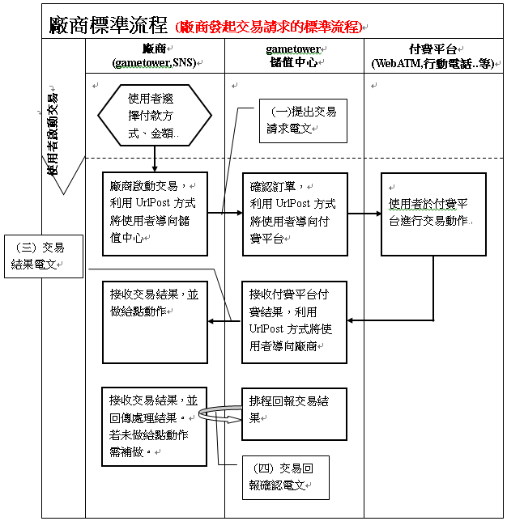
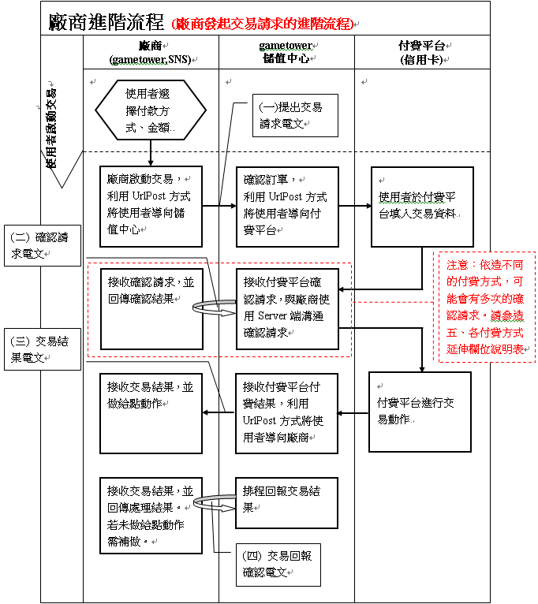
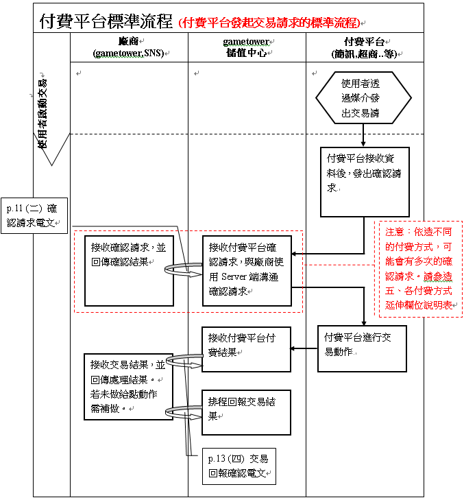
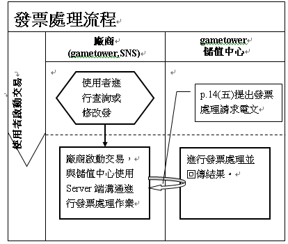
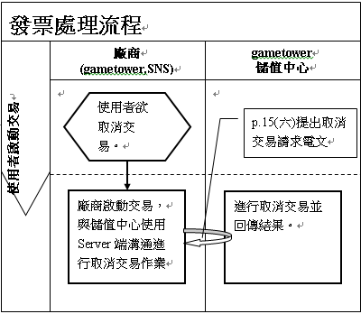
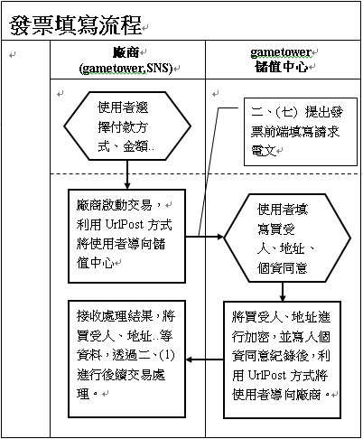
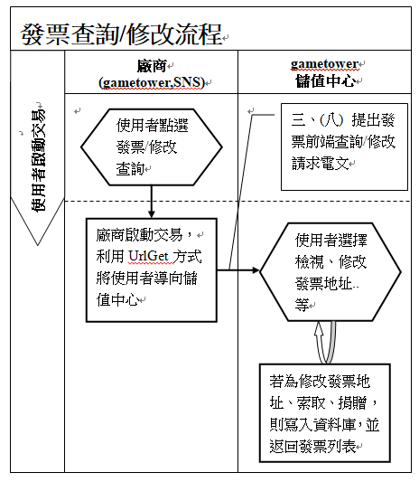
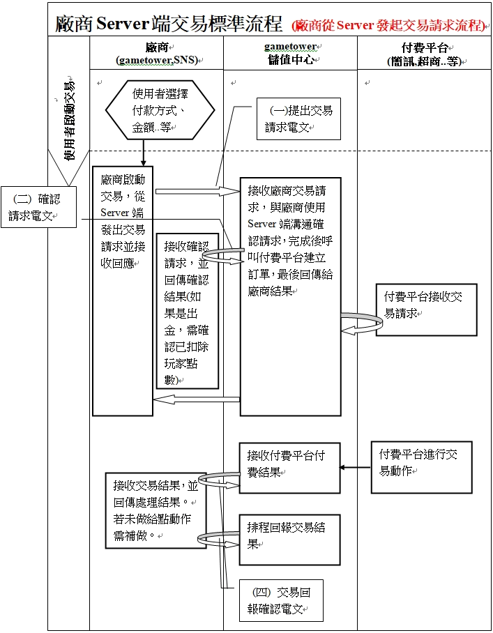
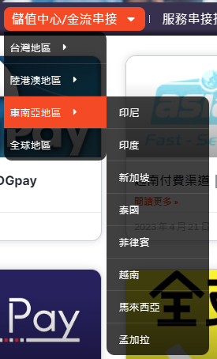

# gametower儲值中心-規格書

## 《更新歷程》


| 版本       | 更新日期   | 編輯者 | 更新內容說明                   |
| --- | --- |--- | ---|
| **0.5**    | 2010/12/06 | 魏嘉男 | 新建立文件                     |
| (略) |  |  |  |
| **1.71.0** | 2022/10/17 | 魏嘉男 | 新增(八)廠商Server端交易標準流程 |
| **1.72.0** | 2022/10/27 | 魏嘉男 | 刪除OffGamersCard國際充值通路與說明 |
| **1.73.0** | 2023/04/25 | 林子傑 | 部分內容轉移資訊站 |
| **1.74.0** | 2023/05/11 | 魏嘉男 | 修改(五)批准/取消交易流程<br/>新增(十四)查詢交易紀錄請求 |
| **1.75.0** | 2023/05/23 | 林子傑 | (1)四.付款方式代碼表新增 AFTEE |

## 一.交易流程種類說明
### (一)廠商標準流程

說明：使用者從廠商選擇付款方式、金額等資訊啟動的交易，並於付費平台完成交易。

適用付費平台：WebATM,SmartPay,ADSL、市話、行動電話輕鬆付、Alipay、ChinaPay..等。

**注意事項：有可能因為網路中斷或是付費平台的關係導致廠商端無收到(三)交易結果電文，且(三)交易結果電文 也不保證在 (四)交易回報確認電文之前發生，串接時必須考慮只收到(四)交易回報確認電文 或 先收到 (四)交易回報確認電文 再收到
(三)交易結果電文 的狀況。**



### (二)廠商進階流程

說明：標準交易流程中加上確認請求的動作，以核對使用者在付費平台提供的交易資料，例如使用者在信用卡付費平台輸入卡號，付費平台透過儲值中心將卡號回傳讓廠商確認此卡號是否可進行交易。

適用付費平台：信用卡。 **注意事項同 (一)廠商標準流程**



### (三)付費平台標準流程

說明：使用者從付費平台啟動的交易，驗證資料後完成交易。

適用付費平台：簡訊、語音儲值，便利超商輕鬆付。



### (四)發票處理流程

> **(因應新版個資法，降低個資外洩風險，已停用此流程，請改用流程六及七)**

說明：使用者進行查詢或是修改發票資料。

適用付費平台：需要發票資訊的付費方式(詳見【四、付款方式代碼表】)。



### (五)批准/取消交易流程

說明：廠商欲批准/取消交易。

適用廠商：有提供准/取消交易交易的廠商。(需跟gametower確認是否支援)



### (六)發票前端填寫流程

說明：使用者進行填寫發票資料。

適用付費平台：需要發票資訊的付費方式(**詳見【四、付款方式代碼表】**)。



### (七)發票前端查詢/修改流程

說明：使用者進行查詢或修改發票資料。

適用付費平台：需要發票資訊的付費方式(詳見【四、付款方式代碼表】)。



### (八)廠商Server端交易標準流程

說明：使用者從廠商選擇付款方式、金額等資訊啟動的交易，並從廠商端Server發起交易請求，儲值中心在過程中會進行確認請求的動作，以核對使用者是否已完成廠商端的必要作業(e.g.驗證已扣除玩家點數)，確認無誤後將訊息傳送給付費平台。

適用付費平台：純Server端溝通相關通路。 **注意事項同 (一)廠商標準流程**



## 二.溝通電文說明

1.  溝通方式：使用HTTPS協定(Port
    443)，透過POST方式傳輸交易電文，若當下有回傳值，則將回傳電文以Response.Write的方式回傳，並注意傳輸資料與加解密的編碼都使用UTF-8。

2. Response.Write回傳使用QueryString格式，並將VALUE做UrlEncode。

   ```
   Ex.PLATFORM_TRANS_NO=1&MEMO=%e9%ad%8f%e5%98%89%e7%94%b7&RESULT_CODE=00000& RESULT_MESSAGE=%e9%ad%8f%e5%98%89%e7%94%b7
   ```

3.  CHECK_CODE為驗證碼，避免資料在傳輸的過程中遭到竄改，以此值來確保廠商與儲值中心資料交換的安全性。CHECK_CODE計算方式是將接收或傳送的電文資料依照
    Key 排序，將所有 Value 相加(排除 CHECK_CODE
    參數)，最後加上雙方約定的金鑰(PRIVATE_KEY) ，再用 SHA1 加密而成。

注意：CHECK_CODE計算方式請參考**七、驗證碼計算說明與範例**。

4.  EXTEND
    為延伸欄位，使用在部份付費方式需要多餘的參數使用，格式一樣使用QueryString格式，並將VALUE做UrlEncode。例如便利超商輕鬆付帶便利超商通關碼，簡訊、語音帶手機號碼...等。由各付費方式自行定義使用，詳見【五、各付費方式延伸欄位說明表】

注意：回傳(Response.Write)的狀況下，EXTEND的VALUE會做UrlEncode，但是因為EXTEND又是回傳的VALUE，因此需將整串EXTEND再進行一次UrlEncode。

5.  儲值中心當交易完成時，會有排程定時與廠商確認廠商已完成交易，確認原則如下：

```
1.  交易後每 5 分鐘確認一次。
2.  30 分鐘後每 1 小時確認一次。
3.  72 小時後每 1 天確認一次。
4.  7 天後不再確認，走客服流程。
```
6.  由儲值中心排程進行的【(四)交易回報確認電文】，會包含請款已失敗**(RESULT_CODE!=000000)**以及請款已完成**(RESULT_CODE=000000)**的交易紀錄，如廠商收到處理無誤後請回傳RESULT_CODE為000000-處理完成，若在此之前已處理完成，則回RESULT_CODE為000001-已處理完成。

注意：若交易仍在請款進行中(交易中斷或是使用者尚未付款)，則無法回覆交易結果。

7.  回覆結果代號(RESULT_CODE)與回覆結果訊息(RESULT_MESSAGE)請參考六、回覆結果訊息表。

注意：若結果代號為000251，付費平台回傳的訊息會放在EXTEND欄位的PAYMENT_MESSAGE

8.  發票寄送方式值如下，以及INVOICE_KEY_VALUE所代表的意義：
```
1：紙本電子發票

2：gametower會員 未歸戶 不需要INVOICE_KEY_VALUE

3：選擇捐贈單位 INVOICE_KEY_VALUE = 愛心碼

4：自行決定捐贈單位 INVOICE_KEY_VALUE = 愛心碼

5：gametower會員 歸戶 不需要INVOICE_KEY_VALUE

6：手機條碼 INVOICE_KEY_VALUE = 手機條碼

7：自然人條碼 INVOICE_KEY_VALUE = 自然人條碼
```
9.  若傳輸的資料要進行AES加密時，AES的Mode為ECB、Padding為PCKS7，Key為PRIVATE_KEY的MD5雜湊值，且AES加密後進行Base64編碼。

10.  電文中所有decimal的欄位都是decimal(19,5)，就是整數位數最長為19，小數位數為5。


## 三.溝通電文格式

### (一)提出交易請求

| (一) 提出交易請求電文參數說明            |
| ---------------------------------------- |
| 將使用者透過Url Post送到儲值中心交易頁面 |

| 參數名稱          | 參數大小       | 必要 | 説明                                                         |
| ----------------- | -------------- | ---- | ------------------------------------------------------------ |
| PLATFORM          | varchar(15)    | 是   | 廠商ID                                                       |
| AMOUNT            | decimal(19, 5) | 是   | 交易金額<br/>若付費方式為【Game淘儲值卡】或【MyCard 儲值卡】請帶 0 |
| PLATFORM_TRANS_NO | varchar(50)    | 是   | 廠商訂單編號                                                 |
| CHECK_CODE        | char(40)       | 是   | 驗證碼                                                       |
| PAY_TYPE          | integer        | 是   | 付費方式 詳見【四、付款方式代碼表】                          |
| RETURN_URL        | varchar(255)   | 是   | 回傳網址                                                     |
| IDENTITY_1        | varchar(100)   | 是   | 使用者識別值_1                                               |
| IDENTITY_2        | varchar(100)   | 是   | 使用者識別值_2                                               |
| REMOTE_IP         | varchar(15)    | 是   | 使用者IP                                                     |
| EXTEND            | 無長度限制     | 否   | 延伸欄位                                                     |

### (二)請求確認

| (二) 請求確認電文參數說明                                    |
| ------------------------------------------------------------ |
| 儲值中心Server傳送Url Post到廠商接收頁面，廠商將結果Response.Write回覆 |

| 參數名稱          | 參數大小       | 必要 | 説明                                        |
| ----------------- | -------------- | ---- | ------------------------------------------- |
| PLATFORM          | varchar(15)    | 是   | 廠商ID                                      |
| AMOUNT            | decimal(19, 5) | 是   | 交易金額                                    |
| PLATFORM_TRANS_NO | varchar(50)    | 否   | 廠商訂單編號 若為廠商進階流程，則為必填欄位 |
| CHECK_CODE        | char(40)       | 是   | 驗證碼                                      |
| PAY_TYPE          | integer        | 是   | 付費方式 詳見【四、付款方式代碼表】         |
| CENTER_TRANS_NO   | char(19)       | 是   | 儲值中心訂單編號                            |
| EXTEND            | 無長度限制     | 否   | 延伸欄位                                    |

**廠商回覆參數**

| 參數名稱                       | 參數大小       | 必要 | 説明                           |
| ------------------------------ | -------------- | ---- | ------------------------------ |
| PLATFORM_TRANS_NO              | varchar(50)    | 是   | 廠商訂單編號                   |
| RESULT_CODE                    | varchar(6)     | 是   | 回覆結果代號                   |
| RESULT_MESSAGE                 | nvarchar(200)  | 是   | 回覆結果訊息                   |
| MEMO                           | nvarchar(200)  | 否   | 描述                           |
| EXTEND                         | 無長度限制     | 否   | 延伸欄位                       |

### (三)交易結果

| (三) 交易結果電文參數說明                     |
| --------------------------------------------- |
| 將使用者透過Url Post送到廠商指定的 RETURN_URL |

| 參數名稱          | 參數大小       | 必要 | 説明                                                         |
| ----------------- | -------------- | ---- | ------------------------------------------------------------ |
| PLATFORM          | varchar(15)    | 是   | 廠商ID                                                       |
| AMOUNT            | decimal(19, 5) | 是   | 交易金額                                                     |
| PLATFORM_TRANS_NO | varchar(50)    | 是   | 廠商訂單編號                                                 |
| CHECK_CODE        | char(40)       | 是   | 驗證碼                                                       |
| PAY_TYPE          | integer        | 是   | 付費方式 詳見【四、付款方式代碼表】                          |
| RETURN_URL        | varchar(255)   | 否   | 回傳網址<br/>廠商標準流程與廠商進階流程會將廠商送來的RETURN_URL回傳，提供給廠商有自訂參數最後可接回處理。 |
| CENTER_TRANS_NO   | char(19)       | 是   | 儲值中心訂單編號                                             |
| EXTEND            | 無長度限制     | 否   | 延伸欄位                                                     |
| RESULT_CODE       | varchar(6)     | 是   | 回覆結果代號                                                 |
| RESULT_MESSAGE    | nvarchar(200)  | 是   | 回覆結果訊息                                                 |
| SETTLE_DATETIME   | Varchar(19)    | 否   | 請款完成時間(yyyy/mm/dd hh:MM:ss)                            |

### (四)交易回報確認

| (四) 交易回報確認電文參數說明                                |
| ------------------------------------------------------------ |
| 儲值中心Server使用排程傳送Url Post到廠商接收頁面，廠商將結果Response.Write回覆 |

| 參數名稱          | 參數大小       | 必要 | 説明                                                         |
| ----------------- | -------------- | ---- | ------------------------------------------------------------ |
| PLATFORM          | varchar(15)    | 是   | 廠商ID                                                       |
| AMOUNT            | decimal(19, 5) | 是   | 交易金額                                                     |
| PLATFORM_TRANS_NO | varchar(50)    | 是   | 廠商訂單編號                                                 |
| CHECK_CODE        | char(40)       | 是   | 驗證碼                                                       |
| PAY_TYPE          | integer        | 是   | 付費方式 詳見【四、付款方式代碼表】                          |
| RETURN_URL        | varchar(255)   | 否   | 回傳網址<br/>廠商標準流程與廠商進階流程會將廠商送來的RETURN_URL回傳，提供給廠商有自訂參數最後可接回處理。 |
| CENTER_TRANS_NO   | char(19)       | 是   | 儲值中心訂單編號                                             |
| EXTEND            | 無長度限制     | 否   | 延伸欄位                                                     |
| RESULT_CODE       | varchar(6)     | 是   | 回覆結果代號                                                 |
| RESULT_MESSAGE    | nvarchar(200)  | 是   | 回覆結果訊息                                                 |
| SETTLE_DATETIME   | Varchar(19)    | 否   | 請款完成時間(yyyy/mm/dd hh:MM:ss)                            |

**廠商回覆參數**

| 參數名稱          | 參數大小      | 必要 | 説明         |
| ----------------- | ------------- | ---- | ------------ |
| PLATFORM_TRANS_NO | varchar(50)   | 是   | 廠商訂單編號 |
| RESULT_CODE       | varchar(6)    | 是   | 回覆結果代號 |
| RESULT_MESSAGE    | nvarchar(200) | 是   | 回覆結果訊息 |
| MEMO              | nvarchar(200) | 否   | 描述         |
| EXTEND            | 無長度限制    | 否   | 延伸欄位     |

### ~~(五)提出發票處理請求~~

**(因應新版個資法，降低個資外洩風險，已停用此電文格式，請改用電文格式八)**

### (六)提出批准/取消交易請求

| (六) 提出取消交易請求電文參數說明                            |
| ------------------------------------------------------------ |
| 廠商Server傳送Url Post到儲值中心接收頁面，儲值中心將結果Response.Write回覆<br />批准交易(改為成功)位置是 /common/receive/ApproveTrade.aspx<br/>取消交易(改為失敗)位置是 /common/receive/CancelTrade.aspx |

| 參數名稱          | 參數大小       | 必要 | 説明                                |
| ----------------- | -------------- | ---- | ----------------------------------- |
| PLATFORM          | varchar(15)    | 是   | 廠商ID                              |
| AMOUNT            | decimal(19, 5) | 是   | 交易金額                            |
| PLATFORM_TRANS_NO | varchar(50)    | 是   | 廠商訂單編號                        |
| CHECK_CODE        | char(40)       | 是   | 驗證碼                              |
| PAY_TYPE          | integer        | 是   | 付費方式 詳見【四、付款方式代碼表】 |
| CENTER_TRANS_NO   | char(19)       | 是   | 儲值中心訂單編號                    |

**儲值中心回覆參數**

| 參數名稱          | 參數大小      | 必要 | 説明         |
| ----------------- | ------------- | ---- | ------------ |
| RESULT_CODE       | varchar(6)    | 是   | 回覆結果代號 |
| RESULT_MESSAGE    | nvarchar(200) | 是   | 回覆結果訊息 |
| PLATFORM_TRANS_NO | varchar(50)   | 否   | 廠商訂單編號 |
| EXTEND            | 無長度限制    | 否   | 延伸欄位     |

### ~~(七)提出發票前端填寫請求~~

**(因應發票簡化流程，已停用此電文格式，發票部分由儲值中心處理即可)**

------------------------------------------------ ----------------- -------- ----------------------------------------
### (八) 發票記錄查詢

| 電文參數說明                                                 |
| ------------------------------------------------------------ |
| 見<br />http://support.towergame.com/?p=11682<br />1.查詢發票紀錄 |

### (九)查詢訂單交易結果請求

| (九) 查詢訂單交易結果參數說明                                |
| ------------------------------------------------------------ |
| 廠商Server傳送Url Post到儲值中心接收頁面，儲值中心將結果Response.Write回覆 |

| 參數名稱          | 參數大小    | 必要 | 說明                                        |
| ----------------- | ----------- | ---- | ------------------------------------------- |
| PLATFORM          | varchar(15) | 是   | 廠商ID                                      |
| PLATFORM_TRANS_NO | varchar(50) | 否   | 廠商訂單編號 與儲值中心訂單編號至少需填一個 |
| CENTER_TRANS_NO   | char(19)    | 否   | 儲值中心訂單編號 與廠商訂單編號至少需填一個 |
| CHECK_CODE        | char(40)    | 是   | 驗證碼                                      |
| PAY_TYPE          | integer     | 是   | 付費方式 詳見【四、付款方式代碼表】         |

**儲值中心回覆參數**

| 參數名稱          | 參數大小       | 必要 | 說明                                                         |
| ----------------- | -------------- | ---- | ------------------------------------------------------------ |
| PLATFORM          | varchar(15)    | 否   | 廠商ID                                                       |
| PAY_TYPE          | integer        | 否   | 付費方式 詳見【四、付款方式代碼表】                          |
| RESULT_CODE       | varchar(6)     | 是   | 回覆結果代號                                                 |
| RESULT_MESSAGE    | nvarchar(200)  | 是   | 回覆結果訊息                                                 |
|                   |                |      | 以下欄位也為回覆參數，分幾種狀況<br/>RESULT_CODE=000000(處理完成)會帶詳細資料<br/>RESULT_CODE=000006(交易進行中)會帶目前有的資料<br/>RESULT_CODE=000007(交易已失敗)會帶目前有的資料<br/>RESULT_CODE=000310(傳入訂單編號無相符資料)則會帶原來傳到儲值中心的資料<br/>其他RESULT_CODE表示發生異常，請稍候再試。並會帶原來傳到儲值中心的資料 |
| AMOUNT            | decimal(19, 5) | 否   | 交易金額                                                     |
| PLATFORM_TRANS_NO | varchar(50)    | 否   | 廠商訂單編號                                                 |
| RETURN_URL        | varchar(255)   | 否   | 回傳網址 廠商標準流程與廠商進階流程會將廠商送來的RETURN_URL回傳，提供給廠商有自訂參數最後可接回處理。 |
| CENTER_TRANS_NO   | char(19)       | 否   | 儲值中心訂單編號                                             |
| EXTEND            | 無長度限制     | 否   | 延伸欄位 會根據【五、各付費方式延伸欄位說明表】各付費方式的說明帶值，並加上PRICE資訊，如有NT_PRICE也會一併加上。 |

查詢訂單交易結果位置：

```
測試機：https://bank.twtest.towergame.com/common/receive/Service/QueryOrder.aspx
正式機：https://bank.gametower.com.tw/common/receive/Service/QueryOrder.aspx
```

### (十)交易前授權請求

| (十) 交易前授權參數說明                                      |
| ------------------------------------------------------------ |
| 廠商Server傳送Url Post到儲值中心接收頁面，儲值中心將結果Response.Write回覆 |

| 參數名稱          | 參數大小       | 必要 | 說明                                                         |
| ----------------- | -------------- | ---- | ------------------------------------------------------------ |
| PLATFORM          | varchar(15)    | 是   | 廠商ID                                                       |
| AMOUNT            | decimal(19, 5) | 是   | 交易金額 若付費方式為【Game淘儲值卡】或 【MyCard 儲值卡】請帶 0 |
| PLATFORM_TRANS_NO | varchar(50)    | 是   | 廠商訂單編號                                                 |
| CHECK_CODE        | char(40)       | 是   | 驗證碼                                                       |
| PAY_TYPE          | integer        | 是   | 付費方式 詳見【四、付款方式代碼表】                          |
| EXTEND            | 無長度限制     | 否   | 延伸欄位                                                     |

**儲值中心回覆參數**

| 參數名稱          | 參數大小       | 必要 | 說明                                |
| ----------------- | -------------- | ---- | ----------------------------------- |
| PLATFORM          | varchar(15)    | 否   | 廠商ID                              |
| PAY_TYPE          | integer        | 否   | 付費方式 詳見【四、付款方式代碼表】 |
| RESULT_CODE       | varchar(6)     | 是   | 回覆結果代號                        |
| RESULT_MESSAGE    | nvarchar(200)  | 是   | 回覆結果訊息                        |
| AMOUNT            | decimal(19, 5) | 否   | 交易金額                            |
| PLATFORM_TRANS_NO | varchar(50)    | 否   | 廠商訂單編號                        |
| CENTER_TRANS_NO   | char(19)       | 否   | 儲值中心訂單編號                    |
| EXTEND            | 無長度限制     | 否   | 延伸欄位                            |

### (十一)發票選擇差異說明

| 電文參數說明                                                 |
| ------------------------------------------------------------ |
| 見<br />http://support.towergame.com/?p=11682<br />2.發票選擇差異說明頁 |

### (十二)發票歸戶

| 電文參數說明                                                 |
| ------------------------------------------------------------ |
| 見<br />http://support.towergame.com/?p=11682<br />3.從遊戲端發起發票歸戶 |

### (十三)修改發票預設值

| 電文參數說明                                                 |
| ------------------------------------------------------------ |
| 見<br />http://support.towergame.com/?p=11682<br />4.設定發起交易時發票預設值 |

### (十四)查詢交易紀錄請求

適用廠商：有提供准/取消交易交易的廠商。(需跟gametower確認是否支援)

| (十四) 查詢交易紀錄參數說明                                  |
| ------------------------------------------------------------ |
| 廠商Server傳送Url Post到儲值中心接收頁面，儲值中心將結果Response.Write回覆資料<br/>/common/receive/QueryTransRecord.aspx |

| 參數名稱       | 參數大小     | 必要 | 說明                                |
| -------------- | ------------ | ---- | ----------------------------------- |
| PLATFORM       | varchar(15)  | 是   | 廠商ID                              |
| START_DATETIME | Varchar(19)  | 是   | 查詢開始時間(yyyy/mm/dd hh:MM:ss)   |
| END_DATETIME   | Varchar(19)  | 是   | 查詢結束時間(yyyy/mm/dd hh:MM:ss)   |
| PAY_TYPE       | integer      | 否   | 付費方式 詳見【四、付款方式代碼表】 |
| IDENTITY_1     | varchar(100) | 否   | 使用者識別值_1                      |
| PAGE           | integer      | 否   | 頁數，default為1                    |
| PAGE_SIZE      | integer      | 否   | 每頁筆數，default為 20              |
| CHECK_CODE     | char(40)     | 是   | 驗證碼                              |

**儲值中心回覆參數**

| 參數名稱       | 參數大小      | 必要 | 說明               |
| -------------- | ------------- | ---- | ------------------ |
| PLATFORM       | varchar(15)   | 否   | 廠商ID             |
| RESULT_CODE    | varchar(6)    | 是   | 回覆結果代號       |
| RESULT_MESSAGE | nvarchar(200) | 是   | 回覆結果訊息       |
| DATA           | string        | 否   | 回傳資料(JSON格式) |

**DATA回傳資料(JSON格式)參數**

| 參數名稱       | 參數大小       | 必要 | 說明               |
| -------------- | -------------- | ---- | ------------------ |
| PAGE       | integer    | 是   | 頁數             |
| PAGE_SIZE | integer | 是   | 每頁筆數   |
| TOTAL | integer | 是   | 總筆數       |
| ITEMS    | string | 是   | 資料列表(JSON Array格式)           |

**ITEMS資料列表(JSON Array單筆格式)參數**

| 參數名稱       | 參數大小       | 必要 | 說明               |
| -------------- | -------------- | ---- | ------------------ |
| PAY_TYPE             | integer        | 是   | 付費方式 詳見【四、付款方式代碼表】                       |
| CENTER_TRANS_NO      | char(19)       | 是   | 儲值中心訂單編號                                          |
| PLATFORM_TRANS_NO    | varchar(50)    | 是   | 廠商訂單編號                                              |
| TRADE_TRANS_NO       | varchar(50)    | 否   | 付費方式訂單編號                                          |
| IDENTITY_1           | varchar(100)   | 否   | 使用者識別值_1                                            |
| IDENTITY_2           | varchar(100)   | 否   | 使用者識別值_2                                            |
| TYPE                 | integer        | 是   | 狀態：<br/>1-失敗 2-進行中 3-已成功 4-取消授權 5-取消請款 |
| TRANS_RETURN_CODE    | varchar(30)    | 否   | 交易回傳的錯誤代碼                                        |
| TRANS_RETURN_MESSAGE | nvarchar(500)  | 否   | 交易回傳的錯誤訊息                                        |
| CURRENCY_ID          | varchar(3)     | 是   | 貨幣別                                                    |
| AMOUNT               | decimal(19, 5) | 是   | 交易金額                                                  |
| PRICE                | decimal(19, 5) | 是   | 交易價值                                                  |
| FEE                  | decimal(19, 5) | 是   | 交易費用                                                  |
| SETTLE_DATETIME      | Varchar(19)    | 否   | 請款完成時間(yyyy/mm/dd hh:MM:ss)                         |
| C_DATETIME | Varchar(19) | 是 | 訂單建立時間(yyyy/mm/dd hh:MM:ss) |
| E_DATETIME | Varchar(19) | 否 | 訂單修改時間(yyyy/mm/dd hh:MM:ss) |
| REMARK | nvarchar(2000) | 否 | 備註 |

## 四.付款方式代碼表

各地區渠道整理

http://support.towergame.com/?page_id=16420



| 付費方式(PAY_TYPE) | 付費方式說明 | 適用交易流程 | 是否需要發票資訊 | 是否可取消交易 | 說明 |
|----------------|--------|----------|---------|---------|----------------|
| 1 | Game 淘儲值卡 | (一)廠商標準流程 | | | 見<br/>http://support.towergame.com/?p=11076 |
| 22 | 玉山銀行 Web ATM | (一)廠商標準流程 | 是 | 是 | 見<br>http://support.towergame.com/?p=11123 |
| 31 | 中國信託 Smart Pay | (一)廠商標準流程 | 是 | 是 | 見<br>http://support.towergame.com/?p=11129 |
| 32 | 玉山銀行Smart Pay | (一)廠商標準流程 | 是 | 是 | 見<br>http://support.towergame.com/?p=11131 |
| 42 | 中華國際手機簡訊輕鬆付 | (三)付費平台標準流程 | | |  |
| 51 | 市話輕鬆付 | (一)廠商標準流程 |  | 是 | 見<br>http://support.towergame.com/?p=11141 |
| 61 | 中華電信行動輕鬆付 | (一)廠商標準流程 |  | 是 | 見<br/>http://support.towergame.com/?p=11141 |
| 62 | 遠傳電信行動輕鬆付 | (一)廠商標準流程 |  | 是 | 見<br/>http://support.towergame.com/?p=11141 |
| 63 | 台灣大哥大行動輕鬆付 | (一)廠商標準流程 |  | 是 | 見<br/>http://support.towergame.com/?p=11141 |
| 64 | 亞太電信行動輕鬆付 | (一)廠商標準流程 |  | 是 | 見<br/>http://support.towergame.com/?p=11141 |
| 72 | HiNet ADSL 輕鬆付 | (一)廠商標準流程 |  | 是 | 見<br/>http://support.towergame.com/?p=11141 |
| 91 | Go!Card 儲值卡 | (一)廠商標準流程 |  |  | 見<br/>http://support.towergame.com/?p=15690 |
| 92 | NOW_POINT 增值計畫 | (三)付費平台標準流程 |  |  | 提出交易請求電文連結位置：<br/>測試機：https://bank-twtest.towergame.com/common/receive/NowPoint/AutoMsgClient.aspx<br/>正式機：https://bank.gametower.com.tw/common/receive/NowPoint/AutoMsgClient.aspx<br/>可直接串接的儲值中心：台版儲值中心(※若欲串接的儲值中心不在明細內，則專案串接時程需包含網頁組進行搬移作業的時間) |
| 104 | 銀聯國際充值 | (一)廠商標準流程 | | | 見<br/>http://support.towergame.com/?p=15729 |
| 106 | MOL 國際充值 | (一)廠商標準流程 |  |  | 見<br />http://support.towergame.com/?p=20205 |
| 109 | Google Play 國際充值 | (三)付費平台標準流程 |  |  | 見<br/>http://support.towergame.com/?p=25234 |
| 117 | AppStore 國際充值 | (三)付費平台標準流程 |  |  | 見<br/>http://support.towergame.com/?p=25263 |
| 120 | MOL Card 國際充值 | (一)廠商標準流程 |  |  | 見<br/>http://support.towergame.com/?p=20212 |
| 126 | FunPay 全家立即儲 | (一)廠商標準流程 |  |  | 見<br/>http://support.towergame.com/?p=11154 |
| 127 | 信用卡 | (一)廠商標準流程 | | | 見<br/>http://support.towergame.com/?p=11159 |
| 129 | 港澳Visa信用卡 | (一)廠商標準流程 | | | 見<br/>http://support.towergame.com/?p=15735 |
| 130 | 八達通 | (一)廠商標準流程 | | | 見<br/>http://support.towergame.com/?p=15738 |
| 131 | MyCard 儲值卡 | (一)廠商標準流程 | | | 見<br/>http://support.towergame.com/?p=11172 |
| 132 | GASH卡 | (一)廠商標準流程 | | | 見<br/>http://support.towergame.com/?p=11174 |
| 133 | 藍新信用卡 | (一)廠商標準流程 | | | 請參考127-信用卡說明 |
| 134 | 中國信託信用卡 | (一)廠商標準流程 | | | 請參考127-信用卡說明 |
| 151 | FunApp(天天賺)儲值 | (一)廠商標準流程 | | | 見<br/>http://support.towergame.com/?p=11177 |
| 165 | 萊爾富代碼儲值 | (一)廠商標準流程 | 是 | 是 | 見<br/>http://support.towergame.com/?p=11180 |
| 166 | OK代碼儲值 | (一)廠商標準流程 | 是 | 是 | 見<br/>http://support.towergame.com/?p=11180 |
| 168 | BankTransfers(CodaPay) | (一)廠商標準流程 | | | 見<br/>http://support.towergame.com/?p=20225 |
| 169 | Alfamart(CodaPay) | (一)廠商標準流程 | | | 見<br/>http://support.towergame.com/?p=20225 |
| 170 | TrueMoney(CodaPay) | (一)廠商標準流程 | | | 見<br/>http://support.towergame.com/?p=20225 |
| 171 | Indomaret(CodaPay) | (一)廠商標準流程 | | | 見<br/>http://support.towergame.com/?p=20225 |
| 172 | DokuWallet(CodaPay) | (一)廠商標準流程 | | | 見<br/>http://support.towergame.com/?p=20225 |
| 173 | Go-Pay(CodaPay) | (一)廠商標準流程 | | | 見<br/>http://support.towergame.com/?p=20225 |
| 176 | UPay - 越南 - 儲值卡 | (一)廠商標準流程 | | | 見<br/>http://support.towergame.com/?p=20614 |
| 182 | iWinCard - 儲值卡 | (一)廠商標準流程 | | | 見<br/>http://support.towergame.com/?p=11190 |
| 185 | 閃快 – 支付寶儲值 | (一)廠商標準流程 | | | 見<br/>http://support.towergame.com/?p=15740 |
| 186 | Linepay一卡通 | (一)廠商標準流程 | | | 見<br/>http://support.towergame.com/?p=11192 |
| 187 | `Indonesia``OVO (CodaPay)` | (一)廠商標準流程 | | | 見<br/>http://support.towergame.com/?p=20225 |
| 188 | `Indonesia``DANA (CodaPay)` | (一)廠商標準流程 | | | 見<br/>http://support.towergame.com/?p=20225 |
| 189 | `Indonesia``Telkomsel (CodaPay)` | (一)廠商標準流程 | | | 見<br/>http://support.towergame.com/?p=20225 |
| 190 | `Indonesia``Indosat (CodaPay)` | (一)廠商標準流程 | | | 見<br/>http://support.towergame.com/?p=20225 |
| 191 | `Indonesia``XL(CodaPay)` | (一)廠商標準流程 | | | 見<br/>http://support.towergame.com/?p=20225 |
| 192 | `Indonesia``Tri(CodaPay)` | (一)廠商標準流程 | | | 見<br/>http://support.towergame.com/?p=20225 |
| 193 | `Indonesia``Smartfren (CodaPay)` | (一)廠商標準流程 | | | 見<br/>http://support.towergame.com/?p=20225 |
| 194 | GASH會員轉點 | (一)廠商標準流程 | | | 見<br/>http://support.towergame.com/?p=11188 |
| 200 | 馬來 GrabPay (CodaShop) | (三)付費平台標準流程 | | | 見<br/>http://support.towergame.com/?p=20234 |
| 201 | 馬來 Boost (CodaShop) | (三)付費平台標準流程 | | | 見<br/>http://support.towergame.com/?p=20234 |
| 202 | 馬來 Touch 'n Go (CodaPay) | (一)廠商標準流程 | | | 見<br/>http://support.towergame.com/?p=20225 |
| 202 | 馬來 Touch 'n Go (CodaShop) | (三)付費平台標準流程 | | | 見<br/>http://support.towergame.com/?p=20234 |
| 203 | Singapore  GrabPay (CodaPay) | (一)廠商標準流程 | | | 見<br/>http://support.towergame.com/?p=20225 |
| 204 | Singapore  PayNow (CodaPay) | (一)廠商標準流程 | | | 見<br/>http://support.towergame.com/?p=20225 |
| 206 | MyBillingPay MyCard轉點 | (一)廠商標準流程 | | 是 | 見<br/>http://support.towergame.com/?p=11194 |
| 207 | 泰國 Rabbit LINE Pay (CodaShop) | (三)付費平台標準流程 | |  | 見<br/>http://support.towergame.com/?p=20234 |
| 208 | 泰國 True Money Wallet (CodaShop) | (三)付費平台標準流程 | |  | 見<br/>http://support.towergame.com/?p=20234 |
| 209 | 泰國 Bank Transfer (CodaShop) | (三)付費平台標準流程 | |  | 見<br/>http://support.towergame.com/?p=20234 |
| 210 | 泰國 7 Eleven (CodaShop) | (三)付費平台標準流程 | |  | 見<br/>http://support.towergame.com/?p=20234 |
| 211 | 泰國 Card Payment (CodaShop) | (三)付費平台標準流程 | |  | 見<br/>http://support.towergame.com/?p=20234 |
| 212 | MyBillingPay台灣Pay | (一)廠商標準流程 | |  | 見<br/>http://support.towergame.com/?p=11196 |
| 213 | MyBillingPay合作金庫WebATM | (一)廠商標準流程 | |  | 見<br/>http://support.towergame.com/?p=20120 |
| 214 | MyBillingPay上海銀行WebATM | (一)廠商標準流程 | |  | 見<br/>http://support.towergame.com/?p=20120 |
| 215 | MyBillingPay土地銀行WebATM | (一)廠商標準流程 | |  | 見<br/>http://support.towergame.com/?p=20120 |
| 216 | MyBillingPay中國信託WebATM | (一)廠商標準流程 | |  | 見<br/>http://support.towergame.com/?p=20120 |
| 217 | MyBillingPay中華郵政WebATM | (一)廠商標準流程 | |  | 見<br/>http://support.towergame.com/?p=20120 |
| 218 | MyBillingPay台北富邦WebATM | (一)廠商標準流程 | |  | 見<br/>http://support.towergame.com/?p=20120 |
| 219 | MyBillingPay台新銀行WebATM | (一)廠商標準流程 | |  | 見<br/>http://support.towergame.com/?p=20120 |
| 220 | MyBillingPay台灣銀行WebATM | (一)廠商標準流程 | |  | 見<br/>http://support.towergame.com/?p=20120 |
| 221 | MyBillingPay玉山銀行WebATM | (一)廠商標準流程 | |  | 見<br/>http://support.towergame.com/?p=20120 |
| 222 | MyBillingPay兆豐銀行WebATM | (一)廠商標準流程 | |  | 見<br/>http://support.towergame.com/?p=20120 |
| 223 | MyBillingPay第一銀行WebATM | (一)廠商標準流程 | |  | 見<br/>http://support.towergame.com/?p=20120 |
| 224 | MyBillingPay華南銀行WebATM | (一)廠商標準流程 | |  | 見<br/>http://support.towergame.com/?p=20120 |
| 225 | MyBillingPay彰化銀行WebATM | (一)廠商標準流程 | |  | 見<br/>http://support.towergame.com/?p=20120 |
| 226 | MyBillingPay銀行轉帳 | (一)廠商標準流程 | |  | 見<br/>http://support.towergame.com/?p=20123 |
| 227 | 馬來 Bank Transfers FPX (CodaShop) | (三)付費平台標準流程 | | | 見<br/>http://support.towergame.com/?p=20234 |
| 228 | 馬來 Card Payment (CodaShop) | (三)付費平台標準流程 | | | 見<br/>http://support.towergame.com/?p=20234 |
| 229 | 馬來 Shopee Pay (CodaShop) | (三)付費平台標準流程 | | | 見<br/>http://support.towergame.com/?p=20234 |
| 230 | 泰國 Coda Cash (CodaShop) | (三)付費平台標準流程 | | | 見<br/>http://support.towergame.com/?p=20234 |
| 231 | 泰國 KPlus (CodaShop) | (三)付費平台標準流程 | | | 見<br/>http://support.towergame.com/?p=20234 |
| 232 | 泰國 TrueMoney CashCard (CodaShop) | (三)付費平台標準流程 | | | 見<br/>http://support.towergame.com/?p=20234 |
| 233 | 馬來 Bank Transfers MAE (CodaShop) | (三)付費平台標準流程 | | | 見<br/>http://support.towergame.com/?p=20234 |
| 234 | 全支付 | (一)廠商標準流程 | | | 見<br/>http://support.towergame.com/?p=25548 |
| 235 | Gash信用卡 | (一)廠商標準流程 | | | 請參考127-信用卡說明 |
| 239 | AFTEE | (一)廠商標準流程 | | | 見<br/>http://support.towergame.com/?p=28435 |
| 501 | MOL泰國版_12Call卡 | (一)廠商標準流程 | | | 見<br/>http://support.towergame.com/?p=20704 |
| 502 | MOL泰國版_TrueMoney卡 | (一)廠商標準流程 | | | 見<br/>http://support.towergame.com/?p=20704 |
| 504 | MOL泰國版_MOLPoints卡 | (一)廠商標準流程 | | | 見<br/>http://support.towergame.com/?p=20704 |
| 505 | MOL泰國版_簡訊儲值 | (一)廠商標準流程 | | | 見<br/>http://support.towergame.com/?p=20704 |
| 506 | MOL泰國版_LINEPAY儲值 | (一)廠商標準流程 | | | 見<br/>http://support.towergame.com/?p=20704 |
| 507 | MOL泰國版_MPAY儲值 | (一)廠商標準流程 | | | 見<br/>http://support.towergame.com/?p=20704 |
| 508 | MOL泰國版_TRUEWALLET儲值 | (一)廠商標準流程 | | | 見<br/>http://support.towergame.com/?p=20704 |
| 509 | MOL泰國版_BAY儲值(網路銀行) | (一)廠商標準流程 | | | 見<br/>http://support.towergame.com/?p=20704 |
| 510 | MOL泰國版_BBL儲值(網路銀行) | (一)廠商標準流程 | | | 見<br/>http://support.towergame.com/?p=20704 |
| 511 | MOL泰國版_KTB儲值(網路銀行) | (一)廠商標準流程 | | | 見<br/>http://support.towergame.com/?p=20704 |
| 512 | MOL泰國版_SCB儲值(網路銀行) | (一)廠商標準流程 | | | 見<br/>http://support.towergame.com/?p=20704 |
| 513 | MOL泰國版_KBank儲值(網路銀行) | (一)廠商標準流程 | | | 見<br/>http://support.towergame.com/?p=20704 |
| 651 | PiPay儲值 | (一)廠商標準流程 | | | 見<br/>http://support.towergame.com/?p=20707 |
| 652 | Wing儲值(Cash In) | (一)廠商標準流程 | | | 見<br/>http://support.towergame.com/?p=20711 |
| 654 | 1ClickPay | (一)廠商標準流程 | | | 見<br/>http://support.towergame.com/?p=20721 |
| 661 | 越南聯發 VGPAY | (一)廠商標準流程 | | | 見<br/>http://support.towergame.com/?p=20717 |
| 666 | KolaPay | (一)廠商標準流程 | | | 見<br/>http://support.towergame.com/?p=25720 |
| 672 | HonorPay | (一)廠商標準流程 | | | 見<br/>http://support.towergame.com/?p=26582 |
| 701 | Globe (CodaPay) | (一)廠商標準流程 | | | 見<br/>http://support.towergame.com/?p=20225 |
| 702 | Bank Transfer (CodaPay) | (一)廠商標準流程 | | | 見<br/>http://support.towergame.com/?p=20225 |
| 703 | GCash (CodaPay) | (一)廠商標準流程 | | | 見<br/>http://support.towergame.com/?p=20225 |
| 704 | 7-Eleven PH (CodaPay) | (一)廠商標準流程 | | | 見<br/>http://support.towergame.com/?p=20225 |
| 705 | Convenience Store (CodaPay) | (一)廠商標準流程 | | | 見<br/>http://support.towergame.com/?p=20225 |
| 706 | GrabPay (CodaPay) | (一)廠商標準流程 | | | 見<br/>http://support.towergame.com/?p=20225 |
| 708 | JSTPay | (一)廠商標準流程 | | | 見<br/>http://support.towergame.com/?p=20729 |
| 710 | 肥宝支付 | (一)廠商標準流程 | | | 見<br/>http://support.towergame.com/?p=20737 |
| 715 | SHPPay | (一)廠商標準流程 | | | 見<br/>http://support.towergame.com/?p=20741 |
| 717 | Baofei | (一)廠商標準流程 | | | 見<br/>http://support.towergame.com/?p=20746 |
| 719 | LRPay | (一)廠商標準流程 | | | 見<br/>http://support.towergame.com/?p=24775 |
| 721 | ZINPay | (一)廠商標準流程 | | | 見<br/>http://support.towergame.com/?p=25444 |
| 723 | IrPhpPay | (一)廠商標準流程 | | | 見<br/>http://support.towergame.com/?p=27336 |
| 801 | Momo_QR (VNPay) | (一)廠商標準流程 | | | 見<br/>http://support.towergame.com/?p=20761 |
| 802 | Zalo_QR (VNPay) | (一)廠商標準流程 | | | 見<br/>http://support.towergame.com/?p=20761 |
| 803 | Upacp_PC (VNPay) | (一)廠商標準流程 | | | 見<br/>http://support.towergame.com/?p=20761 |
| 804 | Bank_Transfer (VNPay) | (一)廠商標準流程 | | | 見<br/>http://support.towergame.com/?p=20761 |
| 805 | Bank_QR (VNPay) | (一)廠商標準流程 | | | 見<br/>http://support.towergame.com/?p=20761 |
| 806 | Viettel_QR (VNPay) | (一)廠商標準流程 | | | 見<br/>http://support.towergame.com/?p=20761 |
| 807 | Viettel_Fix_QR  (VNPay) | (一)廠商標準流程 | | | 見<br/>http://support.towergame.com/?p=20761 |
| 808 | Rcgcard_PC  (VNPay) | (一)廠商標準流程 | | | 見<br/>http://support.towergame.com/?p=20761 |
| 809 | Momo_QR (TruePay) | (一)廠商標準流程 | | | 見<br/>http://support.towergame.com/?p=20787 |
| 810 | Zalo_QR (TruePay) | (一)廠商標準流程 | | | 見<br/>http://support.towergame.com/?p=20787 |
| 811 | Bank_Transfer (TruePay) | (一)廠商標準流程 | | | 見<br/>http://support.towergame.com/?p=20787 |
| 812 | Bank_QR (TruePay) | (一)廠商標準流程 | | | 見<br/>http://support.towergame.com/?p=20787 |
| 813 | Momo_QR (HiPay) | (一)廠商標準流程 | | | 見<br/>http://support.towergame.com/?p=20791 |
| 814 | Zalo_QR (HiPay) | (一)廠商標準流程 | | | 見<br/>http://support.towergame.com/?p=20791 |
| 815 | Bank_QR (HiPay) | (一)廠商標準流程 | | | 見<br/>http://support.towergame.com/?p=20791 |
| 816 | eBank(HiPay) | (一)廠商標準流程 | | | 見<br/>http://support.towergame.com/?p=20791 |
| 817 | Bank_Transfer (HiPay) | (一)廠商標準流程 | | | 見<br/>http://support.towergame.com/?p=20791 |
| 818 | Viettel_QR (HiPay) | (一)廠商標準流程 | | | 見<br/>http://support.towergame.com/?p=20791 |
| 820 | Momo_QR (1SPay) | (一)廠商標準流程 | | | 見<br/>http://support.towergame.com/?p=24060 |
| 821 | Zalo_QR (1SPay) | (一)廠商標準流程 | | | 見<br/>http://support.towergame.com/?p=24060 |
| 822 | Bank_QR (1SPay) | (一)廠商標準流程 | | | 見<br/>http://support.towergame.com/?p=24060 |
| 823 | Viettel_QR (1SPay) | (一)廠商標準流程 | | | 見<br/>http://support.towergame.com/?p=24060 |
| 824 | MM1S (1SPay) | (一)廠商標準流程 | | | 見<br/>http://support.towergame.com/?p=24060 |
| 826 | Bank_QR (FYPay) | (一)廠商標準流程 | | | 見<br/>http://support.towergame.com/?p=23569 |
| 827 | Momo_QR (FYPay) | (一)廠商標準流程 | | | 見<br/>http://support.towergame.com/?p=23569 |
| 836 | QR_Pro (AsiaPay) | (一)廠商標準流程 | | | 見<br/>http://support.towergame.com/?p=27626 |
| 837 | Bank_Transfer (AsiaPay) | (一)廠商標準流程 | | | 見<br/>http://support.towergame.com/?p=27626 |
| 838 | Bank_QR (AsiaPay) | (一)廠商標準流程 | | | 見<br/>http://support.towergame.com/?p=27626 |
| 839 | Momo_QR (AsiaPay) | (一)廠商標準流程 | | | 見<br/>http://support.towergame.com/?p=27626 |
| 840 | Zalo_QR (AsiaPay) | (一)廠商標準流程 | | | 見<br/>http://support.towergame.com/?p=27626 |
| 841 | Viettel_QR (AsiaPay) | (一)廠商標準流程 | | | 見<br/>http://support.towergame.com/?p=27626 |
| 842 | Card_PC (AsiaPay) | (一)廠商標準流程 | | | 見<br/>http://support.towergame.com/?p=27626 |
| 844 | Momo_QR (DGPay) | (一)廠商標準流程 | | | 見<br/>http://support.towergame.com/?p=27798 |
| 845 | Zalo_QR (DGPay) | (一)廠商標準流程 | | | 見<br/>http://support.towergame.com/?p=27798 |
| 846 | Bank_QR (DGPay) | (一)廠商標準流程 | | | 見<br/>http://support.towergame.com/?p=27798 |
| 847 | Viettel_QR (DGPay) | (一)廠商標準流程 | | | 見<br/>http://support.towergame.com/?p=27798 |
| 851 | UPI (IndPay) | (一)廠商標準流程 | | | 見<br/>http://support.towergame.com/?p=23614 |
| 861 | Bkash (Yangon) | (一)廠商標準流程 | | | 見<br/>http://support.towergame.com/?p=23639 |
| 862 | Rocket (Yangon) | (一)廠商標準流程 | | | 見<br/>http://support.towergame.com/?p=23639 |
| 863 | Nagad (Yangon) | (一)廠商標準流程 | | | 見<br/>http://support.towergame.com/?p=23639 |
| 891 | GCash_Qr (Dafa) | (一)廠商標準流程 | | | 見<br/>http://support.towergame.com/?p=23643 |

## 五.各付費方式延伸欄位說明表

常用渠道 EXTEND 規格已整合到<b>四.付款方式代碼表</b>

| 付費方式                                                     | 電文階段                                                     | 傳遞者                | 延伸欄位規格說明                                             |
| ------------------------------------------------------------ | ------------------------------------------------------------ | --------------------- | ------------------------------------------------------------ |
| 中華國際簡訊<br>中華國際語音                                 | (二) 確認請求電文                                            | 儲值中心<br>↓<br>廠商 | (1)資格確認：<br>PHONE=8869xxxxxxxx&SMS_MESSAGE=yyy<br>PHONE：用戶門號，使用8869xxxxxxxx門號格式傳遞<br>SMS_MESSAGE：用戶發送的簡訊或語音內容<br>(2) 簡訊發送結果通知：<br>SEND_RESULT=000000<br>SEND_RESULT：簡訊發送結果訊息，char(6)。<br>成功為 000000，否則為錯誤訊息、或是付費平台回應的資訊 |
| 中華國際簡訊<br>中華國際語音                                 | (二) 確認請求電文                                            | 廠商<br>↓<br>儲值中心 | (1)資格確認回覆：<br>SMS_MESSAGE= yyy<br>&IDENTITY_1=yyy&IDENTITY_2=zzz<br>SMS_MESSAGE：要回覆給用戶的簡訊內容， varchar(70)<br>IDENTITY_1：廠商用戶識別值1，varchar(100)<br>IDENTITY_2：廠商用戶識別值2，varchar(100)<br>(2) 簡訊發送結果通知回覆：<br>無需回覆 |
| NOW_POINT 增值計畫                                           | (二) 確認請求電文<br>前端選擇品項的檢驗，<br>不需要新增資料，<br>且CENTER_TRANS_NO<br>不會帶值，回傳也不需<br>回傳<br>PLATFORM_TRANS_NO | 儲值中心<br>↓<br>廠商 | USER_ID=xxxxxxxx<br>USER_ID：檢驗是否可儲值的帳號            |
| NOW_POINT 增值計畫                                           | (二) 確認請求電文                                            | 儲值中心<br>↓<br>廠商 | PRODUCT_ID=1&USER_ID=xxxxxxxx &CURRENCY_ID=HKD<br>&NOW_ORDER_NO=123456<br>PRODUCT_ID：雙方定義的品項ID，varchar(20)<br>USER_ID：欲儲值的帳號<br>CURRENCY_ID：欲儲值的貨幣ID，varchar(10)<br>NOW_ORDER_NO：NOW訂單編號 |
| NOW_POINT 增值計畫                                           | (二) 確認請求電文                                            | 廠商<br>↓<br>儲值中心 | IDENTITY_1=yyy&IDENTITY_2=zzz<br>IDENTITY_1：廠商用戶識別值1，varchar(100)<br>IDENTITY_2：廠商用戶識別值2，varchar(100) |
| NOW_POINT 增值計畫                                           | (三) 交易結果電文<br>(四) 交易回報確認電文                   | 儲值中心<br>↓<br>廠商 | PRODUCT_ID=1&CURRENCY_ID=HKD<br>&CURRENCY_RATE=30.1&NT_AMOUNT=35.2<br>&NT_PRICE=28.5<br>PRODUCT_ID：雙方定義的品項ID，varchar(20)<br>CURRENCY_ID：欲儲值的貨幣ID，varchar(10)<br>CURRENCY_RATE：該貨幣的買進匯率，decimal<br>NT_AMOUNT：換算的台幣金額，decimal<br>NT_PRICE：換算的台幣價值 |
| 需要發票資訊的付費方式                                       | (七)  提出發票填寫請求電文                                   | 廠商<br>↓<br>儲值中心 | 1.   PRODUCT_NAME=商品名稱<br>&EMAIL=電子郵件信箱<br>注意：<br>若無PRODUCT_NAME參數值，則前端網頁介面不會顯示商品資訊<br>若無EMAIL參數值，則前端網頁介面會顯示「電子郵件信箱」欄位，要求使用者填寫 (必填) |
| 適用所有付費方式                                             | (九) 查詢訂單交易結果電文                                    | 儲值中心<br>↓<br>廠商 | **會根據****【五、各付費方式延伸欄位說明表】****各付費方式的說明帶值，並加上PRICE資訊，如有NT_PRICE也會一併加上。** |

## 六.回覆結果訊息表

規格說明：訊息代碼共六碼，各別意義拆解如下

前三碼為付費方式代碼，若為000代表為共用訊息，其他則代表該付費方式專用。

後三碼的第一碼為發送訊息方向，0-共用，1~5的區段為儲值中心告知廠商，6~9的區段為廠商告知儲值中心，並就錯誤內容再自行區分區段。

**注意：若訊息代碼為000251，付費平台回傳的訊息會放在EXTEND欄位的PAYMENT_MESSAGE**

| 訊息代碼 | 訊息說明                                                     |
| -------- | ------------------------------------------------------------ |
|          | 成功回覆代碼，適用所有電文                                   |
| 000000   | 處理完成                                                     |
| 000001   | 已處理完成                                                   |
|          | 前端成功回覆代碼，但是不可作為請款依據，須依造(四) 交易回報確認電文回覆成功才給點(000000 or 000001) |
| 000002   | 處理成功但是不進行請款                                       |
| 000003   | 恭喜您完成本次交易流程，如有問題請洽客服。                   |
| 000004   | 伺服器連線失敗，請稍等片刻再確認您的帳戶和遊戲幣，如有問題請洽客服。 |
| 000005   | 交易尚未確認完成，請稍等片刻再確認您的帳戶和遊戲幣，如有問題請洽客服。 |
|          | 儲值中心告知廠商的回覆代碼<br>(三)交易結果電文、(四)交易回報確認電文 |
| 000101   | 其他錯誤                                                     |
| 000102   | 儲值中心訂單編號取得失敗                                     |
| 000103   | 必須以 https 方式連入                                        |
| 000104   | 不允許的來源 IP                                              |
| 000106   | [廠商ID]欄位不得為空                                         |
| 000107   | [廠商ID]欄位長度超過限制                                     |
| 000108   | 無此廠商或已無效                                             |
| 000110   | [廠商ID]其他錯誤                                             |
| 000111   | [付費方式]欄位不得為空                                       |
| 000112   | [付費方式]欄位需為數字                                       |
| 000113   | 付費方式不適用此服務                                         |
| 000114   | 無此付費方式或已無效                                         |
| 000115   | [付費方式]其他錯誤                                           |
| 000116   | [交易金額]欄位不得為空                                       |
| 000117   | [交易金額]欄位需為數字                                       |
| 000118   | [交易金額]欄位<0                                             |
| 000119   | 無此約定金額品項                                             |
| 000120   | [交易金額]其他錯誤                                           |
| 000121   | [廠商訂單編號]欄位不得為空                                   |
| 000122   | [廠商訂單編號]欄位長度超過限制                               |
| 000123   | 廠商訂單編號已存在                                           |
| 000124   | 廠商訂單編號狀態錯誤                                         |
| 000125   | [廠商訂單編號]其他錯誤                                       |
| 000126   | [驗證碼]欄位不得為空                                         |
| 000127   | [驗證碼]欄位計算結果不符                                     |
| 000130   | [驗證碼]其他錯誤                                             |
| 000131   | [回傳網址]欄位不得為空                                       |
| 000132   | [回傳網址]欄位長度超過限制                                   |
| 000133   | [回傳網址]欄位需為網址格式                                   |
| 000135   | [回傳網址]其他錯誤                                           |
| 000136   | [描述]欄位長度超過限制                                       |
| 000140   | [描述]其他錯誤                                               |
| 000141   | [使用者識別值_1]欄位不得為空                                 |
| 000142   | [使用者識別值_1]欄位長度超過限制                             |
| 000145   | [使用者識別值_1]其他錯誤                                     |
| 000146   | [使用者識別值_2]欄位不得為空                                 |
| 000147   | [使用者識別值_2]欄位長度超過限制                             |
| 000150   | [使用者識別值_2]其他錯誤                                     |
| 000151   | [使用者IP]欄位不得為空                                       |
| 000152   | [使用者IP]欄位長度超過限制                                   |
| 000153   | [使用者IP]欄位格式錯誤                                       |
| 000155   | [使用者IP]其他錯誤                                           |
| 000156   | [發票寄送方式]欄位不為捐贈時，[發票中獎通知EMAIL]不得為空    |
| 000157   | [發票寄送方式]欄位為捐贈時，[發票中獎通知EMAIL]不得有值      |
| 000158   | [發票中獎通知EMAIL]欄位長度超過限制                          |
| 000160   | [發票中獎通知EMAIL]其他錯誤                                  |
| 000161   | [發票寄送方式]欄位需為數字                                   |
| 000162   | [發票寄送方式]欄位超出範圍                                   |
| 000163   | [發票寄送方式]欄位錯誤，此付費方式需要填寫發票資訊           |
| 000164   | [發票寄送方式]欄位錯誤，此付費方式不需要填寫發票資訊         |
| 000165   | [發票寄送方式]其他錯誤                                       |
| 000166   | [發票寄送方式]欄位不為捐贈時，[發票買受人]不得為空           |
| 000167   | [發票寄送方式]欄位為捐贈時，[發票買受人]不得有值             |
| 000168   | [發票買受人]欄位長度超過限制                                 |
| 000170   | [發票買受人]其他錯誤                                         |
| 000171   | [發票寄送方式]欄位不為捐贈時，[發票寄送地址]不得為空         |
| 000172   | [發票寄送方式]欄位為捐贈時，[發票寄送地址]不得有值           |
| 000173   | [發票寄送地址]欄位長度超過限制                               |
| 000175   | [發票寄送地址]其他錯誤                                       |
| 000176   | [回覆結果代號]欄位不得為空                                   |
| 000177   | 找不到[回覆結果代號]定義                                     |
| 000180   | [回覆結果代號]其他錯誤                                       |
| 000181   | [回覆結果訊息]欄位不得為空                                   |
| 000182   | [回覆結果訊息]欄位長度超過限制                               |
| 000185   | [回覆結果訊息]其他錯誤                                       |
| 000186   | [交易確認時間]欄位不得為空                                   |
| 000187   | [交易確認時間]欄位需為日期                                   |
| 000190   | [交易確認時間]其他錯誤                                       |
| 000191   | 未知的發票處理模式                                           |
| 000196   | [儲值中心訂單編號]欄位不得為空                               |
| 000197   | [儲值中心訂單編號]欄位需為19碼                               |
| 000198   | [儲值中心訂單編號]欄位格式錯誤                               |
| 000201   | [發票寄送方式]欄位不為索取時，[發票關鍵值]不得為空           |
| 000202   | [發票寄送方式]欄位為索取時，[發票關鍵值]不得有值             |
| 000203   | [發票關鍵值]欄位長度超過限制                                 |
| 000205   | [發票關鍵值]其他錯誤                                         |
| 000206   | [載具傳送碼]欄位不得為空                                     |
| 000207   | [載具傳送碼]欄位長度超過限制                                 |
| 000210   | [載具傳送碼]欄位其他錯誤                                     |
| 000211   | [電子發票歸戶]歸戶作業失敗                                   |
| 000215   | [電子發票歸戶]系統異常，請稍後再試～                         |
| 000251   | 付費平台回覆結果為失敗                                       |
|          | 注意：若為000251，付費平台回傳的訊息會放在EXTEND欄位的PAYMENT_MESSAGE |
| 000252   | 付費平台交易額度已達上限                                     |
| 000253   | 付費平台不允許用戶進行交易                                   |
| 000301   | [資料庫]中心訂單不存在                                       |
| 000302   | [資料庫]交易金額不符                                         |
| 000303   | [資料庫]訂單狀態不符                                         |
| 000304   | [資料庫]發票不存在                                           |
| 000305   | [資料庫]交易時間需30分鐘後才可取消                           |
| 000306   | [資料庫]發票號碼已存在                                       |
| 000307   | [資料庫]廠商訂單編號不符                                     |
| 000308   | [資料庫]品項不符                                             |
| 000309   | [資料庫]交易貨幣不符                                         |
| 000310   | [資料庫]傳入訂單編號無相符資料                               |
| 000311   | [資料庫]交易已取消                                           |
| 000401   | 請求確認回應失敗                                             |
| 000402   | 確認請求頁面執行失敗                                         |
| 000501   | [個人資料保護政策]尚未勾選同意                               |
| 000502   | [個人資料保護政策]檢查是否同意發生異常                       |
| 000503   | [個人資料保護政策]寫入同意紀錄發生異常                       |
| 000598   | 伺服器連線失敗，請稍後再試～                                 |
| 000599   | 伺服器維護中                                                 |
|          | 廠商回覆儲值中心的回覆代碼<br>(二)請求確認電文、(四)交易回報確認電文 |
| 000601   | 其他錯誤                                                     |
| 000603   | 必須以 https 方式連入                                        |
| 000606   | [廠商ID]欄位不得為空                                         |
| 000607   | [廠商ID]欄位長度超過限制                                     |
| 000608   | [廠商ID]錯誤                                                 |
| 000610   | [廠商ID]其他錯誤                                             |
| 000611   | [付費方式]欄位不得為空                                       |
| 000612   | [付費方式]欄位需為數字                                       |
| 000613   | 付費方式不適用此服務                                         |
| 000614   | 無此付費方式或已無效                                         |
| 000615   | [付費方式]其他錯誤                                           |
| 000616   | [交易金額]欄位不得為空                                       |
| 000617   | [交易金額]欄位需為數字                                       |
| 000618   | [交易金額]欄位<0                                             |
| 000619   | 無此約定金額品項                                             |
| 000620   | [交易金額]其他錯誤                                           |
| 000621   | 此付費方式下，[廠商訂單編號]欄位不得為空                     |
| 000622   | 此付費方式下，[廠商訂單編號]欄位不得有值                     |
| 000623   | [廠商訂單編號]欄位長度超過限制                               |
| 000624   | 廠商訂單編號狀態錯誤                                         |
| 000625   | [廠商訂單編號]其他錯誤                                       |
| 000626   | [驗證碼]欄位不得為空                                         |
| 000627   | [驗證碼]欄位計算結果不符                                     |
| 000630   | [驗證碼]其他錯誤                                             |
| 000631   | [中心訂單編號]欄位不得為空                                   |
| 000632   | [中心訂單編號]欄位長度超過限制                               |
| 000633   | 中心訂單編號已存在                                           |
| 000634   | 廠商訂單編號與中心訂單編號不符                               |
| 000635   | [中心訂單編號]其他錯誤                                       |
| 000636   | [描述]欄位長度超過限制                                       |
| 000640   | [描述]其他錯誤                                               |
| 000641   | [延伸欄位]欄位長度超過限制                                   |
| 000645   | [延伸欄位]其他錯誤                                           |
| 000646   | [回覆結果代號]欄位不得為空                                   |
| 000647   | 找不到[回覆結果代號]定義                                     |
| 000650   | [回覆結果代號]其他錯誤                                       |
| 000651   | [回覆結果訊息]欄位不得為空                                   |
| 000652   | [回覆結果訊息]欄位長度超過限制                               |
| 000655   | [回覆結果訊息]其他錯誤                                       |
| 000656   | [請款完成時間]欄位不得為空                                   |
| 000657   | [請款完成時間]欄位需為日期                                   |
| 000660   | [請款完成時間]其他錯誤                                       |
| 000691   | 不允許的來源IP                                               |
| 000692   | 無此用戶                                                     |
| 000693   | 用戶不允許進行交易                                           |
| 000998   | 伺服器連線失敗，請稍後再試～                                 |
| 000999   | 伺服器維護中                                                 |

## 七.驗證碼計算說明與範例

CHECK_CODE為驗證碼，避免資料在傳輸的過程中遭到竄改，以此值來確保廠商與儲值中心資料交換的安全性。CHECK_CODE計算方式是將接收或傳送的所有POST電文資料依照 Key 排序，將所有 Value 相加(排除 CHECK_CODE 參數)，最後加上雙方約定的金鑰(PRIVATE_KEY) ，再用 SHA1 加密而成。

注意：請以收到或傳送的所有POST電文資料作CHECK_CODE計算，此比如有多送 submit = Y，那這個Y也會被計算，務必使用動態的算法，避免之後欄位有異動還需要進行修改。

計算步驟範例：

PRIVATE_KEY：**IamPrivateKey**

電文如下

| Key               | Value                                           |
| ----------------- | ----------------------------------------------- |
| PLATFORM          | GT                                              |
| AMOUNT            | 99.90                                           |
| PLATFORM_TRANS_NO | B010010141001000001                             |
| PAY_TYPE          | 001                                             |
| RETURN_URL        | https://yousite.com/Settle.aspx                 |
| IDENTITY_1        | KaneWei                                         |
| IDENTITY_2        | 01                                              |
| REMOTE_IP         | 192.168.1.1                                     |
| EXTEND            | ORDER_DESC=%e5%95%86%e5%93%81%e5%90%8d%e7%a8%b1 |

**Step 1**：將接收或傳送的電文資料依造Key排序，將所有Value相加，再加上雙方約定的金鑰

```
{AMOUNT} + {EXTEND} + {IDENTITY_1} + {IDENTITY_2} + {PAY_TYPE} + {PLATFORM}<br>+ {PLATFORM_TRANS_NO} + {REMOTE_IP} + {RETURN_URL} + {PRIVATE_KEY}
```

**Step 2**：相加的結果如下

```
99.90ORDER_DESC=%e5%95%86%e5%93%81%e5%90%8d%e7%a8%b1KaneWei01001GTB010010141001000001192.168.1.1https://yousite.com/Settle.aspxIamPrivateKey
```

**Step 3**：將相加後的結果作 SHA-1 加密並轉大寫

```
SHA1(99.90ORDER_DESC=%e5%95%86%e5%93%81%e5%90%8d%e7%a8%b1KaneWei01001GTB010010141001000001192.168.1.1https://yousite.com/Settle.aspxIamPrivateKey)= 886C6C899EA70FB0B874138AE47C78F440758C16
```

**Step 4**：將計算出來的CHECK_CODE加到電文中

| Key        | Value                                    |
| ---------- | ---------------------------------------- |
| CHECK_CODE | 886C6C899EA70FB0B874138AE47C78F440758C16 |

ASP.NET計算CHECK_CODE Function範例如下：

```
/// <summary>根據傳入的NameValueCollection取得計算出的驗證碼</summary>
/// <param name=”_csColl”>參數集合</param>
/// <param name=”_strPrivateKey”>私Key</param>
/// <returns>計算出的驗證碼</returns>
public static string GetCheckCode(NameValueCollection _csDataColl,string _strPrivateKey)
{
		StringBuilder	strValue		= new StringBuilder() ;

		// 依照 Key 排序，將所有 Value 相加 (排除 CHECK_CODE 參數)
		foreach(string strKey in _csDataColl.AllKeys.OrderBy(o => o))
		{
			if (!strKey.Equals(“CHECK_CODE”,StringComparison.OrdinalIgnoreCase))
				strValue.Append(_csDataColl[strKey]) ;
		}
		// 最後加入私Key
		strValue.Append(_strPrivateKey) ;

		return FormsAuthentication.HashPasswordForStoringInConfigFile(strValue.ToString(),”SHA1”) ;
}
```

