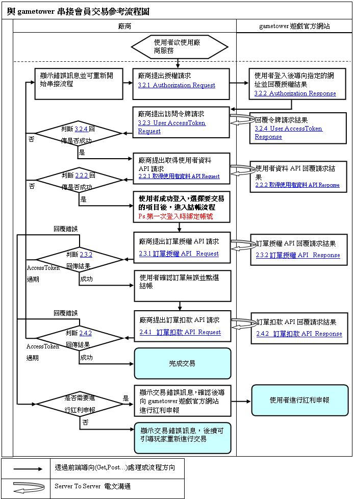
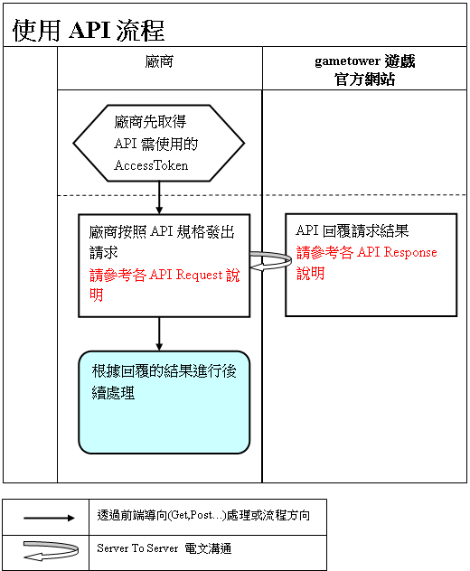
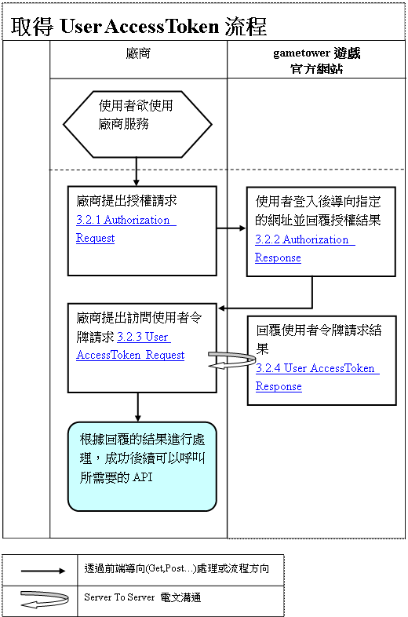
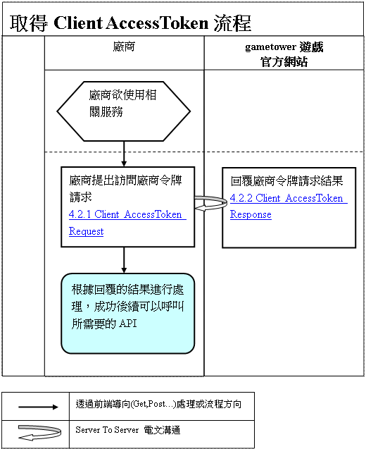

# gametower會員登入串接規格書

## 《更新歷程》


| 版本 | 更新日期 | 編輯者     | 更新內容說明 |
| --- | --- | ------------ | --------------- |
| **1.0.0** | 2015/01/15 | 魏嘉男 | 新建立文件|
| **1.0.1** | 2016/07/25 | 謝昇富 | 授權請求 scope 增加 user_login_token、User AccessToken 增加回傳 LC 登入字串|
| **1.0.2** | 2016/08/01 | 魏嘉男 | expires_in修正為逾時秒數|
| **1.0.3** | 2016/08/01 | 謝昇富 | 修正 user_login_token 改為在**取得使用者資料** 步驟回傳|
| **1.0.4** | 2016/09/10 | 吳志豪 | 修改『取得使用者資料API』fields參數傳入規則 及『取得User AccessToken API』scope參數傳入規則|
| **1.0.5** | 2017/01/09 | 吳志豪 | 新增『取得會員資料API』|
| **1.0.6** | 2017/03/03 | 魏嘉男 | 修改檔名、加上版號說明，之後以新版號命名規則進行  |
| **1.1.0** | 2017/09/22 | 陳柏森 | 授權頁 GET 增加 third_party參數|
| **1.1.1** | 2017/12/19 | 吳志豪 | 修改2.6.1與2.6.2新增提供會員『serial_number』欄位資料傳回與修改串接的描述 |
| **1.2.0** | 2018/10/18 | 魏嘉男 | 所有網址調整成一階層(ex.www.twtest.towergame.com)   |
| **1.2.1** | 2018/12/21 | 林子傑 | 3.2.1 補上代碼 ln (LINE 登入)   |

## 1.介紹

1. 說明

    gametower遊戲官方網站串接採用OAuth2協定，廠商取得相關的AccessToken後才能存取API所提供的使用者資料以及進行交易；使用gametower遊戲官方網站串接的步驟如下：

   (1) 與gametower遊戲官方網站申請串接，提供以下資訊：
   > 1.廠商ID (字串，最長30碼，由大寫英文字母與 \_ 組成)
   > 2.廠商名稱
   > 3.聯絡人姓名、電話、Email
   > 4\. redirect_uri所允許的Domain (可以是Subdomain)

   gametower遊戲官方網站會提供以下資訊：
   > 1\. client_id：廠商ID
   > 2\. client_secret：廠商私鑰

   (2) 根據要存取的API先取得使用者令牌(User AccessToken)或是廠商令牌(Client
    AccessToken)。
   (3) 使用取得的AccessToken存取API

   **注意事項：**
   (1)**使用HTTPS協定(Port 443)。**
   (2)**傳輸資料與加解密的編碼都使用UTF-8。**
   (3)**字串長度都為byte長度，英數字算1 byte，中文字算2 bytes。**
   (4)**API若是access_token、hash、fileds欄位錯誤或規格錯誤，則會回傳http**
    **status錯誤(400、500、503)；其他狀況都回傳http status**
    **200，處理結果會帶在result_code與result_message中，show_message則是可顯示給使用者看的訊息。**

2. 與gametower串接會員交易參考流程圖

    

## 2.API介紹

### 1.流程圖

 

### 2.取得使用者資料API

**AccessToken類型：User AccessToken。**
2.2.1取得使用者資料API Request  (廠商提出取得使用者資料API請求)

| 2.2.1取得使用者資料API Request說明                           |
| ------------------------------------------------------------ |
| 廠商Server傳送Url Post到儲gametower遊戲官方網站API請求網址<br/>測試機位置：https://www-twtest.towergame.com/common/receive/oauth2/member/getuserdata.aspx<br/>正式機位置：https://www.gametower.com.tw/common/receive/oauth2/member/getuserdata.aspx |
| 範例：<br/>POST common/receive/oauth2/member/getuserdata.aspx HTTP/1.1<br/>Host: www.gametower.com.tw<br/>Content-Type: application/x-www-form-urlencoded<br/>access_token=5d16e00ba2004471ae1db5601ad39264&fields=user_id,user_bonus |

| 參數名稱     | 型態 | 長度   | 必要 | 説明                                                         |
| ------------ | ---- | ------ | ---- | ------------------------------------------------------------ |
| access_token | 字串 | 固定32 | 是   | **接收到的User AccessToken**                                 |
| fields       | 字串 |        | 字串 | 欲取得的使用者資料，以逗號字元區格，有以下項目：<br/>user_id:使用者ID<br/>user_bonus:使用者紅利點數<br/>user_login_token:使用者登入權杖 (LC) |

2.2.2取得使用者資料API Response(取得使用者資料API回覆請求結果)

| 2.2.2取得使用者資料API Response說明 |
| ------------------------------------------------------------ |
| 回傳Content-Type為JSON的請求結果 |
| 成功範例：<br/>HTTP/1.1 200 OK<br/>Content-Type: application/json;charset=UTF-8<br/>Cache-Control: no-store<br/>Pragma: no-cache<br/><br/>{<br/>	"user_id":"U4W0K1KRSTUXEPFH" ,<br/>	"user_bonus":10000,<br/>	"user_login_token":"010AAFE178DCE0AE78A878E4AA78A87878DD78A8A878A9EBE07878787878AEA8E7"<br/>} |

| 參數名稱 | 型態 | 長度 | 必要 | 説明 |
| --- | --- | --- | --- | --- |
| user_id | 字串 | 固定16 | 否  | **使用者ID (需要求user_id)** |
| user_bonus| 正整數 |        | 否 | **使用者紅利點數 (需要求user_bonus)**                        |
| user_login_token | 字串 |        | 否 | **使****用者登入權杖 (LC)**   **(****需要求 user_login_token)** |

| 失敗範例 |
| ------------------------------------------------------------ |
| 失敗範例：<br>HTTP/1.1 400 Bad Request<br>Content-Type: application/json;charset=UTF-8<br>Cache-Control: no-store<br>Pragma: no-cache<br>{<br>	"error":invalid_access_token<br>} |

| 參數名稱 | 型態 | 長度 | 必要 | 説明 |
| --- | --- | --- | --- | --- |
| error | 字串 | 最長50 | 是  | 錯誤原因，有以下錯誤(括號內為http status)：<br>invalid_request (400)<br>invalid_access_token (400)<br>expired_access_token (400)<br>invalid_fields (400)<br>server_error (500)<br>temporarily_unavailable (503) |

### 3.訂單授權API

**AccessToken類型：User AccessToken。**
2.3.1訂單授權API Request (廠商提出訂單授權API請求)

| **2.3.1****訂單授權API Request說明** |
| ------------------------------------------------------------ |
| 廠商Server傳送Url Post到儲gametower遊戲官方網站API請求網址<br/>測試機位置：https://www-twtest.towergame.com/common/receive/oauth2/bank/order.aspx<br/>正式機位置：https://www.gametower.com.tw/common/receive/oauth2/bank/order.aspx |
| 範例：<br/>POST /common/receive/oauth2/bank/order.aspx HTTP/1.1<br/>Host: www.gametower.com.tw<br/>Content-Type: application/x-www-form-urlencoded<br/><br/>access_token=5d16e00ba2004471ae1db5601ad39264<br/>&content={"request_id":"A0001","request_value":1000,"trade_type":"bonus","remote_ip":" 61.219.10.247",<br/>"product_list":[{"name":"產品1"," value":600},{"name":"產品2"," value":400}]}<br/>&hash=69C0D87F01D153E9EBB6677453B81E52ACA8C7F9 |

| 參數名稱 | 型態 | 長度 | 必要 | 説明 |
| --- | --- | --- | --- | --- |
| access_token | 字串 | 固定32 | 是   | **接收到的User AccessToken**                            |
| content      | 字串 |        | 是   | **Json****格式的訂單授權需求**                          |
| hash         | 字串 |        | 是   | **sha-1(access_token+content+client_secret)****轉大寫** |

content參數參考如下：

| 參數名稱 | 型態 | 長度 | 必要 | 説明 |
| --- | --- | --- | --- | --- |
| request_id    | 字串   | 最長32 | 是   | **廠商交易編號**                                |
| request_value | 正整數 |        | 是   | **請求點數，須等於product_list所有value的加總** |
| trade_type    | 字串   |        | 是   | **交易類型，固定為bonus**                       |
| remote_ip     | 字串   | 最長39 | 是   | **使用者IP**                                    |
| product_list  | 字串   |        |      | **Json****格式的產品清單**                      |

product_list參數參考如下：

| 參數名稱 | 型態 | 長度 | 必要 | 説明 |
| --- | --- | --- | --- | --- |
| name     | 字串   | 最長100 | 是   | **產品名稱** |
| value    | 正整數 |         | 是   | **產品點數** |

2.3.2訂單授權API Response(訂單授權API回覆請求結果)

| **2.3.2****訂單授權API Response說明** |
| ------------------------------------------------------------ |
| 回傳Content-Type為JSON的請求結果 |
| 成功範例：<br/>HTTP/1.1 200 OK<br/>Content-Type: application/json;charset=UTF-8<br/>Cache-Control: no-store<br/>Pragma: no-cache<br/>{<br/>	"trans_id":"G0130200140120000001",<br/>	"request_id":"A0001",<br/>	"request_value":1000,<br/>	"trade_type":"bonus",<br/>	"result_code":"00",<br/>	"result_message":"成功",<br/>	"show_message":"成功",<br/>	"request_value":1000,<br/>	"remaining_value":9000,<br/>	"required value":"1000",<br/>	"tax_value":0,<br/>	"declaration_url":""<br/>} |

| 參數名稱 | 型態 | 長度 | 必要 | 説明 |
| --- | --- | --- | --- | --- |
| trans_id       | 字串 | 固定20 | 是 | **gametower平台訂單編號**                                |
| request_id     | 字串 | 最長32 | 是 | **廠商交易編號**                                             |
| trade_type | 字串   |         | 是   | **交易類型，固定為bonus** |
| result_code | 字串 | 固定2 | 是 | 結果代碼：00為成功，其他為失敗。但需注意若為01代表需進行紅利申報，<br/>需導至 declaration_url進行紅利申報。<br/>詳細代碼及訊息請參考【六、回覆結果訊息表】 |
| result_message | 字串 | 最長100 |  | **結果訊息** |
| show_message | 字串 | 最長100 |  | **顯示訊息** |
| request_value | 正整數 |  | 否 | **請求點數(result_code=00才會帶值)** |
| remaining_value | 正整數 |  | 否 | **剩餘點數(result_code=00才會帶值)** |
| required_value | 正整數 |  | 否 | **應扣除點數含稅金點數(result_code=00才會帶值)** |
| tax_value | 正整數 |  | 否 | **稅金點數(result_code=00才會帶值)** |
| declaration_url | 字串 |  | 否 | **紅利申報網址(result_code=01才會帶值)** |


| 失敗範例 |
| ------------------------------------------------------------ |
| 失敗範例：<br>HTTP/1.1 400 Bad Request<br>Content-Type: application/json;charset=UTF-8<br>Cache-Control: no-store<br>Pragma: no-cache<br>{<br>	"error":invalid_access_token<br>} |

| 參數名稱 | 型態 | 長度 | 必要 | 説明 |
| --- | --- | --- | --- | --- |
| error | 字串 | 最長50 | 是  | 錯誤原因，有以下錯誤(括號內為http status)：<br>invalid_request (400)<br>invalid_access_token (400)<br>expired_access_token (400)<br>invalid_fields (400)<br>server_error (500)<br>temporarily_unavailable (503) |

### 4.訂單扣款API

**AccessToken類型：User AccessToken。**

2.4.1 訂單扣款API Request (廠商提出訂單扣款API請求)

| **2.4.1** **訂單扣款API Request說明** |
| ------------------------------------------------------------ |
| 廠商Server傳送Url Post到儲gametower遊戲官方網站API請求網址<br/>測試機位置：https://www-twtest.towergame.com/common/receive/oauth2/bank/settle.aspx<br/>正式機位置：https://www.gametower.com.tw/common/receive/oauth2/bank/settle.aspx |
| 範例：<br/>POST /common/receive/oauth2/bank/settle.aspx HTTP/1.1<br/>Host: www.gametower.com.tw<br/>Content-Type: application/x-www-form-urlencoded<br/><br/>access_token=5d16e00ba2004471ae1db5601ad39264<br/>&content={"trans_id":"G0130200140120000001","request_id":"A0001","request_value":1000,"trade_type":"bonus"}<br/>&hash=4CDB5050E60B3FF3163B8A57A895BE25780A84C4 |

| 參數名稱 | 型態 | 長度 | 必要 | 説明 |
| --- | --- | --- | --- | --- |
| access_token | 字串 | 固定32 | 是   | **接收到的User AccessToken**                            |
| content      | 字串 |        | 是   | **Json****格式的訂單授權需求**                          |
| hash         | 字串 |        | 是   | **sha-1(access_token+content+client_secret)****轉大寫** |

content參數參考如下：

| 參數名稱 | 型態 | 長度 | 必要 | 説明 |
| --- | --- | --- | --- | --- |
| trans_id | 字串 | 固定20 | 是 | **gametower平台訂單編號** |
| request_id    | 字串   | 最長32 | 是   | **廠商交易編號**                                |
| request_value | 正整數 |        | 是   | **請求點數，須等於product_list所有value的加總** |
| trade_type    | 字串   |        | 是   | **交易類型，固定為bonus**                       |

2.4.2 訂單扣款API Response(訂單扣款API回覆請求結果)

| **2.4.2** **訂單扣款API Response說明** |
| ------------------------------------------------------------ |
| 回傳Content-Type為JSON的請求結果 |
| 成功範例：<br/>HTTP/1.1 200 OK<br/>Content-Type: application/json;charset=UTF-8<br/>Cache-Control: no-store<br/>Pragma: no-cache<br/>{<br/>	"trans_id":"G0130200140120000001",<br/>	"request_id":"A0001",<br/>	"request_value":1000,<br/>	"trade_type":"bonus",<br/>	"result_code":"00",<br/>	"result_message":"成功",<br/>	"show_message":"成功",<br/>	"request_value":1000,<br/>	"remaining_value":9000,<br/>	"required value":"1000",<br/>	"tax_value":0,<br/>	"declaration_url":""<br/>} |

| 參數名稱 | 型態 | 長度 | 必要 | 説明 |
| --- | --- | --- | --- | --- |
| trans_id       | 字串 | 固定20 | 是 | **gametower平台訂單編號**                                |
| request_id     | 字串 | 最長32 | 是 | **廠商交易編號**                                             |
| trade_type | 字串   |         | 是   | **交易類型，固定為bonus** |
| result_code | 字串 | 固定2 | 是 | 結果代碼：00為成功，其他為失敗。但需注意若為01代表需進行紅利申報，<br/>需導至 declaration_url進行紅利申報。<br/>詳細代碼及訊息請參考【六、回覆結果訊息表】 |
| result_message | 字串 | 最長100 |  | **結果訊息** |
| show_message | 字串 | 最長100 |  | **顯示訊息** |
| request_value | 正整數 |  | 否 | **請求點數(result_code=00才會帶值)** |
| remaining_value | 正整數 |  | 否 | **剩餘點數(result_code=00才會帶值)** |
| required_value | 正整數 |  | 否 | **應扣除點數含稅金點數(result_code=00才會帶值)** |
| tax_value | 正整數 |  | 否 | **稅金點數(result_code=00才會帶值)** |
| declaration_url | 字串 |  | 否 | **紅利申報網址(result_code=01才會帶值)** |


| 失敗範例 |
| ------------------------------------------------------------ |
| 失敗範例：<br>HTTP/1.1 400 Bad Request<br>Content-Type: application/json;charset=UTF-8<br>Cache-Control: no-store<br>Pragma: no-cache<br>{<br>	"error":invalid_access_token<br>} |

| 參數名稱 | 型態 | 長度 | 必要 | 説明 |
| --- | --- | --- | --- | --- |
| error | 字串 | 最長50 | 是  | 錯誤原因，有以下錯誤(括號內為http status)：<br>invalid_request (400)<br>invalid_access_token (400)<br>expired_access_token (400)<br>invalid_fields (400)<br>server_error (500)<br>temporarily_unavailable (503) |

### 5.訂單查詢API

**AccessToken類型：Client AccessToken。**

2.5.1 訂單查詢API Request (廠商提出訂單查詢API請求)

| **2.5.1** **訂單查詢API Request說明**                        |
| ------------------------------------------------------------ |
| 廠商Server傳送Url Post到儲gametower遊戲官方網站API請求網址<br/>測試機位置：https://www-twtest.towergame.com/common/receive/oauth2/bank/queryorder.aspx<br/>正式機位置：https://www.gametower.com.tw/common/receive/oauth2/bank/queryorder.aspx |
| 範例：<br/>POST /common/receive/oauth2/bank/queryorder.aspx HTTP/1.1<br/>Host: www.gametower.com.tw<br/>Content-Type: application/x-www-form-urlencoded<br/><br/>access_token=f5894bc73f164192a8b48c2de1cdd658&content={"request_id":"A0001"}<br/>&hash=DBF7B028761AAFCFCEEE094D431CDF8AEC8C6983 |

| 參數名稱     | 型態 | 長度   | 必要 | 説明                                                    |
| ------------ | ---- | ------ | ---- | ------------------------------------------------------- |
| access_token | 字串 | 固定32 | 是   | **接收到的Client AccessToken**                          |
| content      | 字串 |        | 是   | **Json****格式的訂單授權需求**                          |
| hash         | 字串 |        | 是   | **sha-1(access_token+content+client_secret)****轉大寫** |

content參數參考如下：

| 參數名稱   | 型態 | 長度   | 必要 | 説明                                      |
| ---------- | ---- | ------ | ---- | ----------------------------------------- |
| trans_id   | 字串 | 固定20 | 否   | **gametower平台訂單編號  (至少擇一輸入)** |
| request_id | 字串 | 最長32 | 否   | **廠商交易編號 (至少擇一輸入)****         |

2.5.2 訂單查詢API Response(訂單查詢API回覆請求結果)

| **2.5.2** **訂單查詢API Response說明**                       |
| ------------------------------------------------------------ |
| 回傳Content-Type為JSON的請求結果                             |
| 成功範例：<br/>HTTP/1.1 200 OK<br/>Content-Type: application/json;charset=UTF-8<br/>Cache-Control: no-store<br/>Pragma: no-cache<br/>{<br/>	"trans_id":"G0130200140120000001",<br/>	"request_id":"A0001",<br/>	"request_value":1000,<br/>	"trade_type":"bonus",<br/>	"result_code":"00",<br/>	"result_message":"成功",<br/>	"show_message":"成功",<br/>	"request_value":1000,<br/>	"remaining_value":9000,<br/>	"required value":"1000",<br/>	"tax_value":0,<br/>	"declaration_url":""<br/>} |

| 參數名稱        | 型態   | 長度    | 必要 | 説明                                                         |
| --------------- | ------ | ------- | ---- | ------------------------------------------------------------ |
| trans_id        | 字串   | 固定20  | 是   | **gametower平台訂單編號**                                    |
| request_id      | 字串   | 最長32  | 是   | **廠商交易編號**                                             |
| trade_type      | 字串   |         | 是   | **交易類型，固定為bonus**                                    |
| result_code     | 字串   | 固定2   | 是   | 結果代碼：00為成功，其他為失敗。但需注意若為01代表需進行紅利申報，<br/>需導至 declaration_url進行紅利申報。<br/>詳細代碼及訊息請參考【六、回覆結果訊息表】 |
| result_message  | 字串   | 最長100 |      | **結果訊息**                                                 |
| show_message    | 字串   | 最長100 |      | **顯示訊息**                                                 |
| request_value   | 正整數 |         | 否   | **請求點數(result_code=00才會帶值)**                         |
| remaining_value | 正整數 |         | 否   | **剩餘點數(result_code=00才會帶值)**                         |
| required_value  | 正整數 |         | 否   | **應扣除點數含稅金點數(result_code=00才會帶值)**             |
| tax_value       | 正整數 |         | 否   | **稅金點數(result_code=00才會帶值)**                         |
| declaration_url | 字串   |         | 否   | **紅利申報網址(result_code=01才會帶值)**                     |


| 失敗範例                                                     |
| ------------------------------------------------------------ |
| 失敗範例：<br>HTTP/1.1 400 Bad Request<br>Content-Type: application/json;charset=UTF-8<br>Cache-Control: no-store<br>Pragma: no-cache<br>{<br>	"error":invalid_access_token<br>} |

| 參數名稱 | 型態 | 長度   | 必要 | 説明                                                         |
| -------- | ---- | ------ | ---- | ------------------------------------------------------------ |
| error    | 字串 | 最長50 | 是   | 錯誤原因，有以下錯誤(括號內為http status)：<br>invalid_request (400)<br>invalid_access_token (400)<br>expired_access_token (400)<br>invalid_fields (400)<br>server_error (500)<br>temporarily_unavailable (503) |

### 6.取得使用者資料API

**AccessToken類型：Client AccessToken。**

2.6.1取得會員資料API Request (廠商提出取得會員資料API請求)

| **2.6.1****取得使用者資料API Request說明**                   |
| ------------------------------------------------------------ |
| 廠商Server傳送Url Post到儲gametower遊戲官方網站API請求網址<br/>測試機位置：https://www-twtest.towergame.com/common/receive/oauth2/member/ServerGetUserData.aspx<br/>正式機位置：https://www.gametower.com.tw/common/receive/oauth2/member/ServerGetUserData.aspx |
| 範例：<br/>POST common/receive/oauth2/member/getuserdata.aspx HTTP/1.1<br/>Host: www.gametower.com.tw<br/>Content-Type: application/x-www-form-urlencoded<br/><br/>access_token=f5894bc73f164192a8b48c2de1cdd658&content={"key":"SERIAL_NUMBER",<br/>"value":"E32P4F44156QKET9","fields":["MEMBER_NO","ACCOUNT"...]}<br/>&hash=DBF7B028761AAFCFCEEE094D431CDF8AEC8C6983 |

| 參數名稱     | 型態 | 長度   | 必要 | 説明                                                         |
| ------------ | ---- | ------ | ---- | ------------------------------------------------------------ |
| access_token | 字串 | 固定32 | 是   | **接收到的Client AccessToken**                               |
| content      | 字串 |        | 是   | Json格式<br/>欲取得的某個會員的會員資料，以逗號字元區格，有以下項目：<br/>key:針對欲取得的會員，傳入要用來當識別欄位KEY名稱(目前支援：SERIAL_NUMBER、MEMBER_NO、ACCOUNT)<br/>value: 針對欲取得的會員，傳入對應Key(識別欄位)的值<br/>fields:要取得的該會員哪些欄位資料(目前支援：member_no、account、alias、come_from_no、relation_no、serial_number)<br/><br/>EX: 欲取得yaya736這個帳號的member_no、account、alias、come_from_no、relation_no資訊，則"key" :"ACCOUNT","value":"yaya736"<br/>,"fields" :["member_no","account","alias","come_from_no","relation_no"] |
| hash         | 字串 |        | 是   | **sha-1(access_token+content+client_secret)****轉大寫**      |

2.6.2取得會員資料API Response(取得會員資料API回覆請求結果)

| **2.6.2 取得使用者資料API Response說明**                     |
| ------------------------------------------------------------ |
| 回傳Content-Type為JSON的請求結果                             |
| 成功範例：<br/>HTTP/1.1 200 OK<br/>Content-Type: application/json;charset=UTF-8<br/>Cache-Control: no-store<br/>Pragma: no-cache<br/><br/>{<br/>   "MEMBER_NO":760055,<br/>   "ACCOUNT":"5416870@FB",<br/>   "ALIAS":"zxzxzxqq@FB",<br/>   "COME_FROM_NO":9,<br/>   "RELATION_NO":"100003669203219",<br/>   "SERIAL_NUMBER":"950H123454P70E0A"<br/>} |

| 參數名稱      | 型態 | 長度 | 必要 | 説明                                                 |
| ------------- | ---- | ---- | ---- | ---------------------------------------------------- |
| MEMBER_NO     | 數字 |      |      | **會員編號**|
| ACCOUNT       | 字串 |      |      | **會員帳號**|
| ALIAS         | 字串 |      |      | **會員別名(若非串接會員則回傳null)**|
| COME_FROM_NO  | 數字 |      |      | **會員來源(若非串接會員則回傳-1)**|
| RELATION_NO   | 字串 |      |      | **會員來源身份唯一識別碼(若非串接會員則回傳null)**|
| SERIAL_NUMBER | 字串 |      |      | **序號**|


| 失敗範例                                                     |
| ------------------------------------------------------------ |
| 失敗範例：<br>HTTP/1.1 400 Bad Request<br>Content-Type: application/json;charset=UTF-8<br>Cache-Control: no-store<br>Pragma: no-cache<br>{<br>	"error":invalid_access_token<br>} |

| 參數名稱 | 型態 | 長度   | 必要 | 説明                                                         |
| -------- | ---- | ------ | ---- | ------------------------------------------------------------ |
| error    | 字串 | 最長50 | 是   | 錯誤原因，有以下錯誤(括號內為http status)：<br>invalid_request (400)<br>invalid_access_token (400)<br>expired_access_token (400)<br>invalid_fields (400)<br>server_error (500)<br>temporarily_unavailable (503) |

## 3.取得User AccessToken說明

### 1.流程圖

​          

### 2.**電文說明**

3.2.1 Authorization Request (廠商提出授權請求)

| **3.2.1 Authorization Request說明**                          |
| ------------------------------------------------------------ |
| 將使用者透過Url Get送到gametower遊戲官方網站授權網址<br/>測試機位置：https://www-twtest.towergame.com/oauth2/auth.aspx<br/>正式機位置：https://www.gametower.com.tw/oauth2/auth.aspx |
| 範例：<br/>GET /oauth2/auth.aspx?response_type=code&client_id=myclient&state=xyz&scope=user_id,user_bonus,<br/>bonus_transaction&redirect_uri=https%3A%2F%2Fclient%2Eexample%2Ecom%2Fcb HTTP/1.1<br/>Host: www.gametower.com.tw |

| 參數名稱     | 型態 | 長度   | 必要 | 説明                                                         |
| ------------ | ---- | ------ | ---- | ------------------------------------------------------------ |
| response_type                                         | 字串                  |       | 是  | 固定為 code                    |
| client_id                                             | 字串                  | 最長30  | 是  | 廠商ID                        |
| redirect_uri                                          | 字串                  | 最長255 | 是  | 授權後導向的網址                    |
| scope                                                 | 字串                  |       | 是  | 申請的授權項目，以逗號字元區格，有以下項目：<br/>user_id:取得使用者ID<br/>user_bonus:取得使用者紅利點數<br/>bonus_transaction:允許紅利交易<br/>user_login_token:登入 LC 字串|
| state                                                 | 字串                  | 最長50  | 是  | 內部狀態，防止CSRF攻擊，成功授權後回調時會原樣帶回 |
| third_party                                           | 字串                  |       | 否  | 支援參數值：<br/>  none 不顯示第三方平台登入區塊<br/>  fb 顯示 Facebook 登入按鈕<br/>  yg 顯示 Yahoo 登入按鈕<br/>  gg 顯示 Google 登入按鈕<br/>  ms 顯示 Window Live 登入按鈕<br/>  ln 顯示 LINE 登入按鈕<br/>範例1 不帶 third_party 參數，預設顯示全部的第三方平台登入按鈕。<br/>https://www.gt.web/oauth2/auth.aspx<br/>範例2 (第三方平台登入只顯示 Facebook 及 Google 按鈕) <br/>https://www.gt.web/oauth2/auth.aspx?third_party=fb,gg<br/>範例3 (不顯示第三方平台登入介面)<br/>https://www.gt.web/oauth2/auth.aspx?third_party=none |

3.2.2 Authorization Response (回覆授權結果)

| **3.2.2 Authorization Response說明**                         |
| ------------------------------------------------------------ |
| **將使用者透過Url Get導回廠商return_uri並回覆授權結果**      |
| 成功範例：<br/>GET HTTP/1.1 302 Found<br/>Location: https://client.example.com/cb?code=7a5f0b892b1649208f21f08574a98f33&state=xyz |

| 參數名稱 | 型態 | 長度   | 必要 | 説明                                             |
| -------- | ---- | ------ | ---- | ------------------------------------------------ |
| code     | 字串 | 固定32 | 是   | **授權碼，10分鐘內有效，只能使用一次**           |
| state    | 字串 | 最長50 | 是   | **內部狀態，防止CSRF攻擊，回傳授權請求所帶的值** |

| 失敗範例                                                     |
| ------------------------------------------------------------ |
| 失敗範例：<br>HTTP/1.1 400 Bad Request<br>Content-Type: application/json;charset=UTF-8<br>Cache-Control: no-store<br>Pragma: no-cache<br>{<br>	"error":invalid_access_token<br>} |

| 參數名稱 | 型態 | 長度   | 必要 | 説明                                                         |
| -------- | ---- | ------ | ---- | ------------------------------------------------------------ |
| error    | 字串 | 最長50 | 是   | 錯誤原因，有以下錯誤(括號內為http status)：<br>invalid_request (400)<br>invalid_access_token (400)<br>expired_access_token (400)<br>invalid_fields (400)<br>server_error (500)<br>temporarily_unavailable (503) |

3.2.3 User AccessToken Request (廠商提出訪問使用者令牌請求)

| **3.2.3** User AccessToken Request說明                       |
| ------------------------------------------------------------ |
| 廠商Server傳送Url Post到儲gametower遊戲官方網站令牌請求網址<br/>測試機位置：https://www-twtest.towergame.com/common/receive/oauth2/token.aspx<br/>正式機位置：https://www.gametower.com.tw/common/receive/oauth2/token.aspx |
| 範例：<br/>POST /common/receive/oauth2/token.aspx HTTP/1.1<br/>Host: www.gametower.com.tw<br/>Content-Type: application/x-www-form-urlencoded<br/><br/>grant_type=authorization_code&code=7a5f0b892b1649208f21f08574a98f33<br/>&redirect_uri=https%3A%2F%2Fclient%2Eexample%2Ecom%2Fcb<br/>&client_id=myclient&client_secret=IamSecret |

| 參數名稱      | 型態 | 長度    | 必要 | 説明                                      |
| ------------- | ---- | ------- | ---- | ----------------------------------------- |
| grant_type    | 字串 |         | 是   | 固定為 authorization_code                 |
| code          | 字串 | 固定32  | 是   | 與Authorization Response 回傳的 code 相同 |
| redirect_uri  | 字串 | 最長255 | 是   | 與Authorization Request的redirect_uri相同 |
| client_id     | 字串 | 最長30  | 是   | 廠商ID                                    |
| client_secret | 字串 | 最長30  | 是   | 廠商私鑰                                  |

3.2.4 User AccessToken Response(回覆使用者令牌請求結果)

| **3.2.4** **User AccessToken Response說明**                  |
| ------------------------------------------------------------ |
| 回傳Content-Type為JSON的請求結果                             |
| 成功範例：<br/>HTTP/1.1 200 OK<br/>Content-Type: application/json;charset=UTF-8<br/>Cache-Control: no-store<br/>Pragma: no-cache<br/><br/>{<br/>	"access_token":"5d16e00ba2004471ae1db5601ad39264",<br/>	"token_type":"Bearer",<br/>	"expires_in":3600,<br/>} |

| 參數名稱         | 型態  | 長度   | 必要 | 説明           |
|--------------|-----|------|----|--------------|
| access_token | 字串  | 固定32 | 是  | 使用者令牌        |
| token_type   | 字串  |      | 是  | 固定為 Bearer   |
| expires_in   | 正整數 |      | 是  | 逾時秒數，預設為3600 |

| 失敗範例                                                     |
| ------------------------------------------------------------ |
| 失敗範例：<br>HTTP/1.1 400 Bad Request<br>Content-Type: application/json;charset=UTF-8<br>Cache-Control: no-store<br>Pragma: no-cache<br><br>{<br>	"error":"invalid_request"<br>} |

| 參數名稱 | 型態 | 長度   | 必要 | 説明                                                         |
| -------- | ---- | ------ | ---- | ------------------------------------------------------------ |
| error    | 字串 | 最長50 | 是   | 錯誤原因，有以下錯誤(括號內為http status)：<br>invalid_request (400)<br>invalid_access_token (400)<br>expired_access_token (400)<br>invalid_fields (400)<br>server_error (500)<br>temporarily_unavailable (503) |

## 4.取得Client AccessToken說明

### 1.流程圖

​                    

### 2.**電文說明**

4.2.1 Client AccessToken Request (廠商提出訪問廠商令牌請求)

| **4.2.1** **Client AccessToken Request說明**                 |
| ------------------------------------------------------------ |
| 廠商Server傳送Url Post到儲gametower遊戲官方網站令牌請求網址<br/>測試機位置：https://www-twtest.towergame.com/common/receive/oauth2/token.aspx<br/>正式機位置：https://www.gametower.com.tw/common/receive/oauth2/token.aspx |
| 範例：<br/>POST /common/receive/oauth2/token.aspx HTTP/1.1<br/>Host: www.gametower.com.tw<br/>Content-Type: application/x-www-form-urlencoded<br/><br/>grant_type=client_credentials&client_id=myclient&client_secret=IamSecret |

| 參數名稱      | 型態 | 長度   | 必要 | 説明                      |
| ------------- | ---- | ------ | ---- | ------------------------- |
| grant_type    | 字串 |        | 是   | 固定為 client_credentials |
| client_id     | 字串 | 最長30 | 是   | 廠商ID                    |
| client_secret | 字串 | 最長30 | 是   | 廠商私鑰                  |

4.2.2 Client AccessToken Response(回覆廠商令牌請求結果)

| **4.2.2** **Client AccessToken Response說明**                |
| ------------------------------------------------------------ |
| 回傳Content-Type為JSON的令牌請求結果                         |
| 成功範例：<br/>HTTP/1.1 200 OK<br/>Content-Type: application/json;charset=UTF-8<br/>Cache-Control: no-store<br/>Pragma: no-cache<br/><br/>{<br/>	"access_token":"f5894bc73f164192a8b48c2de1cdd658",<br/>	"token_type":"Bearer",<br/>	"expires_in":3600,<br/>}<br/> |

| 參數名稱         | 型態  | 長度   | 必要 | 説明            |
|--------------|-----|------|----|---------------|
| access_token | 字串  | 固定32 | 是  | 廠商令牌          |
| token_type   | 字串  |      | 是  | 固定為 Bearer    |
| expires_in   | 正整數 |      | 是  | 逾時分鐘數，預設為3600 |

| 失敗範例                                                     |
| ------------------------------------------------------------ |
| 失敗範例：<br>HTTP/1.1 400 Bad Request<br>Content-Type: application/json;charset=UTF-8<br>Cache-Control: no-store<br>Pragma: no-cache<br>{<br>	"error":invalid_request<br>} |

| 參數名稱 | 型態 | 長度   | 必要 | 説明                                                         |
| -------- | ---- | ------ | ---- | ------------------------------------------------------------ |
| error    | 字串 | 最長50 | 是   | 錯誤原因，有以下錯誤(括號內為http status)：<br>invalid_request (400)<br>invalid_access_token (400)<br>expired_access_token (400)<br>invalid_fields (400)<br>server_error (500)<br>temporarily_unavailable (503) |

## 5.回覆結果訊息表

說明：此回覆結果訊息表通用所有回傳result_code & result_message& show_message的API

| 結果代碼 | 結果訊息                             | 顯示訊息                                                     |
| -------- | ------------------------------------ | ------------------------------------------------------------ |
| 00       | 成功                                 | 成功                                                         |
| 01       | 需進行紅利申報                       | 交易點數超過限制，需先進行紅利申報，請先至gametower遊戲官方網站進行紅利申報。 |
| 06       | [trade_type]欄位不得為空             | 交易發生異常，錯誤代碼06                                     |
| 07       | 無法識別的[trade_type]               | 交易發生異常，錯誤代碼07                                     |
| 10       | [trade_type]其他錯誤                 | 交易發生異常，錯誤代碼10                                     |
| 11       | [request_value]欄位不得為空          | 交易發生異常，錯誤代碼11                                     |
| 12       | [request_value]欄位需為正整數        | 交易發生異常，錯誤代碼12                                     |
| 13       | [request_value]與產品點數加總不符    | 交易發生異常，錯誤代碼13                                     |
| 15       | [request_value]其他錯誤              | 交易發生異常，錯誤代碼15                                     |
| 16       | [request_id]欄位不得為空             | 交易發生異常，錯誤代碼16                                     |
| 17       | [request_id]欄位長度超過限制         | 交易發生異常，錯誤代碼17                                     |
| 18       | [request_id]已存在                   | 交易發生異常，錯誤代碼18                                     |
| 19       | [request_id]狀態錯誤                 | 交易發生異常，錯誤代碼19                                     |
| 20       | [request_id]其他錯誤                 | 交易發生異常，錯誤代碼20                                     |
| 21       | [remote_ip]欄位不得為空              | 交易發生異常，錯誤代碼21                                     |
| 22       | [remote_ip]欄位長度超過限制          | 交易發生異常，錯誤代碼22                                     |
| 23       | [remote_ip]欄位格式錯誤              | 交易發生異常，錯誤代碼23                                     |
| 25       | [remote_ip]其他錯誤                  | 交易發生異常，錯誤代碼25                                     |
| 26       | [product_list]欄位不得為空           | 交易發生異常，錯誤代碼26                                     |
| 30       | [product_list]其他錯誤               | 交易發生異常，錯誤代碼30                                     |
| 31       | [product_list][name]欄位不得為空     | 交易發生異常，錯誤代碼31                                     |
| 32       | [product_list][name]欄位長度超過限制 | 交易發生異常，錯誤代碼32                                     |
| 35       | [product_list][name]其他錯誤         | 交易發生異常，錯誤代碼35                                     |
| 36       | [product_list][value]欄位不得為空    | 交易發生異常，錯誤代碼36                                     |
| 37       | [product_list][value]欄位需為正整數  | 交易發生異常，錯誤代碼37                                     |
| 40       | [product_list][value]其他錯誤        | 交易發生異常，錯誤代碼40                                     |
| 41       | [trans_id]欄位不得為空               | 交易發生異常，錯誤代碼41                                     |
| 42       | [trans_id]欄位長度不符               | 交易發生異常，錯誤代碼42                                     |
| 43       | [trans_id]不存在                     | 交易發生異常，錯誤代碼43                                     |
| 45       | [trans_id]其他錯誤                   | 交易發生異常，錯誤代碼45                                     |
| 71       | 會員狀態無法進行交易                 | 會員狀態無法進行交易，請聯絡gametower客服人員。              |
| 72       | 會員紅利點數不足                     | 會員紅利點數不足，請重新確認紅利點數與商品所需紅利點數再重新進行交易，謝謝。 |
| 81       | 交易進行中                           | 交易進行中                                                   |
| 82       | 交易已失敗                           | 交易已失敗                                                   |
| 98       | 其他錯誤                             | 交易發生異常，錯誤代碼98                                     |
| 99       | 伺服器維護中                         | gametower遊戲官方網站維護中，請稍後再試。                    |

## 6.驗證碼計算說明與範例

hash為驗證碼，避免資料在傳輸的過程中遭到竄改，以此值來確保廠商與gametower遊戲官方網站資料交換的安全性。hash計算方式是將電文中的access_token加 content，最後加上雙方約定的金鑰(client_secret) ，再用 SHA1 加密並轉大寫而成。

 

計算步驟範例：

client_secret：**IamSecret**

電文如下

| Key          | Value                                                        |
| ------------ | ------------------------------------------------------------ |
| access_token | 5d16e00ba2004471ae1db5601ad39264                             |
| content      | {"trans_id":"G0130200140120000001","request_id":"A0001","request_value":1000,"trade_type":"bonus"} |

**Step 1**：將電文中的access_token 加 content，再加上雙方約定的金鑰

```
{access_token} + {content} + {client_secret}
```

**Step 2**：相加的結果如下

```
5d16e00ba2004471ae1db5601ad39264{"trans_id":"G0130200140120000001","request_id":"A0001","request_value":1000,"trade_type":"bonus"}IamSecret
```

**Step 3**：將相加後的結果作 SHA-1 加密並轉大寫

```
SHA1(5d16e00ba2004471ae1db5601ad39264{"trans_id":"G0130200140120000001","request_id":"A0001","request_value":1000,"trade_type":"bonus"}IamSecret)= 4CDB5050E60B3FF3163B8A57A895BE25780A84C4
```

**Step 4**：將計算出來的CHECK_CODE加到電文中

| Key  | Value                                    |
| ---- | ---------------------------------------- |
| hash | 4CDB5050E60B3FF3163B8A57A895BE25780A84C4 |

ASP.NET計算hash Function範例如下：

```
/// <summary>根據傳入的參數取得計算出的驗證碼</summary>
/// <param name="_strAccessToken">AccessToken</param>
/// <param name="_strContent">Json格式的內容</param>
/// <param name="_strClientSecret">廠商私鑰</param>
/// <returns>計算出的驗證碼</returns>
public static string GetHash(string _strAccessToken,string _strContent,string _strClientSecret)
{
	return FormsAuthentication.HashPasswordForStoringInConfigFile(_strAccessToken + _strContent + _strClientSecret,"SHA1") ;
}

```

