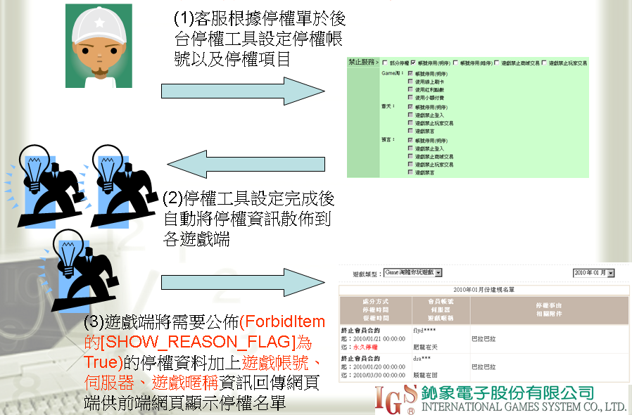
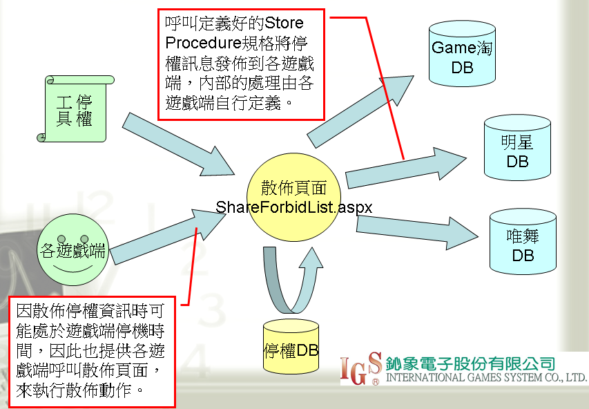

# 客服停權工具整合規格說明

## 需求背景/目的

- 現有停權無統一機制，導致作業費時，且無法針對細項功能(如商城購買、玩家交易)作停權。
- 設計一方便客服操作，並可針對設定的細項作停權設計，再透過網頁端將停權資訊發佈到各遊戲的停權工具。
- 各遊戲端可根據散佈的停權資訊，自行在遊戲內作處理判斷。

## 停權工具流程圖



## 遊戲端實作項目說明

1.實作停權工具散佈停權資訊的Store Procedure

   **(遊戲端需備Store Procedure規格說明 1~4)**

2.實作將需要公佈的停權資料加上遊戲帳號、伺服器、遊戲暱稱回傳GameTower_Web DB的機制

**ps.需公佈的停權資料為ForbidItem的[SHOW_REASON_FLAG]為True的停權資料**

**ps2.提供呼叫的Store Procedure請參照提供呼叫Store Procedure規格說明1~2**

3.實作網頁端檢查會員停權狀態的Store Procedure

​    **(遊戲端需備Store Procedure規格說明 5)**

## 散佈停權名單示意圖



## 遊戲端需備Store Procedure規格說明

1. 新增停權資訊
   ```
   函　　式：[Web_AddForbidRecord]
   功能說明：新增停權資料
   
   		@nForbidNo		停權單號
   		@nMemberNo		會員編號
   		@nItemNo		停權項目
   		@dtEffectiveDateTime	生效時間
   		@dtExpireDateTime	到期時間
   		@strReason		停權事由
   		@strWay		處分方式
   		@nGmMemberNo	客服GM的帳號
   
   傳回結果：		 
   		0		= 新增成功
   		-1		= 資料已存在(停權單號+ 會員編號+ 停權項目)
   		其他負數	= (SQL錯誤代碼+ 100000) * (-1) 
   ```
2. 移除停權資訊
   ```
   函　　式：[Web_RemoveForbidRecord]
   功能說明：移除停權資料
   
   		@nForbidNo		停權單號
   		@nMemberNo		會員編號
   		@nItemNo		停權項目
   
   傳回結果：		 
   		0		= 移除成功
   		-1		= 資料不存在(停權單號+ 會員編號+ 停權項目)
   		其他負數	= (SQL錯誤代碼+ 100000) * (-1)
   ```
3. 新增停權項目
   ```
   函　　式：[Web_AddForbidItem]
   功能說明：新增停權項目
   
   		@nItemNo		停權項目編號
   		@nItemName		停權項目名稱
   		@nItemId		停權項目識別ID
   		@bShowReasonFlag	是否要在前台顯示停權原因
   		@bInvalidFlag		是否停用
   
   傳回結果：		 
   		0		= 新增成功
   		-1		= 資料已存在(停權項目編號)
   		其他負數	= (SQL錯誤代碼+ 100000) * (-1)
   ```
4. 修改停權項目
   ```
   函　　式：[Web_ModifyForbidItem]
   功能說明：修改停權項目
   
   		@nItemNo		停權項目編號
   		@bShowReasonFlag	是否要在前台顯示停權原因
   		@bInvalidFlag		是否停用
   
   傳回結果：		 
   		0		= 修改成功
   		-1		= 資料不存在(停權項目編號)
   		其他負數	= (SQL錯誤代碼+ 100000) * (-1)
   ```
5. 查詢停權狀態
   ```
   函　　式：[Web_FORBID_CheckState]
   功能說明：檢查會員停權狀態
   
   		@nMemberNo				會員編號
   傳回結果：		 
   		STATE,FORBID_MESSAGE, EXPIRE_DATETIME
   
   		 STATE 回傳說明：
   		0		= 會員沒被停權
   		-1		= 會員已被停權			
   				(ForbidItem的[SHOW_REASON_FLAG]為True)
   		-2		= 會員已被停權			
   				(ForbidItem的[SHOW_REASON_FLAG]為False)
   		-3至-20為網頁組保留，如遊戲有其他實作訊息，請用 < -20的訊息
   
   		其他負數	= (SQL錯誤代碼+ 100000) * (-1) 
   
   		 FORBID_MESSAGE 回傳說明：狀態為-1時，網頁顯示給玩家的訊息
   		 EXPIRE_DATETIME 回傳說明：到期時間
   回傳範例： SELECT -1 AS STATE, '遊戲中嚴重吃餵牌' AS FORBID_MESSAGE,2009-03-15 00:00:00 as EXPIRE_DATETIME
   ```
## 提供呼叫Store Procedure規格說明

1. 新增停權名單資訊
   ```
   函　　式：[Web_FORBID_AddCommonRecord]
   功能說明：新增停權資料
   		@nGameProductNo	遊戲類型
   		@strAccount 		會員帳號
   		@strServerName 	伺服器
   		@strNickName		遊戲暱稱
   		@nForbidNo		停權單號
   		@nMemberNo		會員編號
   		@nItemNo		停權項目
   		@dtEffectiveDateTime	生效時間
   		@dtExpireDateTime	到期時間
   		@strReason		停權事由
   		@strWay		處分方式
   		
   傳回結果：		 
   		0	 = 新增成功
   		-1	 = 資料已存在(遊戲類型 +停權單號+ 會員編號+ 停權項目)
   		其他負數 = (SQL錯誤代碼+ 100000) * (-1) 
   ```
2. 移除停權名單資訊
   ```
   函　　式：[Web_FORBID_RemoveCommonRecord]
   功能說明：移除停權資料
   		@nGameProductNo	遊戲類型
   		@nForbidNo		停權單號
   		@nMemberNo		會員編號
   		@nItemNo		停權項目
   
   傳回結果：		 
   		0	 = 移除成功
   		-1	 = 資料不存在 (遊戲類型 +停權單號+ 會員編號+ 停權項目) 		其他負數 = (SQL錯誤代碼+ 100000) * (-1)
   ```

## 停權項目說明(請提供可能停權項目)

- 101-帳號停用(明停)
- 102-帳號停用(暗停)
- 103-帳號停用(待刪)
- 104-帳號停用(明停)加立即踢下線
- 105-帳號停用(暗停)加立即踢下線
- 201-禁止登入不秀原因
- 251-禁止登入強迫至特殊修改頁面
- 301-禁止登入
- 302-禁止商城交易
- 303-禁止玩家交易
- 304-禁言

## 注意事項

- Store Procedure請用SELECT回傳參數(ex. SELECT 0;)

- 遊戲端實作停權檢查時，如同時有SHOW_REASON_FLAG為True與False的資訊，請優先顯示True的停權資訊。

- 為避免同步停權資訊有誤差，遊戲端維修開機後請呼叫散佈頁面作同步處理。

  –開發機位置：http://admin.gt.web/common/routine/Forbid/ShareForbidList.aspx

  –測試機位置：http://admin-twtest.towergame.com/common/routine/Forbid/ShareForbidList.aspx

  –正式機位置：http://admin.gametower.com.tw/common/routine/Forbid/ShareForbidList.aspx

## 若沒有跟gametower串接停權之遊戲需實作以下API規格

說明：

因遊戲沒有跟gametower串接停權機制，則透過API去達到停權或覆權該遊戲的玩家的帳號

API網址：

​	開發環境：{請研發單位提供}

​	測試環境：{請研發單位提供}

​	正式環境：{請研發單位提供}

傳遞參數方式：

| Request Header |      |
| -------------- | ---- |
| HTTP Method    | POST |

需要參數：

| 參數名稱            | 型別   | 長度 | 是否必填 | 預設值 | 說明                                                         |
| ------------------- | ------ | ---- | -------- | ------ | ------------------------------------------------------------ |
| Source              | string | -    | 是       | 無     | 來源資訊(e.g. 問題回報單-{流水號})                           |
| Reason              | string | -    | 是       | 無     | 事由                                                         |
| GameId              | string | -    | 是       | 無     | 遊戲識別ID <br />e.g. PANTHER、FISH、KARASU、TAPIRUS、TAPIRUS_SG、HOYEAH...etc |
| IdentifyNo          | string | -    | 是       | 無     | 會員識別值<br />e.g. 商用的話可能是ArkId                     |
| Type                | int    | -    | 是       | 無     | 1：停權(目前為暗停且可以踢玩家下線) 2：覆權                  |
| ForbidStartDateTime | string | -    | 否       | 無     | 停權開始時間，格式：yyyy/MM/dd HH:mm:ss                      |
| ForbidEndDateTime   | string | -    | 否       | 無     | 停權結束時間，格式：yyyy/MM/dd HH:mm:ss                      |
| CheckCode           | String | -    | 是       | 無     | CheckCode計算方式是將傳送的參數資料依照 Key 排序，<BR>將所有 Value 相加(排除 CheckCode 參數)，<BR>最後加上雙方約定的金鑰(PRIVATE_KEY(由網頁組提供)) ，再用 SHA512加密並轉成大寫而成。 |

CheckCode範例程式如下：

```c#
public static string GetCheckCode(NameValueCollection _csDataColl,string _strPrivateKey)
{
     StringBuilder strValue      = new StringBuilder() ;
    
     // 依照 Key 排序，將所有 Value 相加 (排除 CheckCode 參數)
     foreach(string strKey in _csDataColl.AllKeys.OrderBy(o => o))
     {
     	if (!strKey.Equals("CheckCode",StringComparison.OrdinalIgnoreCase))
              strValue.Append(_csDataColl[strKey]) ;
     }
    
     // 最後加入私Key
     strValue.Append(_strPrivateKey) ;
    
	 return FormsAuthentication.HashPasswordForStoringInConfigFile(strValue.ToString(),"SHA512") ;
}
```

## 	

回傳格式：

| 參數名稱 | 說明                          |
| -------- | ----------------------------- |
| Code     | 處理結果，成功為0，其餘為失敗 |
| Message  | 回傳訊息                      |
| Data     | 回傳資料                      |

成功範例

```json
{"Code":"0","Message":"成功","Data":null}
```

失敗範例

```json
{"Code":"1001","Message":"缺少必要參數","Data":null}
```


錯誤代碼表：

| 代碼 | 說明                                                |
| ---- | --------------------------------------------------- |
| 0    | 成功                                                |
| 1001 | 缺少必要參數                                        |
| 1002 | 參數值錯誤或格式不正確                              |
| 1003 | 請求傳送的格式或內容有誤                            |
| 1004 | 在一定時間內訪問次數已達上限                        |
| 1005 | 無對應資料                                          |
| 1006 | 資料已存在                                          |
| 1007 | 綁定屬性失敗                                        |
| 2001 | 不允許的上傳檔案類型                                |
| 2003 | 此環境不允許操作                                    |
| 2004 | 沒有上傳檔案                                        |
| 3001 | 登入失敗                                            |
| 9000 | 自定義失敗<br />對應的Message內容為客製化的訊息內容 |
| 9001 | WebAPI 服務不存在                                   |
| 9002 | 系統異常                                            |
| 9003 | 系統維護中                                          |
| 9004 | 未知的錯誤                                          |
| 9005 | 驗證失敗                                            |
| 9006 | 伺服器連線失敗                                      |
| 9007 | 連線逾時                                            |
| 9008 | 權限不足                                            |
| 9100 | 連線逾時(9100)                                      |
| 9101 | 連線逾時(9101)                                      |
| 9104 | 連線逾時(9104)                                      |

