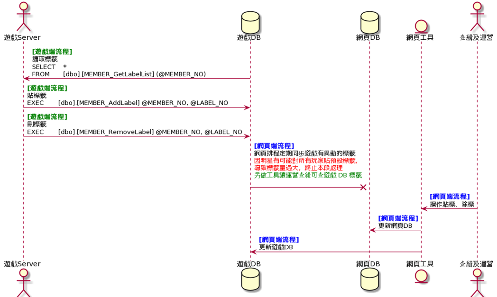

# 帳號、機碼貼標規格說明

## 流程圖



## 遊戲端需提供的資訊

標籤資料表存放DB位置，並開放 webuser 讀寫權限(網頁組排程會定時拉異動資料回去，以及將運營、查緝在工具的異動同步遊戲)

## 遊戲端實作項目說明

1. 遊戲端需建立自己的標籤資料表及預存 (與 網頁DB 相同結構)
    (1)標籤定義資料表 MEMBER_CODE_Label
    (2)會員貼標資料表 MEMBER_LabelList
    (3)機碼貼標資料表 DEVICE_LabelList
    (4)貼標預存 MEMBER_AddLabel
    (5)取得標籤預存 MEMBER_GetLabelList
    (6)移除標籤預存 MEMBER_RemoveLabel
2. 貼標、除標時，更新遊戲自己 DB 就好

## 資料表規格說明

1. 標籤定義資料表 

     ```
   資料表：[MEMBER_CODE_Label]
   欄位說明：
   
   	[INDEX_NO]		INT 			標籤編號
   	[GROUP_CODE]	VARCHAR(10) 	群組代碼
   	[NAME]			NVARCHAR(50) 	標籤名稱
   	[INVALID_FLAG] 	BIT	 			無效旗標
   	[C_DATETIME] 	DATETIME	 	建立時間
   	[E_DATETIME] 	DATETIME	 	異動時間
   	[GAME_NO] 		INT 	 		遊戲編號
   
   		遊戲編號 0 為共用標籤 (只能由查緝貼，專案只能讀)
   		明星：1006
   		滿貫：3012
   		…
   ```

2. 會員貼標資料表 

     ```
   資料表：[MEMBER_LabelList]
   欄位說明：
   
   	[INDEX_NO]		INT 			流水號
   	[MEMBER_NO] 	INT 	 		會員編號
   	[LABEL_NO] 		INT 	 		標籤編號
   	[C_DATETIME] 	DATETIME	 	建立時間
   	[E_DATETIME] 	DATETIME	 	異動時間
   	[INVALID_FLAG] 	BIT	 			無效旗標
   ```

3. 機碼貼標資料表 

     ```
   資料表：[DEVICE_LabelList]
   欄位說明：
   
   	[INDEX_NO]		INT 			流水號
   	[DEVICE_NO] 	BIGINT 	 		機碼編號
   	[LABEL_NO] 		INT 	 		標籤編號
   	[C_DATETIME] 	DATETIME	 	建立時間
   	[E_DATETIME] 	DATETIME	 	異動時間
   	[INVALID_FLAG] 	BIT	 			無效旗標
   ```
## 預存規格說明

1. 貼標預存 

   ```
   函　　式：[MEMBER_AddLabel]
   功能說明：對特定對象貼標籤(會員編號、機碼至少要傳一個，不貼的傳 0)
   
   		@nMemberNo		會員編號 (不貼傳 0)
   		@nLabelNo		標籤編號
   		@lDeviceNo		機碼編號 (不貼傳 0)
   
   傳回結果：
   		Return Value 
   		 0 :成功
         	-1:會員不存在
         	-2:標籤編號不存在或已無效
     		-3:該會員已被貼上同類別(同類別標籤只能被貼一個)
   		-4:未傳入有效會員編號或機碼
        	-5:該機碼已被貼上同類別標籤 (同類別標籤只能被貼一個)
        	-99:發生非預期錯誤
   ```

2. 取得標籤預存 

   ```
   函　　式：[MEMBER_GetLabelList]
   功能說明：標籤查詢 (會員編號、機碼都傳 <= 0 則回傳所有標籤定義)
   
   		@nMemberNo	會員編號(有傳的話以此為準)
   		@lDeviceNo	機碼編號(會員編號 <= 0 才會撈機碼的標籤)
   傳回結果：		 
   		傳回虛擬表，欄位為[標籤編號][標籤名稱][遊戲編號] 
   
   		遊戲編號 0 為共用標籤 (只能由查緝貼，專案只能讀)
   		明星：1006
   		滿貫：3012
   		…
   ```

3. 移除標籤預存

     ```
   函　　式：[MEMBER_RemoveLabel]
   功能說明：移除特定對象標籤(會員編號、機碼至少要傳一個，不移除的傳 0)
   
   		@nMemberNo		會員編號 (不移除傳 0)
   		@nLabelNo		標籤編號
   		@lDeviceNo		機碼編號 (不移除傳 0)
   
   傳回結果：
   		Return Value 
   		 0 :成功
         	-1:會員不存在
        	-99:發生非預期錯誤
   ```