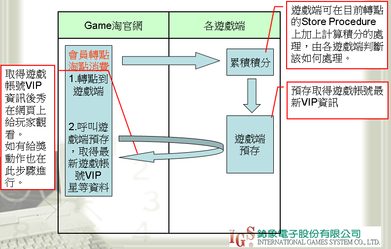
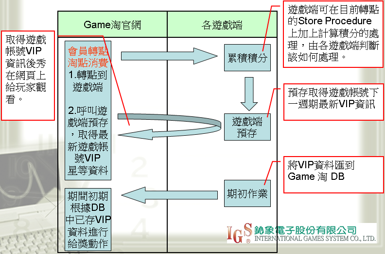

# 遊戲帳號VIP規格說明

## 需求背景/目的

推行遊戲帳號VIP制度，貢獻值高的玩家可享有較多的優惠，更快速的客服服務。

## 遊戲帳號VIP模式說明

- Mode A

  –累積計算

  –效期：永久有效

  –升級判斷：轉點後，網頁端呼叫遊戲端預存取得最新VIP資料

  –資料顯示：網頁端呼叫遊戲端的預存

  –Ex.轉遊戲點數滿10000為1星,滿30000為2星…以此類推

- Mode B

  –區間計算(下面以月結作範例)

  –效期：每月1號計算，有效日為當月2號到次月的1號

  –升級判斷：週期結算後，遊戲端傳送XML格式的資料到網頁端 >= 1星 的遊戲帳號VIP資料皆須傳送

  –資料顯示：網頁端呼叫遊戲端的預存

  –Ex.計算上個月轉的遊戲點數,滿5000為1星,滿15000為2星…以此類推

## 遊戲帳號VIP積分計算注意事項

若轉點時價值為0，則該點數不列入積分。

## ModeA串接溝通方式

即時判斷，由網頁端向遊戲端的預存存取遊戲帳號VIP資料。

## ModeA遊戲帳號VIP等級計算流程圖



## ModeB串接溝通方式

- 即時抓取下一週期的VIP資料，由網頁端向遊戲端的預存存取遊戲帳號VIP資料。
- 由網頁端排程在週期的前一天進行給獎動作(如果有的話)

## ModeB遊戲帳號VIP等級計算流程圖



## Store Procedure規格說明

- 取得會員遊戲帳號VIP資料

  ```
  函　　式：[Web_VIP_GAME_GetUserData]
  功能說明：取得會員遊戲帳號VIP資料
  
  		@nGameAccount				遊戲帳號
  傳回結果：
  		STATE,LEVEL,MODE, SCORE, NEXT_NEED_SCORE,VIP_NO
  		,EFFECTIVE_DATETIME,EXPIRE_DATETIME
  
  		State回傳說明：
  		0		= 正確取得遊戲帳號資料
  		-1		= 查無此使用者		
  
  		其他負數	= (SQL錯誤代碼+ 100000) * (-1)
  
  		當State等於0時，回傳下列資訊(如果是MODE B，請秀出下一個週期的狀態)
  		LEVEL		回傳說明：現在星等
  		MODE		回傳說明：VIP模式(MODE A回傳 1 , MODE B 回傳 2)
  		SCORE		回傳說明：現在分數
  		NEXT_NEED_SCORE  	回傳說明：距離下一星等的分數(如已經是最高星等,則回傳0)
  		VIP_NO		回傳說明：VIP批號(MODE A回傳1,MODE B回傳週期批號 ex.201003)
  		EFFECTIVE_DATETIME	回傳說明：開始生效日(請Convert(varchar,datetime,120))
  				ps.MODE A回傳today
  		EXPIRE_DATETIME	回傳說明：截止日(請Convert(varchar, datetime,120))
  				ps.MODE A回傳9999/12/31 00:00:00
  ```

- 傳送淘點消費資料

  ```
  函　　式：[Web_VIP_GAME_TransPoint]
  功能說明：傳送會員遊戲帳號VIP淘點消費資料
  
  		@nGameAccount				遊戲帳號
  		@nPoint					消費淘點
  		@fPrice					淘點價值
  傳回結果：
  		STATE
  		State回傳說明：
  		0		= 正確傳送無誤
  		-1		= 查無此使用者		
  
  		其他負數	= (SQL錯誤代碼+ 100000) * (-1)
  ```

