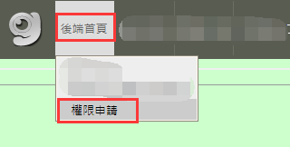

# gametower後端工具權限申請說明

1\. 連結到後端工具：

<https://admin.gametower.com.tw/common/Admin/index.aspx>

此時登入介面會出現 IGS logo 的登入選項


點擊後輸入內網帳密


2\. 成功登入後會自動用內網帳密註冊後端工具帳號並進入工具首頁

新註冊的帳號需點選左上角「後端首頁」→「權限申請」開通相關權限



3\. 權限申請會導向「網頁案件管理系統」填寫gametower後端權限申請需求

「登入模式」請選擇「鈊象內部資訊網帳號」

首次登入的話「分機號碼」請務必填寫


「案件類別」選擇所屬專案

「案件名稱」填寫「申請gametower後端工具權限」


「備註說明」詳細填寫權限需求，內容範例

```
IGS鈊象電子內部資訊網帳號：輸入內網帳號 ( 姓名 )
gametower帳號：輸入後端工具右上角顯示帳號 ( 姓名 )
申請以下權限：
(請選擇案件類別/專案) - XX人員

e.g.
明星3缺1 - 運營人員
e.g.
1.儲值中心交易紀錄查詢
2.問題回報紀錄查詢
```

