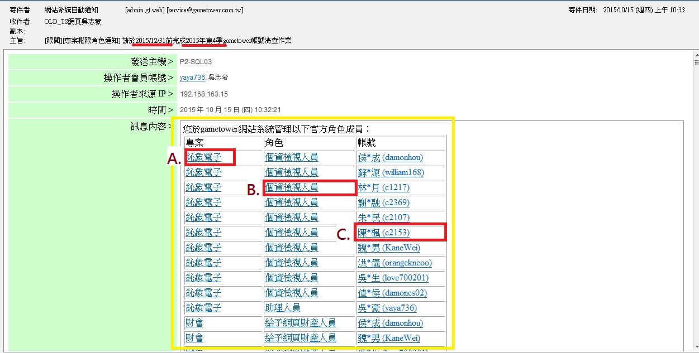
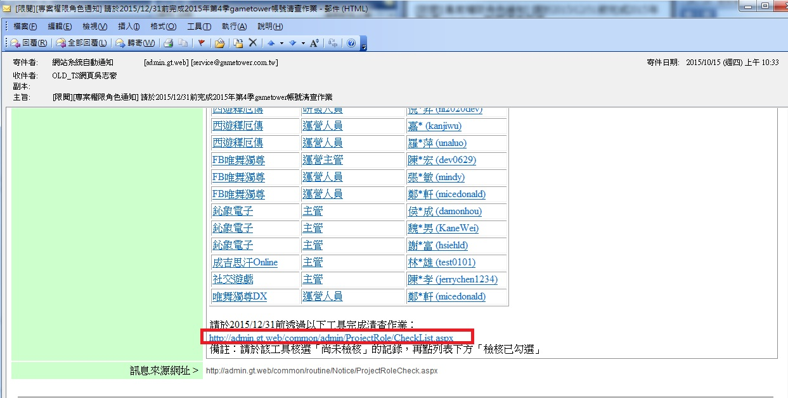
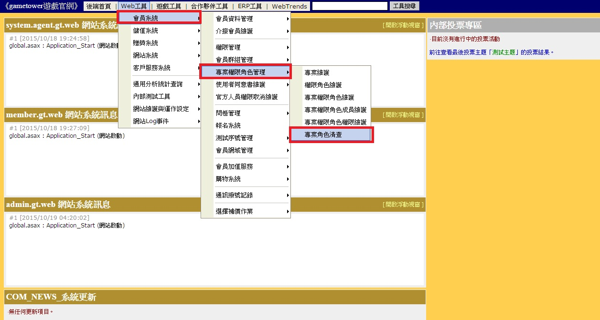
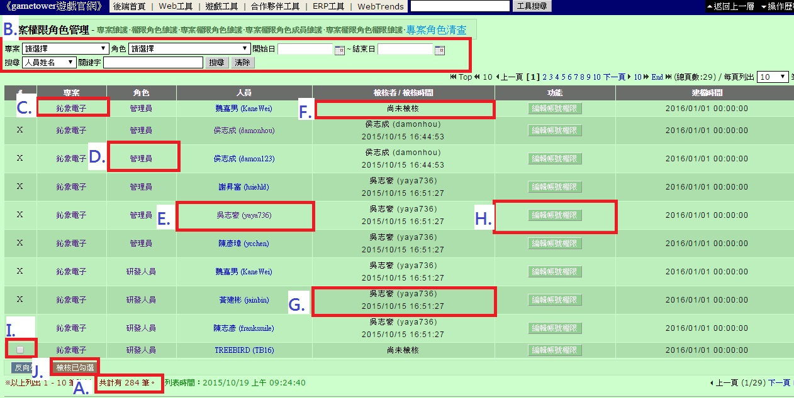

# 專案角色清查工具操作說明

一、 通知信寄發規則說明：

**每季**要清查一次您於『gametower』網站系統管理的所有角色成員，若有尚未清查的成員，則會每日寄發通知信。**(e.g.
如下圖黃色框為尚未檢核的名單)**。

{width="6.6875in"
height="3.3854166666666665in"}

A.
點選則會連結至該**專案**之『[**專案權限角色成員維護**](https://admin.gametower.com.tw/common/admin/ProjectRole/ProjectRoleMemberList.aspx)』工具。

B.
點選則會連結至該**角色**之『[**專案權限角色成員維護**](https://admin.gametower.com.tw/common/admin/ProjectRole/ProjectRoleMemberList.aspx)』工具。

C. 點選則會連結至該**成員**之『**會員明細**』工具。

二、 進入清查工具的方法

1\. 透過信件最下方的連結進入

{width="6.677083333333333in"
height="3.3854166666666665in"}

2\. 進入後端工具利用選單連結進入

{width="6.6875in"
height="3.5729166666666665in"}

三、工具使用介紹

{width="6.6875in"
height="3.3645833333333335in"}

A. 您管理的**成員筆數**。**(e.g. 284位)**

B. 可透過相關的查詢功能，快速搜尋到您要清查的成員。

C.點選則會連結至該**專案**之『[**專案權限角色成員維護**](https://admin.gametower.com.tw/common/admin/ProjectRole/ProjectRoleMemberList.aspx)』工具。

D.點選則會連結至該**角色**之『[**專案權限角色成員維護**](https://admin.gametower.com.tw/common/admin/ProjectRole/ProjectRoleMemberList.aspx)』工具。

E. 點選則會連結至該**成員**之『**會員明細**』工具。

F. 尚未檢核資訊。

G. 成員檢核完成資訊。

H.快速連結至該成員之『**專案角色維護**』，方便**作廢**該成員於**各專案角色內**。

I. 勾選要檢核的成員。

J. 針對有勾選的成員**進行檢核動作**。
