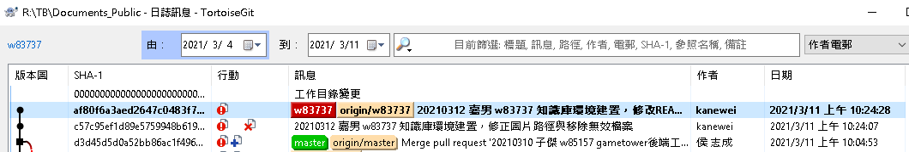
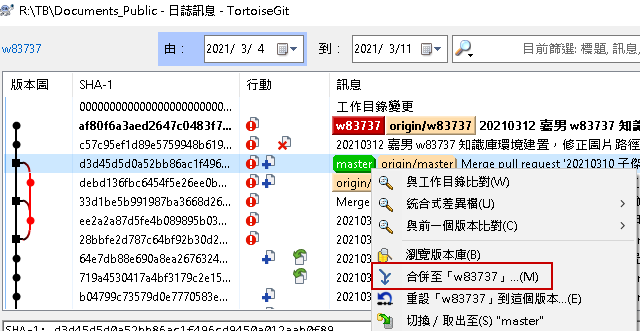
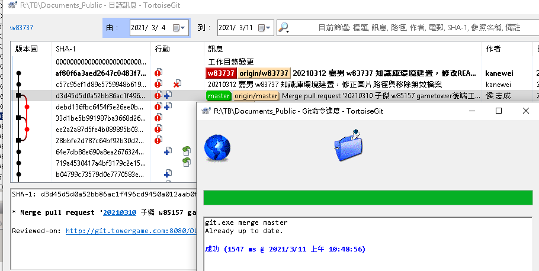
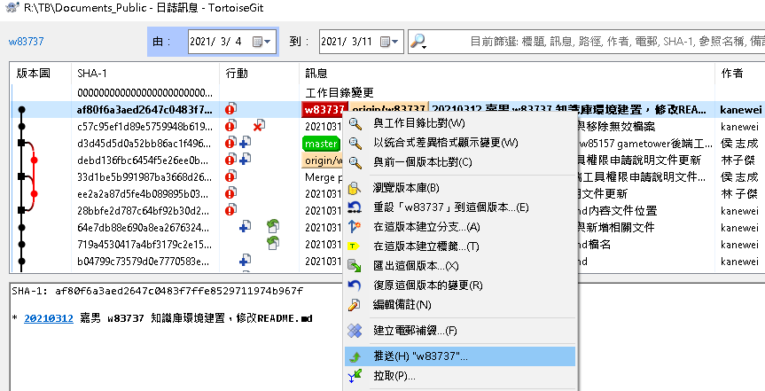
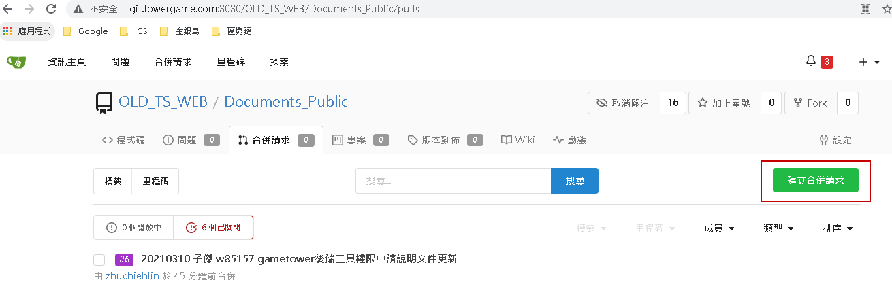
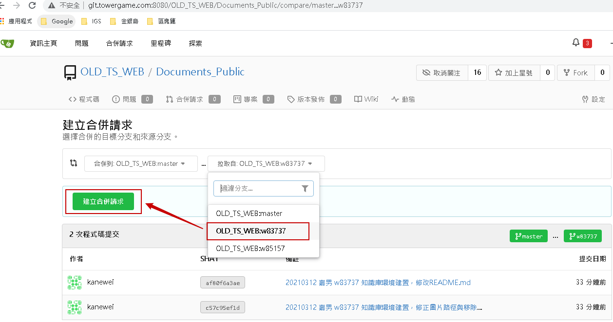
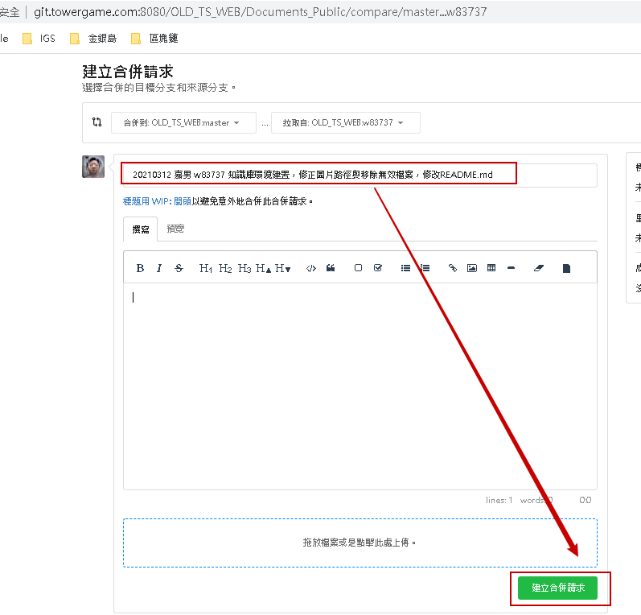
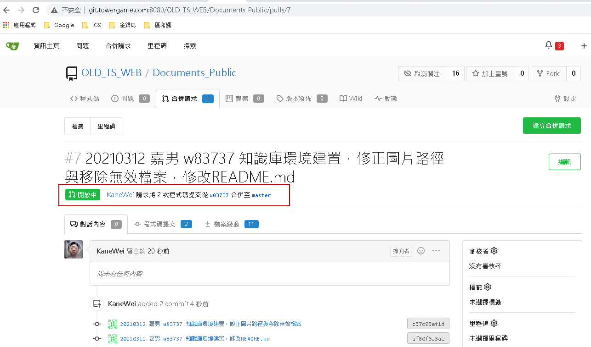

# Gitea合併請求操作手順書

以 Documents_Public 操作作為範例

1. 先按照原先本地修改流程，建立一個案件分支【w83737】，然後進行修改並commit如下圖

   

2. 為了避免合併請求會因為衝突而失敗，先將master分支拉取(pull)後合併到案件分支【w83737】，正常會因為案件分支剛建立，所以也不會有衝突而是Already up to date，如果有衝突就解決並完成合併

   

   

3. 將完成的案件分支推送到遠端

   

4. 到Gitea 的[合併請求頁面](http://git.towergame.com:8080/OLD_TS_WEB/Documents_Public/pulls)，點選【建立合併請求】

   

5. 左邊為【合併到master】，右邊選擇【拉取自w83737】，確認無誤後點選【建立合併請求】

   

6. 輸入【標題】後，點選【建立合併請求】

   

7. 成功建立合併請求，後續等待審核者同意即可

   

