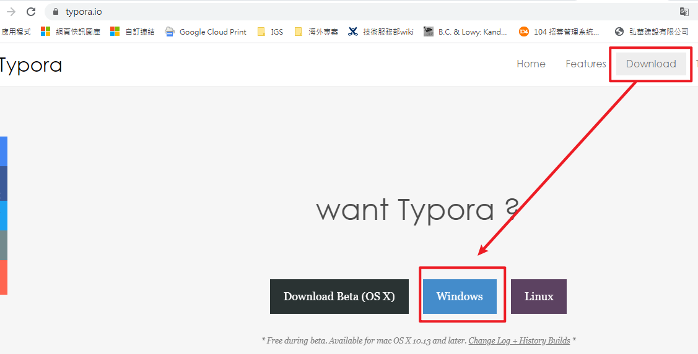
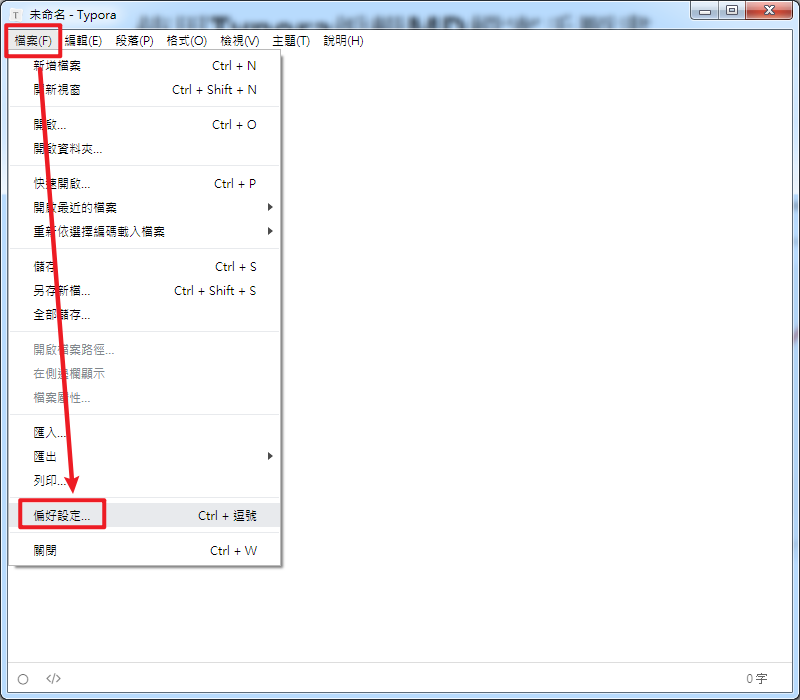
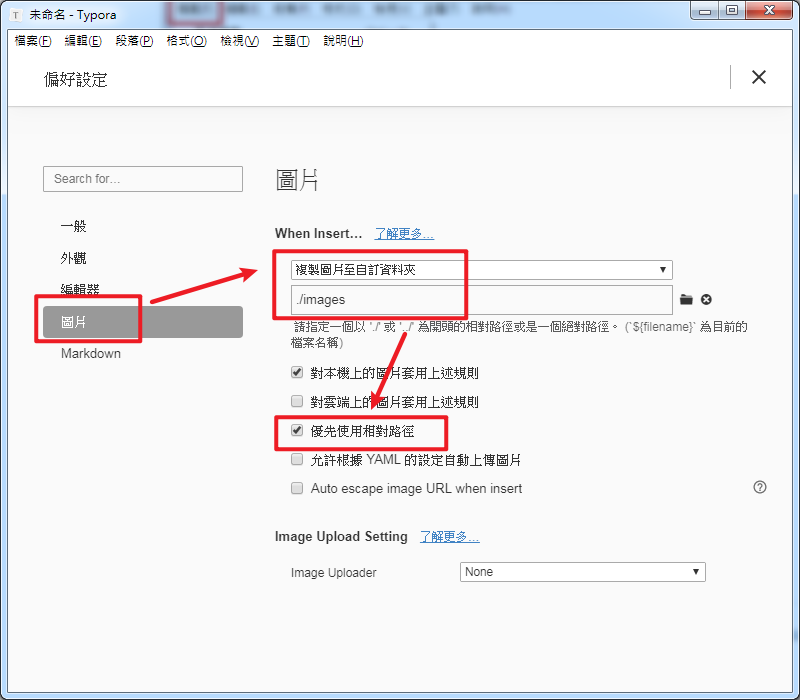
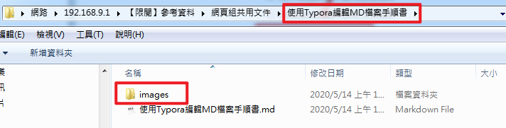
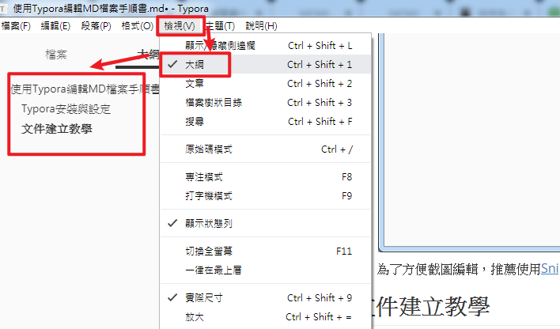
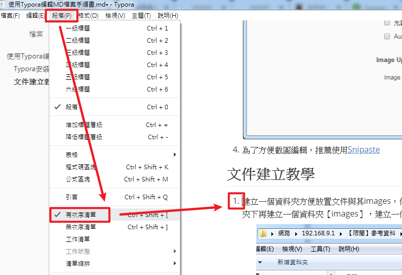
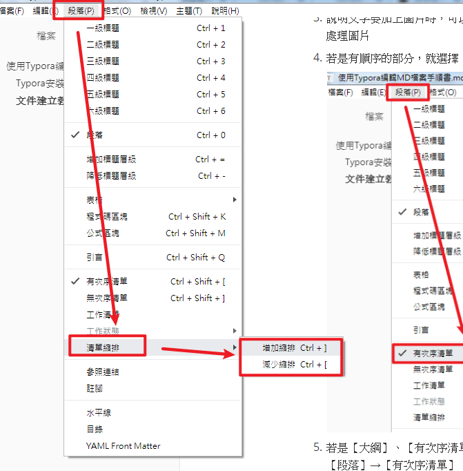
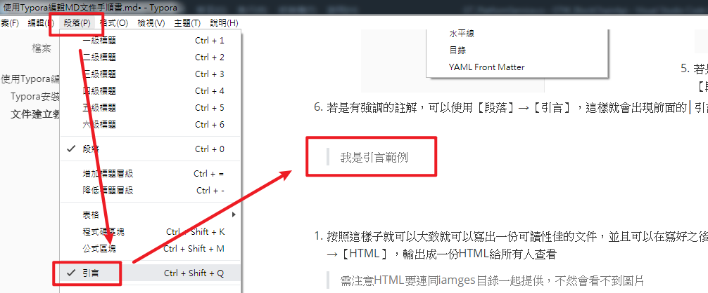
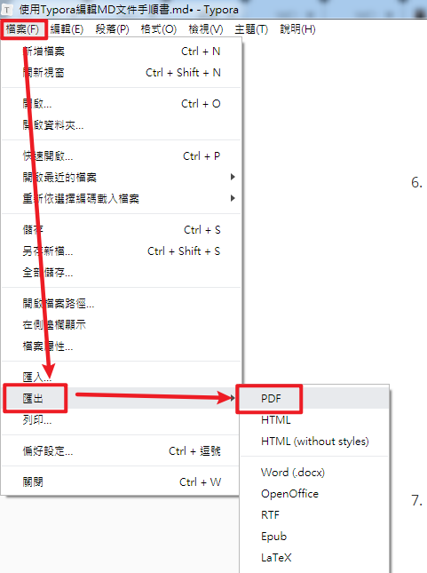

# 使用Typora編輯MD文件手順書

## Typora安裝與設定

1. 到Typora[官網下載](https://typora.io/)Typora

   

2. 安裝後開啟Typora，點選【檔案】→【偏好設定】

   

3. 【圖片】→選擇【複製圖片至自訂資料夾】→【./images】→勾選【優先使用相對路徑】，這樣直接貼上的圖片就會直接儲存在該目錄底下的images目錄，且是使用相對路徑，方便編輯文件時加入圖片與後續查看

   > 請注意圖片目錄斜線的方向是 /，這樣傳到Gitea上才能正常瀏覽圖片

   

4. 為了方便截圖編輯，推薦使用[Snipaste](https://zh.snipaste.com/) 

## 文件建立教學

1. 建立一個資料夾方便放置文件與其images，例如先建立資料夾【Typora編輯MD檔案手順書】，並於該資料夾下再建立一個資料夾【images】，建立一個檔案【 Typora編輯MD檔案手順書.md】

   

2. 打開該檔案，最上方為標題，可以選擇【段落】→【一級標題】，輸入標題【Typora編輯MD檔案手順書】，第二層標題就為【段落】→【二級標題】，這樣的標題可以在【檢視】→【大綱】看到，並可以有快速連結

   > 可以用【Ctrl+1】變為【一級標題】，【Ctrl+2】變為【二級標題】，以此類推

   

3. 說明文字要加上圖片時，可以直接Copy圖片後貼上，該圖片就會自動放置在【./images】底下，不需要額外處理圖片

4. 若是有順序的部分，就選擇【段落】→【有次序清單】，這樣就會產出順序清單

   

5. 若是【大綱】、【有次序清單】沒有跑出來或是按照想要的順序處理，注意一下縮排是否需要調整，可使用【段落】→【清單縮排】→【增加縮排】or【減少縮排】

   > 可以用【Ctrl+]】進行【增加縮排】，【Ctrl+[】進行【減少縮排】
   >

   

6. 若是有強調的註解，可以使用【段落】→【引言】，這樣就會出現前面的│引言

   
7. 按照這樣子就可以簡單寫出一份可讀性佳的文件，並且可以在寫好之後使用【檔案】→【匯出】→【PDF】，輸出成一份PDF給所有人查看

   > 需注意若輸出【HTML】要連同iamges目錄一起提供，不然會看不到圖片

   

   

