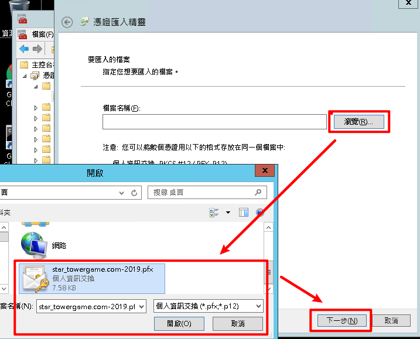

# 安裝憑證設定IIS手順書

## 使用主控台（MMC）安裝憑證

1. 「開始」點擊執行後輸入mmc
    

2. 點擊左上角「檔案」 →「新增/移除嵌入式管理員元(M)…」

    

3. 尋找到「憑證」後點中間的「新增(A) 」 

    

4. 選擇「電腦帳戶(C)」 →「下一步」

    

5. 選擇「本機電腦(執行個這主控台的電腦)(L):」→ 「完成」

    

6. 完成後可看到「憑證(本機電腦)」會出現在右邊方框內，點選「確定」

    

7. 選擇「個人」→「憑證」點右鍵→ 「匯入」

    

8. 「下一步」

    

9. 「瀏覽」→選擇要匯入的憑證→「開啟」→「下一步」

    

10. 輸入密碼→勾選「包含所有延伸內容」→「下一步」

    

11. 將所有憑證放入以下的存放區→「個人」→「下一步」

     

12. 「完成」

     

13. 匯入後會在「個人」→「憑證」看到所有該憑證(*.towergame.com)的相關憑證，在該憑證上點兩下→「憑證路徑」，最上面的為「根憑證」，中間的都是「中繼憑證」

     

14. 將「根憑證」移動到「受信任的根憑證授權單位」→「憑證」

     

15. 若出現「已包含該憑證‧‧‧，您要取代現存的憑證？」的訊息，點選「是」

     

16. 將「中繼憑證」移動到「中繼憑證授權單位」→「憑證」

     

17. 若出現「已包含該憑證‧‧‧，您要取代現存的憑證？」的訊息，點選「是」

     

18. 完成上述動作後，「個人」→「憑證」中只會剩下購買的憑證，「根憑證」跟「中繼憑證」都移動到相對應的位置，若是沒有移動到相對應的位置可能會使手機裝置無法信任該SSL憑證

## Internet Information Service（IIS）設定憑證

1. 開啟「IIS」→選擇要設定的「站台」→「繫結」→選擇要設定憑證的443連結埠繫結項目→「編輯」

   

2. 選取剛匯入的「憑證」

   

3. 選好後點選「檢視」→確認「發給」Domain、「有效期」、「這個憑證有一個對應的私密金鑰」→確認無誤後點選「確定」

   

4. 「確定」→「關閉」，這樣就設定完成了

   

5. 使用瀏覽器連結https網址，確認是安全的狀態

   

   