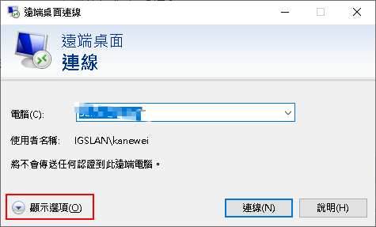

# 解決Win10無法遠端修改密碼問題

1. 使用Win10遠端連線到遠端若是需要修改密碼時會出現錯誤如下


2. 開啟檔案總管→文件→開啟隱藏的項目→Default.rdp點選右鍵使用記事本開啟，若是沒有記事本則選擇其他應用程式後選擇記事本開啟


3. 開啟後加上`enablecredsspsupport:i:0`，然後就可以存檔關閉了


4. 使用mstsc開啟遠端連線→顯示選項→進階，驗證方式選擇【如果驗證失敗，則警告我】

   
   
   
   
5. 切換到一般，輸入位置與帳號點選連線

   ```
   需注意一下帳號是否為網路帳號或是本機帳號
   如網頁組的網域為 oldweb，那帳號就是輸入 oldweb\kanewei
   若是本機帳號則只要輸入帳號 kanewei or .\kanewei
   ```

   

   

6. 會開啟遠端桌面輸入密碼，要修改密碼則會正常導向修改密碼

   ```
   需注意修改密碼時若是該帳號為本機帳號有可能帳號前面要加上.\才會正常改到本機密碼，如輸入 .\kanewei
   ```

   

   

   