#### **製作需求:**  

危機一發小遊戲，會有3種寶劍，10把必中

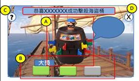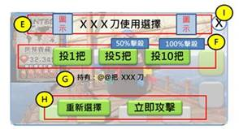

#### **初期版本:**  以海盜危機一發可愛風為主，但與活動主題不符。

活動主要以幽靈船為主題。

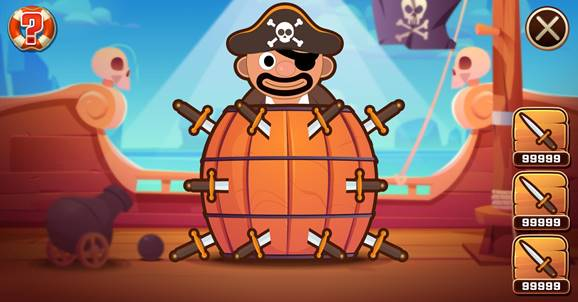

 

#### **最後版本:**

使用寫實的加上詭異的氣氛風格進行畫面合成。

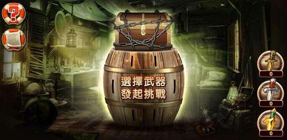

#### 操作版面:

以木紋建立相關介面風格。

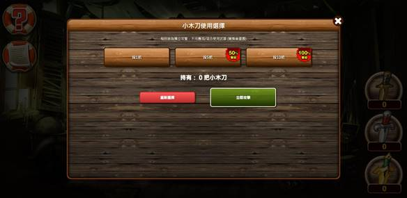

 

#### 合成拆解:

付費圖庫與免費圖庫..等圖片的合成。

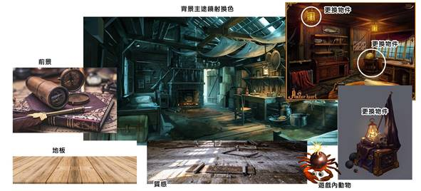

 

#### 背景成品:

色調調正。

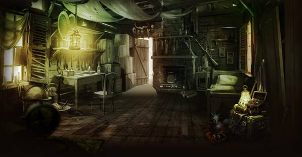

 

#### 合成拆解:

付費圖片的合成。

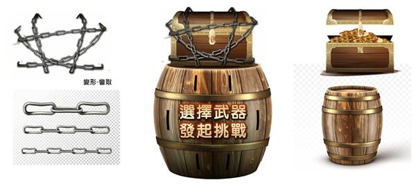

 

#### 成品結果:

檢討彈跳視窗的操作問題

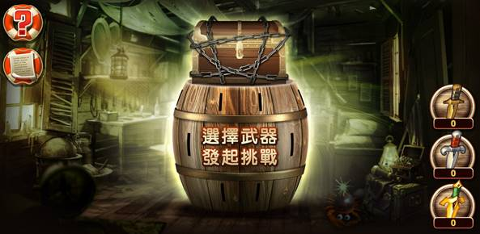

 

#### 未來操做介面的優化:

操作介面減少使用難度，可以考慮介面摺疊收納的問題。

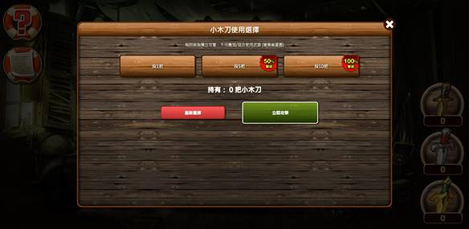

上下選擇攻擊次數

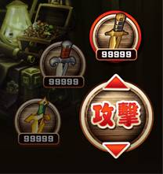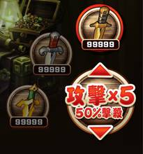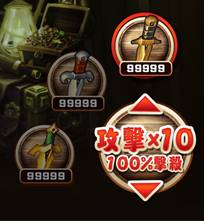

整體介面優化可能性

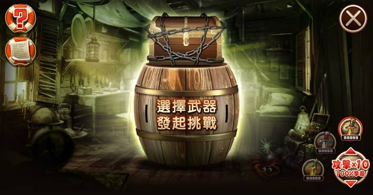

 

 