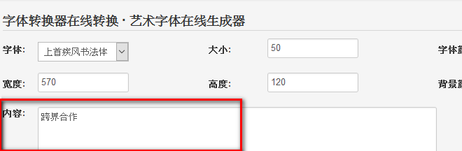
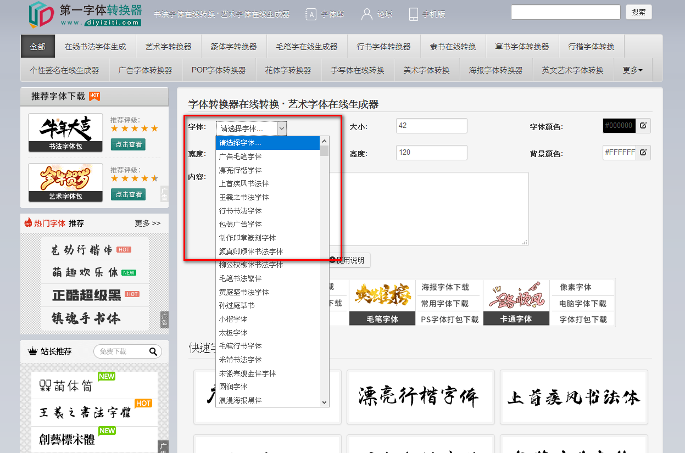
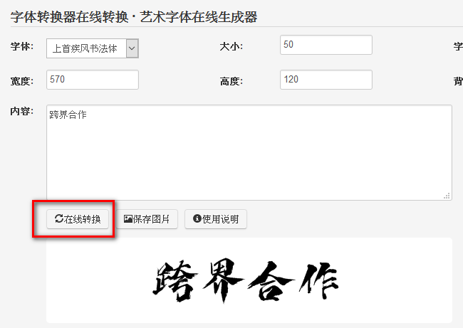
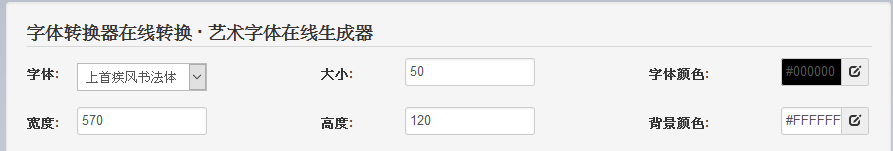
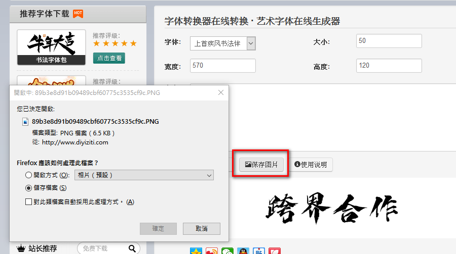

1. **輸入內容**

   在上面的文本框中輸入需要轉換的文

   字內容，字數不限。

   

2. **選擇字體**

   在選擇框下拉菜單中查詢你喜歡的字體，具體效果可以在下面的預覽區中看到。

   

3. **生成字體**

   點擊“在線轉換”按鈕即可。您也可以直接點擊書法和藝術字體效果圖進行快速在線轉換。

   

4. **調整大小顏色**

   如果對默認的效果格式不滿意或轉換的字體沒有顯示完整的圖片，可以對在上面的免費藝術字體在線生成工具設置中修改預覽圖寬度、高度、字體大小、顏色等，再重複上述步驟即可得到理想的效果。如需在線生成背景透明的字體圖片，直接刪除背景顏色框裡面的代碼，或者在“背景顏色”選擇框中選擇頂部的紅色斜杠即可。

   

5. **下載圖片**

   點擊"保存圖片"存檔於自己電腦中使用

   